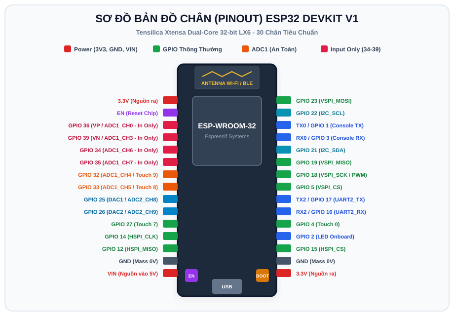
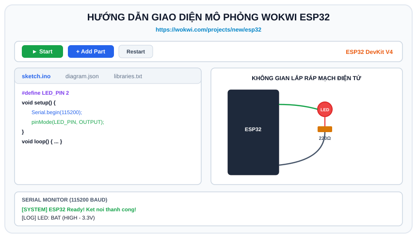

# BÀI 01: TỔNG QUAN ESP32, CÀI ĐẶT ARDUINO IDE VÀ HƯỚNG DẪN GIẢ LẬP WOKWI

## 1. Khái Niệm Về Vi Điều Khiển ESP32

ESP32 là vi điều khiển SoC (System on Chip) giá rẻ, tiêu thụ năng lượng thấp được phát triển bởi hãng Espressif Systems. Điểm vượt trội của ESP32 là được tích hợp sẵn Wi-Fi và Bluetooth kép (Bluetooth Classic và BLE - Bluetooth Low Energy), cùng với vi xử lý 32-bit 2 nhân cực kỳ mạnh mẽ.

Trong lĩnh vực Internet of Things (IoT) hiện nay, ESP32 là dòng chip thông dụng nhất được sử dụng trong các thiết bị nhà thông minh (Smart Home), trạm quan trắc thời tiết, hệ thống tự động hóa và nông nghiệp công nghệ cao.

---

<p align="center">
  
</p>

### 1.1 Thông Số Kỹ Thuật Nổi Bật (ESP32 WROOM-32)
- **CPU**: Vi xử lý lõi kép Tensilica Xtensa Dual-Core 32-bit LX6, xung nhịp 160MHz đến 240MHz.
- **Bộ nhớ**:
  - **SRAM**: 520 KB (lưu trữ biến, dữ liệu bộ nhớ đệm mạng).
  - **ROM**: 448 KB (chứa bootloader và các hàm hệ thống).
  - **Bộ nhớ Flash**: Thường là 4MB (lưu trữ code chương trình và tệp tin hệ thống).
- **Kết nối không dây**:
  - Wi-Fi chuẩn 802.11 b/g/n (tốc độ lên đến 150 Mbps).
  - Bluetooth v4.2 BR/EDR và BLE.
- **Ngoại vi**:
  - 34 chân GPIO đa năng.
  - Bộ chuyển đổi Analog sang Digital (ADC 12-bit) lên đến 18 kênh.
  - 2 kênh Digital sang Analog (DAC 8-bit).
  - 16 kênh PWM phần cứng điều khiển đèn và động cơ.
  - Các chuẩn giao tiếp: 3 bộ UART, 2 bộ I2C, 3 bộ SPI, CAN Bus (TWAI).

---

### 1.2 So Sánh ESP32 với Arduino UNO và STM32

| Tiêu chí | Arduino UNO (ATmega328P) | STM32 (STM32F103C8T6) | ESP32 (ESP-WROOM-32) |
| :--- | :--- | :--- | :--- |
| **Kiến trúc CPU** | 8-bit AVR | 32-bit ARM Cortex-M3 | 32-bit Xtensa Dual-Core LX6 |
| **Xung nhịp** | 16 MHz | 72 MHz | 160 - 240 MHz (2 Nhân) |
| **Dung lượng Flash** | 32 KB | 64 - 128 KB | 4 MB (Lớn hơn 128 lần Arduino Uno) |
| **Dung lượng SRAM** | 2 KB | 20 KB | 520 KB |
| **Wi-Fi / Bluetooth** | Không có | Không có | Tích hợp sẵn Wi-Fi & BLE |
| **Hỗ trợ RTOS** | Khó áp dụng | Tùy chọn FreeRTOS | Tích hợp sẵn FreeRTOS |
| **Giá thành** | ~100.000 VNĐ | ~60.000 VNĐ | ~80.000 - 110.000 VNĐ |

---

## 2. Cài Đặt Môi Trường Lập Trình Arduino IDE Cho ESP32

Nếu bạn đã có phần cứng thật (mạch ESP32 DevKit):

1. **Tải phần mềm**: Tải và cài đặt **Arduino IDE 2.x** tại: `https://www.arduino.cc/en/software`.
2. **Cài đặt ESP32 Board Package**:
   - Mở Arduino IDE, vào menu **File -> Preferences**.
   - Tại dòng **Additional boards manager URLs**, dán link cấu hình sau:
     ```text
     https://raw.githubusercontent.com/espressif/arduino-esp32/gh-pages/package_esp32_index.json
     ```
   - Nhấn **OK**.
   - Vào menu **Tools -> Board -> Boards Manager...**, gõ tìm kiếm từ khóa `esp32` của Espressif Systems và bấm **Install**.
3. **Cài Driver nạp**: Nếu máy tính không nhận cổng COM, hãy cài đặt driver tương ứng của chip chuyển đổi USB trên mạch:
   - Driver CP210x (Silicon Labs) hoặc Driver CH340.
4. **Chọn bo mạch**: Vào menu **Tools -> Board -> esp32 -> ESP32 Dev Module**. Chọn đúng cổng **Port COM**.

---

## 3. Hướng Dẫn Giả Lập Trực Tuyến Bằng Wokwi (Không Cần Phần Cứng)

Nếu bạn chưa có sẵn mạch phần cứng hoặc muốn học tập linh hoạt trên trình duyệt mọi lúc mọi nơi, nền tảng **Wokwi** (`https://wokwi.com`) là công cụ mô phỏng vi điều khiển trực quan, chuẩn xác và hiện đại nhất hiện nay.

### 3.1 Ưu Điểm Khi Học Bằng Wokwi
- **Hoàn toàn miễn phí**: Chạy trực tiếp trên trình duyệt (Chrome, Edge, Firefox).
- **Hỗ trợ đầy đủ linh kiện**: ESP32, LED, Nút nhấn, Màn hình LCD 1602, OLED SSD1306, Cảm biến nhiệt độ DHT22, Cảm biến khoảng cách HC-SR04, Động cơ Servo, Chiết áp, v.v.
- **Giả lập Wi-Fi thật**: Wokwi cung cấp mạng Wi-Fi ảo có tên `Wokwi-GUEST` cho phép ESP32 kết nối Internet thật để truyền dữ liệu qua Web, MQTT, HTTP Client!
- **Dễ dàng chia sẻ dự án**: Chỉ cần 1 đường link là giảng viên và bạn học có thể xem ngay mạch điện và mã nguồn của bạn.

<p align="center">
  
</p>

### 3.2 Các Bước Bắt Đầu Dự Án ESP32 Trên Wokwi
1. Truy cập trực tiếp liên kết tạo mới dự án ESP32: **https://wokwi.com/projects/new/esp32**
2. Giao diện làm việc gồm 2 khu vực:
   - **Bên trái**: Trình soạn thảo mã nguồn `sketch.ino` và danh sách thư viện `libraries.txt`.
   - **Bên phải**: Bàn thí nghiệm mô phỏng mạch điện trực quan.
3. Thêm linh kiện mới: Bấm vào biểu tượng **Dấu cộng màu xanh** (`+`) ở thanh công cụ phía trên màn hình mô phỏng.
4. Nối dây: Nhấp chuột trái vào chân của linh kiện, sau đó kéo đường dây và nhấp chuột vào chân của ESP32. Muốn đổi màu dây, chỉ cần nhấp chuột vào dây và chọn màu sắc mong muốn.
5. Chạy mô phỏng: Nhấn nút **Play** (hình tam giác màu xanh) để bắt đầu chạy code. Bấm nút **Stop** (hình vuông màu đỏ) để dừng.

---

## 4. Chương Trình Đầu Tiên: Chớp Tắt LED (Blink LED) & Serial Monitor

### 4.1 Sơ Đồ Đấu Nối Trên Wokwi
- Thêm 1 linh kiện **LED** và 1 **Điện trở (Resistor)** giá trị 220 Ohm.
- Nối chân **Anode (+)** của LED vào chân **GPIO 2** của ESP32.
- Nối chân **Cathode (-)** của LED qua điện trở 220 Ohm vào chân **GND** của ESP32.

*(Mẹo: Trên hầu hết các board ESP32 thật đều tích hợp sẵn một đèn LED nhỏ màu xanh dương gắn ngầm tại chân GPIO 2).*

### 4.2 Cấu Hình `diagram.json` Trên Wokwi
Nếu làm việc trên Wokwi, bạn có thể dán cấu hình sau vào tab `diagram.json` để tự động tạo mạch nối dây:

```json
{
  "version": 1,
  "author": "Advance_C_ESP32",
  "editor": "wokwi",
  "parts": [
    { "type": "board-esp32-devkit-c-v4", "id": "esp", "top": 0, "left": 0, "attrs": {} },
    { "type": "wokwi-led", "id": "led1", "top": -60, "left": 120, "attrs": { "color": "red" } },
    { "type": "wokwi-resistor", "id": "r1", "top": -20, "left": 120, "attrs": { "value": "220" } }
  ],
  "connections": [
    [ "esp:TX", "$serialMonitor:RX", "", [] ],
    [ "esp:RX", "$serialMonitor:TX", "", [] ],
    [ "esp:2", "led1:A", "green", [ "v0" ] ],
    [ "led1:C", "r1:1", "black", [ "v0" ] ],
    [ "r1:2", "esp:GND.1", "black", [ "v0" ] ]
  ],
  "dependencies": {}
}
```

### 4.3 Mã Nguồn Chương Trình (`sketch.ino`)

```cpp
/*
 * BÀI 01: BLINK LED & SERIAL MONITOR TRÊN ESP32
 * Nền tảng: Arduino IDE / Wokwi Simulator
 */

// Định nghĩa chân nối với đèn LED
#define LED_PIN 2

void setup() {
  // 1. Khởi tạo cổng truyền thông nối tiếp Serial với tốc độ 115200 bps
  Serial.begin(115200);
  delay(500); // Chờ Serial khởi động ổn định

  Serial.println("=================================================");
  Serial.println("  XIN CHAO! CHAO MUNG DEN VOI KHOA HOC ESP32-IOT ");
  Serial.println("=================================================");

  // 2. Thiết lập chân GPIO 2 là ngõ ra (OUTPUT)
  pinMode(LED_PIN, OUTPUT);
}

void loop() {
  // Bật đèn LED (xuất điện áp mức CAO: 3.3V)
  digitalWrite(LED_PIN, HIGH);
  Serial.println("[LOG] LED: BAT (HIGH - 3.3V)");
  delay(1000); // Trì hoãn 1000 mili-giây (1 giây)

  // Tắt đèn LED (xuất điện áp mức THẤP: 0V)
  digitalWrite(LED_PIN, LOW);
  Serial.println("[LOG] LED: TAT (LOW - 0V)");
  delay(1000); // Trì hoãn 1000 mili-giây (1 giây)
}
```

### 4.4 Phân Tích Chi Tiết Mã Nguồn
- `Serial.begin(115200)`: Khởi động giao tiếp Serial giữa ESP32 và máy tính. Khác với Arduino Uno thường dùng 9600 bps, ESP32 có xung nhịp rất cao nên tốc độ chuẩn luôn là **115200 bps**.
- `pinMode(LED_PIN, OUTPUT)`: Đăng ký với vi điều khiển rằng chân GPIO 2 sẽ phát tín hiệu logic ra ngoài.
- `digitalWrite(LED_PIN, HIGH)`: Cấp điện áp 3.3V cho chân GPIO, làm dòng điện chạy qua LED sáng lên.
- `digitalWrite(LED_PIN, LOW)`: Nối chân GPIO về 0V (GND), ngắt dòng điện làm tắt LED.
- `delay(1000)`: Hàm tạm dừng vi điều khiển trong khoảng thời gian xác định (tính theo mili-giây).

---

## 5. Các Lỗi Phổ Biến Của Người Mới Bắt Đầu
1. **Serial Monitor hiện ký tự lạ (`⸮⸮⸮`)**: Do chưa chọn đúng tốc độ 115200 baud trên cửa sổ Serial Monitor.
2. **Nạp code cho mạch thật báo lỗi `A fatal error occurred: Failed to connect to ESP32`**: Lúc Arduino IDE hiện dòng `Connecting........_____.....`, hãy nhấn giữ nút **BOOT** trên board ESP32 khoảng 2 giây để kích hoạt chế độ nạp firmware.
3. **Mắc ngược cực LED**: Cực dương (Anode) chân dài phải nối với GPIO 2, cực âm (Cathode) chân ngắn phải nối với cực âm GND qua điện trở hạn dòng.

---

## 6. Bài Tập Thực Hành

1. **Bài 1 (Cơ bản)**: Mở Wokwi, tạo mạch gồm 3 đèn LED (Đỏ, Vàng, Xanh) nối với các chân GPIO 23, GPIO 22, GPIO 21. Viết chương trình mô phỏng hệ thống **Đèn giao thông**:
   - Đèn Đỏ bật 5 giây, các đèn khác tắt.
   - Đèn Xanh bật 4 giây, các đèn khác tắt.
   - Đèn Vàng bật 2 giây, các đèn khác tắt.
2. **Bài 2 (Nâng cao)**: Lập trình hiệu ứng phát tín hiệu cầu cứu khẩn cấp **mã Morse SOS**:
   - 3 lần chớp ngắn (bật 200ms, tắt 200ms).
   - 3 lần chớp dài (bật 600ms, tắt 200ms).
   - 3 lần chớp ngắn (bật 200ms, tắt 200ms).
   - Tắt hẳn 2 giây rồi lặp lại chu kỳ.