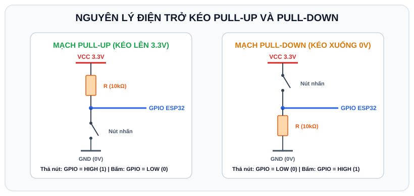

# BÀI 02: LẬP TRÌNH GPIO CƠ BẢN - ĐIỀU KHIỂN LED VÀ ĐỌC NÚT NHẤN

## 1. Khái Niệm Về GPIO (General Purpose Input/Output)

GPIO là các chân đa dụng trên vi điều khiển có thể được lập trình để đóng vai trò làm ngõ vào (Input) nhận tín hiệu từ môi trường hoặc làm ngõ ra (Output) điều khiển thiết bị ngoại vi.

```
                  ┌──────────────────────┐
 Cảm biến/Nút nhấn│ ──► [ INPUT ]        │
                  │         │            │
                  │       ESP32          │
                  │         │            │
 Đèn LED/Rơ-le    │ ◄── [ OUTPUT ]       │
                  └──────────────────────┘
```

---

## 2. Bản Đồ Chân GPIO Trên ESP32 Và Các Cảnh Báo Phần Cứng

ESP32 có 34 chân GPIO (đánh số từ 0 đến 39). Tuy nhiên, không phải chân nào cũng có thể sử dụng tự do:

### 2.1 Bảng phân loại chân GPIO
| Nhóm chân | Danh sách chân GPIO | Đặc tính & Lưu ý quan trọng |
| :--- | :--- | :--- |
| **Input Only (Chỉ đọc vào)** | GPIO 34, 35, 36 (VP), 39 (VN) | **Chỉ có thể làm INPUT**. Không có điện trở kéo nội (Pull-up/Pull-down) và **không thể xuất Output**. Thích hợp làm chân đọc ADC. |
| **Strapping Pins** | GPIO 0, 2, 5, 12, 15 | Dùng để xác định chế độ Boot khi chip khởi động. Tránh dùng làm ngõ vào gắn nút bấm nếu chưa hiểu rõ vì có thể khiến ESP32 không khởi động được. |
| **SPI Flash (CẤM SỬ DỤNG)** | GPIO 6, 7, 8, 9, 10, 11 | Nối trực tiếp với chip nhớ Flash chứa code bên trong. **Nếu cấu hình các chân này, ESP32 sẽ bị sập nguồn (Crash/Panic) ngay lập tức.** |
| **Chân an toàn khuyên dùng** | GPIO 4, 16, 17, 18, 19, 21, 22, 23, 25, 26, 27, 32, 33 | Hoàn toàn an toàn để làm Input, Output, kích hoạt trở kéo nội. |

---

## 3. Khái Niệm Điện Trở Kéo (Pull-up & Pull-down)

<p align="center">
  
</p>

Khi một chân GPIO được cấu hình là INPUT và để lơ lửng (không gắn vào đâu hoặc nút bấm đang hở), chân đó sẽ đóng vai trò như một ăng-ten bắt sóng nhiễu điện từ xung quanh, khiến giá trị đọc về chập chờn ngẫu nhiên giữa 0 và 1 (Floating State).

Để cố định mức điện áp khi nút bấm chưa được nhấn:
- **Pull-up (Kéo lên nguồn 3.3V)**: Khi chưa nhấn nút, chân nhận mức CAO (`1`). Khi nhấn nút (nối với GND), chân nhận mức THẤP (`0`).
- **Pull-down (Kéo xuống mass 0V)**: Khi chưa nhấn nút, chân nhận mức THẤP (`0`). Khi nhấn nút (nối với 3.3V), chân nhận mức CAO (`1`).

> **Ưu điểm của ESP32**: Vi điều khiển ESP32 tích hợp sẵn điện trở kéo nội bên trong chip, ta chỉ cần khai báo trong code:
> - `pinMode(BUTTON_PIN, INPUT_PULLUP);` (Rất phổ biến, không cần gắn thêm điện trở ngoài).
> - `pinMode(BUTTON_PIN, INPUT_PULLDOWN);`

---

## 4. Hướng Dẫn Giả Lập Mạch Nút Nhấn & LED Trên Wokwi

### 4.1 Danh sách linh kiện
- 1 x Board ESP32 DevKit
- 1 x Đèn LED màu đỏ
- 1 x Điện trở 220 Ohm (hạn dòng cho LED)
- 1 x Nút nhấn (Pushbutton)

### 4.2 Sơ đồ nối dây
1. **Mạch Đèn LED**:
   - Chân Anode (+) của LED nối vào **GPIO 2**.
   - Chân Cathode (-) của LED nối qua điện trở 220 Ohm về chân **GND**.
2. **Mạch Nút Nhấn (Chế độ Active-LOW dùng INPUT_PULLUP)**:
   - Chân 1 của Nút nhấn nối vào chân **GPIO 18**.
   - Chân 2 của Nút nhấn nối vào chân **GND**.

### 4.3 Cấu hình `diagram.json` trên Wokwi
```json
{
  "version": 1,
  "author": "Advance_C_ESP32",
  "editor": "wokwi",
  "parts": [
    { "type": "board-esp32-devkit-c-v4", "id": "esp", "top": 0, "left": 0, "attrs": {} },
    { "type": "wokwi-led", "id": "led1", "top": -80, "left": 100, "attrs": { "color": "red" } },
    { "type": "wokwi-resistor", "id": "r1", "top": -40, "left": 100, "attrs": { "value": "220" } },
    { "type": "wokwi-pushbutton", "id": "btn1", "top": 120, "left": 100, "attrs": { "color": "green" } }
  ],
  "connections": [
    [ "esp:TX", "$serialMonitor:RX", "", [] ],
    [ "esp:RX", "$serialMonitor:TX", "", [] ],
    [ "esp:2", "led1:A", "green", [ "v0" ] ],
    [ "led1:C", "r1:1", "black", [ "v0" ] ],
    [ "r1:2", "esp:GND.1", "black", [ "v0" ] ],
    [ "esp:18", "btn1:2.r", "orange", [ "v0" ] ],
    [ "btn1:1.r", "esp:GND.2", "black", [ "v0" ] ]
  ],
  "dependencies": {}
}
```

---

## 5. Ví Dụ Mẫu: Nhấn Nút Để Bật / Tắt Đèn LED (Toggle LED)

Trong thực tế, khi bấm nút ta muốn đèn đổi trạng thái: Đang tắt thì bật, đang bật thì tắt (giống công tắc đèn nhà).

```cpp
/*
 * BÀI 02: ĐIỀU KHIỂN LED BẰNG NÚT BẤM (INPUT_PULLUP)
 * Nền tảng: Arduino IDE / Wokwi Simulator
 */

#define LED_PIN    2   // Chân xuất tín hiệu ra LED
#define BUTTON_PIN 18  // Chân đọc tín hiệu nút nhấn

// Biến lưu trạng thái hiện tại của đèn (false: Tắt, true: Bật)
bool ledState = false;

// Biến ghi nhớ trạng thái nút bấm ở chu kỳ trước
int lastButtonState = HIGH;

void setup() {
  Serial.begin(115200);
  delay(500);

  Serial.println("[SYSTEM] Khoi dong chuong trinh doc nut nhan...");

  // Cấu hình chân LED là OUTPUT
  pinMode(LED_PIN, OUTPUT);
  digitalWrite(LED_PIN, LOW); // Ban đầu tắt đèn

  // Cấu hình chân Nút nhấn là INPUT_PULLUP (Kéo lên nguồn 3.3V)
  // Khi không nhấn: đọc được HIGH (1)
  // Khi nhấn nút: đọc được LOW (0)
  pinMode(BUTTON_PIN, INPUT_PULLUP);
}

void loop() {
  // Đọc mức logic hiện tại của chân nút nhấn
  int currentButtonState = digitalRead(BUTTON_PIN);

  // Phát hiện cạnh xuống (Falling Edge): Chuyển từ HIGH (thả) sang LOW (vừa bấm)
  if (lastButtonState == HIGH && currentButtonState == LOW) {
    Serial.println("[EVENT] Phat hien nut nhan duoc bam!");

    // Đảo trạng thái đèn LED
    ledState = !ledState;
    digitalWrite(LED_PIN, ledState ? HIGH : LOW);

    Serial.print("[STATUS] Den LED hien tai: ");
    Serial.println(ledState ? "DANG BAT" : "DANG TAT");

    // Trì hoãn nhẹ 50ms để lọc nhiễu rung cơ học ban đầu
    delay(50);
  }

  // Cập nhật lại trạng thái nút bấm cho chu kỳ lặp kế tiếp
  lastButtonState = currentButtonState;

  delay(10); // Nghỉ nhẹ 10ms để CPU hoạt động ổn định
}
```

---

## 6. Phân Tích Kỹ Thuật: Cạnh Xuống (Falling Edge)
Nhiều người mới học thường chỉ viết:
```cpp
if (digitalRead(BUTTON_PIN) == LOW) {
  ledState = !ledState;
}
```
Lỗi này sẽ khiến đèn nhấp nháy điên cuồng hàng trăm lần mỗi giây vì một cái nhấn ngón tay người kéo dài khoảng 100ms - 200ms, trong thời gian đó vòng lặp `loop()` đã chạy được hàng nghìn lần.

Việc so sánh `lastButtonState == HIGH && currentButtonState == LOW` giúp hệ thống chỉ đảo trạng thái đúng **1 lần duy nhất** ngay tại thời điểm ngón tay vừa ấn xuống.

---

## 7. Bài Tập Thực Hành

1. **Bài 1 (Cơ bản)**: Thêm một nút nhấn thứ hai gắn vào **GPIO 19**. Lập trình sao cho:
   - Nhấn Nút 1 (GPIO 18): Luôn BẬT đèn LED.
   - Nhấn Nút 2 (GPIO 19): Luôn TẮT đèn LED.
2. **Bài 2 (Nâng cao)**: Lập trình tính năng **Nhấn Giữ (Long Press)** với 1 nút bấm:
   - Nếu bấm nhả nhanh (< 1 giây): Đảo trạng thái Bật/Tắt LED.
   - Nếu nhấn và giữ nút lâu hơn 2 giây: Đèn LED sẽ chớp nháy liên tục 5 lần để báo hiệu kích hoạt "Chế độ khẩn cấp".