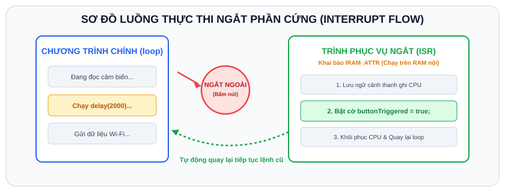
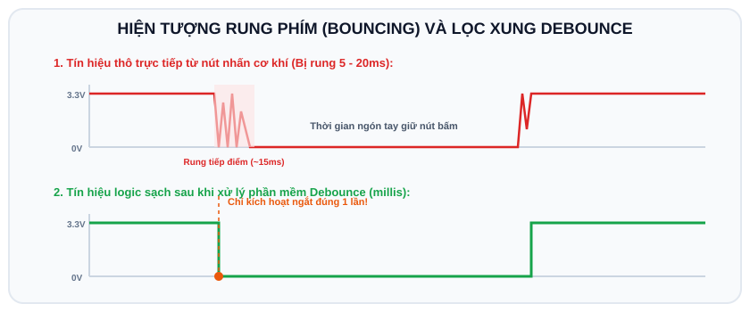

# BÀI 03: NGẮT NGOÀI GPIO INTERRUPT VÀ KỸ THUẬT CHỐNG DỘI PHÍM

## 1. Khái Niệm Về Ngắt (Interrupt) vs Quét Tuần Tự (Polling)

<p align="center">
  
</p>

Trong các bài trước, chúng ta dùng phương pháp **Polling (Thăm dò)**: CPU liên tục chạy trong vòng lặp `loop()` để kiểm tra chân nút nhấn bằng `digitalRead()`. 

**Nhược điểm của Polling**:
- Nếu trong `loop()` có các hàm xử lý tốn thời gian (như đọc cảm biến, gửi dữ liệu Wi-Fi mất 2-3 giây) hoặc các hàm `delay()`, người dùng bấm nút sẽ **hoàn toàn không phản hồi** (bị nuốt phím).
- Gây lãng phí năng lượng CPU do phải liên tục chạy vòng lặp vô nghĩa.

**Giải pháp với Ngắt (Interrupt)**:
Ngắt là cơ chế phần cứng cho phép vi điều khiển tạm dừng ngay lập tức luồng chương trình chính khi phát hiện có sự kiện điện áp thay đổi trên chân GPIO, chuyển sang thực thi ngay một hàm đặc biệt gọi là **Hàm phục vụ ngắt (ISR - Interrupt Service Routine)**, sau đó quay lại chạy tiếp chương trình chính.

```
Luồng chương trình chính (loop)             Trình phục vụ ngắt (ISR)
───────────────────────────────             ────────────────────────
  Đang tính toán dữ liệu
  Đang chạy delay(2000)
       │
       ├──── [Người dùng nhấn nút!] ───────► Tạm ngắt dòng lệnh hiện tại
       │                                     Nhảy vào hàm ISR xử lý ngay
  (Bị tạm dừng)                              (Thời gian cực nhanh: ~vài micro-giây)
       │◄──────────────────────────────────── Kết thúc ISR, quay trở lại
  Tiếp tục chạy hết delay(2000)
```

---

## 2. Các Kiểu Kích Hoạt Ngắt Trên ESP32

Hàm đăng ký ngắt trong Arduino:
```cpp
attachInterrupt(digitalPinToInterrupt(PIN), ISR_Function, MODE);
```

Các chế độ `MODE`:
- `RISING`: Kích hoạt khi điện áp chuyển từ mức Thấp lên mức Cao (Cạnh lên: 0V -> 3.3V).
- `FALLING`: Kích hoạt khi điện áp chuyển từ mức Cao xuống mức Thấp (Cạnh xuống: 3.3V -> 0V - Dùng phổ biến với nút bấm `INPUT_PULLUP`).
- `CHANGE`: Kích hoạt ở cả 2 cạnh (khi vừa bấm hoặc vừa thả nút).
- `LOW`: Kích hoạt liên tục chừng nào điện áp còn ở mức 0V.

---

## 3. Các Quy Tắc Sống Còn Khi Viết Hàm Ngắt (ISR) Trên ESP32

1. **Thêm thuộc tính `IRAM_ATTR`**:
   ESP32 chứa code chương trình trên bộ nhớ Flash ngoài. Nếu hàm ngắt nằm trên Flash, việc nạp lệnh sẽ bị trễ. Gắn từ khóa `IRAM_ATTR` trước hàm giúp mã của hàm ngắt được nạp trực tiếp vào bộ nhớ RAM nội (Instruction RAM) tốc độ cao:
   ```cpp
   void IRAM_ATTR myInterruptHandler() { ... }
   ```
2. **Khai báo biến bằng từ khóa `volatile`**:
   Bất kỳ biến nào được chia sẻ giữa hàm ngắt `ISR` và chương trình chính `loop()` bắt buộc phải có từ khóa `volatile` để thông báo trình biên dịch không được tối ưu hóa biến vào thanh ghi tạm:
   ```cpp
   volatile bool buttonPressed = false;
   ```
3. **Hàm ISR phải cực kỳ ngắn gọn**:
   - **Tuyệt đối KHÔNG** dùng `delay()`, `Serial.print()`, hoặc các vòng lặp tính toán lâu trong ISR (sẽ gây lỗi Reset vi điều khiển do bộ đếm giám sát Watchdog Timer).
   - Chỉ nên gán biến cờ (flag), cập nhật mốc thời gian hoặc gửi tín hiệu, để phần xử lý nặng cho `loop()` thực hiện.

---

## 4. Hiện Tượng Rung Tiếp Điểm (Bouncing) Và Kỹ Thuật Chống Dội (Debounce)

<p align="center">
  
</p>

Khi bấm nút cơ khí, các lá kim loại đàn hồi va đập vào nhau nhiều lần trong khoảng 5ms - 20ms đầu tiên trước khi tiếp xúc hoàn toàn. Mắt người không thấy được, nhưng vi điều khiển cực nhanh nên sẽ bắt được hàng chục cạnh xung ngắt giả mạo, dẫn đến 1 lần bấm mà kích hoạt ngắt 10-20 lần!

```
Điện áp
3.3V ───┐     ┌─┐ ┌───┐ ┌────────── (Ổn định)
        │     │ │ │   │ │
  0V    └───┴─┘ └───┘ └───┴──────── (Rung tiếp điểm 5ms - 20ms)
```

**Thuật toán chống rung bằng phần mềm với `millis()`**:
Ghi lại thời điểm xảy ra ngắt gần nhất. Nếu ngắt mới xuất hiện cách ngắt cũ một khoảng thời gian nhỏ hơn ngưỡng quy định (ví dụ 200ms), ta coi đó là xung nhiễu rung và bỏ qua.

---

## 5. Mạch Thực Hành & Mã Nguồn Trên Wokwi

### 5.1 Sơ đồ nối dây
- Chân LED nối vào **GPIO 2**.
- Nút nhấn nối vào **GPIO 18** và chân **GND** (sử dụng trở kéo `INPUT_PULLUP`).

### 5.2 Mã nguồn hoàn chỉnh (`sketch.ino`)

```cpp
/*
 * BÀI 03: NGẮT NGOÀI VÀ CHỐNG DỘI PHÍM TRÊN ESP32
 * Nền tảng: Arduino IDE / Wokwi Simulator
 */

#define LED_PIN     2
#define BUTTON_PIN  18
#define DEBOUNCE_TIME_MS 200  // Khoảng thời gian chống rung phím (200 mili-giây)

// Biến cờ thông báo có sự kiện ngắt xảy ra (cần từ khóa volatile)
volatile bool buttonTriggered = false;

// Biến lưu mốc thời gian của lần ngắt hợp lệ gần nhất
volatile unsigned long lastDebounceTime = 0;

// Biến đếm số lần bấm nút
volatile int pressCounter = 0;

// Hàm phục vụ ngắt (ISR) đặt trên IRAM nội
void IRAM_ATTR handleButtonInterrupt() {
  unsigned long currentTime = millis();

  // Kiểm tra nếu thời gian giữa 2 lần kích hoạt ngắt lớn hơn 200ms
  if (currentTime - lastDebounceTime > DEBOUNCE_TIME_MS) {
    buttonTriggered = true;
    pressCounter++;
    lastDebounceTime = currentTime;
  }
}

void setup() {
  Serial.begin(115200);
  delay(500);

  Serial.println("[SYSTEM] Khoi tao he thong Ngat ngoai (Interrupt)...");

  pinMode(LED_PIN, OUTPUT);
  digitalWrite(LED_PIN, LOW);

  // Cấu hình chân nút bấm với trở kéo lên nội
  pinMode(BUTTON_PIN, INPUT_PULLUP);

  // Đăng ký ngắt ngoài với cạnh xuống FALLING (từ 3.3V xuống 0V khi bấm nút)
  attachInterrupt(digitalPinToInterrupt(BUTTON_PIN), handleButtonInterrupt, FALLING);

  Serial.println("[READY] He thong da san sang nhan tin hieu ngat!");
}

void loop() {
  // Kiểm tra cờ báo ngắt từ ISR
  if (buttonTriggered) {
    // Đặt lại cờ
    buttonTriggered = false;

    // Đảo trạng thái đèn LED
    int currentLed = digitalRead(LED_PIN);
    digitalWrite(LED_PIN, !currentLed);

    Serial.print("[INTERRUPT EVENT] Da bam nut! So lan bam: ");
    Serial.print(pressCounter);
    Serial.print(" | Trang thai LED: ");
    Serial.println(!currentLed ? "BAT" : "TAT");
  }

  // Giả lập một tác vụ tốn nhiều thời gian chạy ngầm trong loop
  // Dù vòng lặp có bận rộn, ngắt vẫn luôn bắt được nút bấm tức thì!
  delay(500);
}
```

---

## 6. Bài Tập Thực Hành

1. **Bài 1 (Cơ bản)**: Cấu hình 2 nút nhấn gắn vào GPIO 18 và GPIO 19 sử dụng ngắt. Nút 1 bấm để tăng số đếm counter, Nút 2 bấm để giảm số đếm counter. In giá trị counter ra Serial Monitor.
2. **Bài 2 (Nâng cao)**: Lập trình chức năng **Hẹn Giờ Tự Tắt (Auto-off Timer)**:
   - Khi bấm nút ngắt: Đèn LED bật sáng ngay lập tức.
   - Sau 5 giây, đèn LED sẽ tự động tắt mà hoàn toàn không dùng hàm `delay()` làm đơ chương trình (gợi ý: dùng hàm `millis()`).