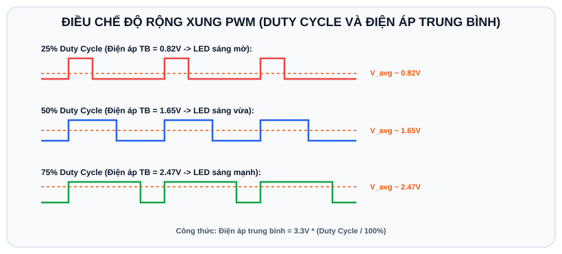
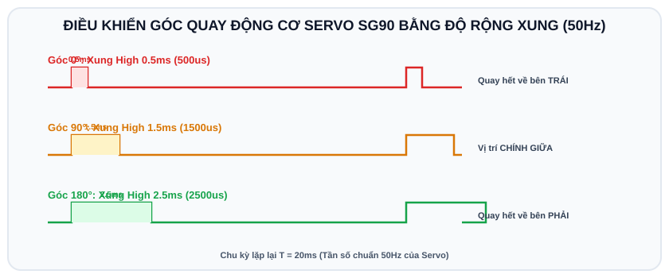

# BÀI 04: ĐIỀU CHẾ ĐỘ RỘNG XUNG (PWM) - ĐIỀU KHIỂN ĐỘ SÁNG LED VÀ ĐỘNG CƠ SERVO

## 1. Nguyên Lý Điều Chế Độ Rộng Xung (PWM - Pulse Width Modulation)

<p align="center">
  
</p>

Vi điều khiển là thiết bị số, nó chỉ có thể xuất ra điện áp 0V (LOW) hoặc 3.3V (HIGH). Để tạo ra mức điện áp "tương tự" (như 1V, 1.5V, 2.5V) để làm mờ đèn LED hoặc điều khiển tốc độ động cơ, người ta sử dụng kỹ thuật **PWM**.

PWM bật và tắt điện áp ở tần số cực cao. Mắt người hoặc động cơ sẽ chỉ cảm nhận được mức **điện áp trung bình**:

```
Chu kỳ T (Period) = Thời gian BẬT (T_on) + Thời gian TẮT (T_off)
Duty Cycle (%) = (T_on / T) * 100%
Điện áp trung bình = 3.3V * (Duty Cycle / 100)

 25% Duty:  ──┐   ┌───────┐   ┌─────── (Điện áp TB ~ 0.82V -> LED sáng mờ)
            └───┘       └───┘
 50% Duty:  ─────┐   ┌─────┐   ┌───── (Điện áp TB ~ 1.65V -> LED sáng vừa)
                 └───┘     └───┘
 75% Duty:  ───────┐ ┌───────┐ ┌───── (Điện áp TB ~ 2.47V -> LED sáng mạnh)
                   └─┘       └─┘
```

---

## 2. Hệ Thống PWM Trên ESP32 (LEDC Peripheral)

Trên board Arduino Uno cũ, ta chỉ dùng hàm `analogWrite()` ở các chân cố định. Nhưng trên ESP32:
- Tích hợp ngoại vi phần cứng mạnh mẽ tên là **LEDC (LED Control)**.
- Có **16 kênh PWM độc lập**.
- Có thể xuất xung PWM ra **bất kỳ chân GPIO nào** (nhờ ma trận chuyển mạch GPIO Matrix).
- Cho phép cấu hình linh hoạt:
  - **Tần số (Frequency)**: từ 1Hz đến hàng chục MHz.
  - **Độ phân giải (Resolution)**: từ 1-bit đến 16-bit. Thường dùng 8-bit (0 - 255) hoặc 10-bit (0 - 1023) hoặc 12-bit (0 - 4095).

---

## 3. Cú Pháp Điều Khiển PWM Trên ESP32 Arduino Core

> **Lưu ý quan trọng**: Từ phiên bản ESP32 Arduino Core v3.x mới nhất, Espressif đã đơn giản hóa cú pháp LEDC:
- Gắn chân GPIO vào tần số và độ phân giải:
  ```cpp
  ledcAttach(pin, frequency, resolution_bits);
  ```
- Xuất giá trị độ rộng xung (Duty cycle):
  ```cpp
  ledcWrite(pin, duty);
  ```

---

## 4. Ví Dụ Mẫu 1: Hiệu Ứng LED Thở (Breathing LED)

Chương trình điều khiển đèn LED tăng dần độ sáng từ tối nhất lên sáng nhất và ngược lại một cách êm ái.

### 4.1 Sơ đồ nối dây trên Wokwi
- Chân Anode (+) của LED nối vào **GPIO 2**.
- Chân Cathode (-) của LED nối qua trở 220 Ohm về **GND**.

### 4.2 Mã nguồn (`sketch.ino`)

```cpp
/*
 * BÀI 04 - PHẦN 1: HIỆU ỨNG LED THỞ VỚI PWM (LEDC)
 * Nền tảng: Arduino IDE / Wokwi Simulator
 */

#define LED_PIN     2
#define PWM_FREQ    5000  // Tần số 5 kHz (đảm bảo không bị rung mắt)
#define PWM_RES     8     // Độ phân giải 8-bit: Duty nhận giá trị từ 0 đến 255

void setup() {
  Serial.begin(115200);

  // Gắn chân LED_PIN với tần số 5000Hz và độ phân giải 8-bit
  ledcAttach(LED_PIN, PWM_FREQ, PWM_RES);

  Serial.println("[PWM] Da khoi tao PWM cho LED tai GPIO 2");
}

void loop() {
  // Sáng dần lên (Duty tăng từ 0 đến 255)
  for (int duty = 0; duty <= 255; duty++) {
    ledcWrite(LED_PIN, duty);
    delay(5); // Tốc độ biến thiên ánh sáng
  }

  // Tối dần đi (Duty giảm từ 255 về 0)
  for (int duty = 255; duty >= 0; duty--) {
    ledcWrite(LED_PIN, duty);
    delay(5);
  }

  delay(200); // Nghỉ 0.2s trước chu kỳ mới
}
```

---

## 5. Ví Dụ Mẫu 2: Điều Khiển Góc Động Cơ RC Servo (SG90)

<p align="center">
  
</p>

Động cơ Servo điều khiển góc quay từ $0^\circ$ đến $180^\circ$ dựa vào độ rộng xung phát ra trong chu kỳ 20ms (tần số chuẩn 50Hz):
- Xung **0.5ms** ($500\mu s$): Quay về góc $0^\circ$.
- Xung **1.5ms** ($1500\mu s$): Quay về góc $90^\circ$ (Chính giữa).
- Xung **2.5ms** ($2500\mu s$): Quay về góc $180^\circ$.

Trên môi trường Arduino và Wokwi, cách điều khiển Servo đơn giản và chuẩn xác nhất là sử dụng thư viện **`ESP32Servo`**.

### 5.1 Cài đặt thư viện trên Wokwi
Trong Wokwi, bấm vào tab **Library Manager** (hoặc mở file `libraries.txt`) và thêm dòng:
```text
ESP32Servo
```

### 5.2 Sơ đồ nối dây Servo trên Wokwi
- Thêm linh kiện **Servo** (`wokwi-servo`).
- Chân **PWM (Màu cam/vàng)** của Servo nối vào **GPIO 18** của ESP32.
- Chân **VCC (Màu đỏ)** nối vào chân nguồn **5V** (hoặc VIN) của ESP32.
- Chân **GND (Màu nâu/đen)** nối vào chân **GND** của ESP32.

### 5.3 Mã nguồn điều khiển Servo (`sketch.ino`)

```cpp
/*
 * BÀI 04 - PHẦN 2: ĐIỀU KHIỂN GÓC QUAY SERVO SG90
 * Thư viện: ESP32Servo
 */

#include <ESP32Servo.h>

#define SERVO_PIN 18

// Khởi tạo đối tượng Servo
Servo myServo;

void setup() {
  Serial.begin(115200);

  // Phân bổ bộ timer phần cứng cho Servo
  ESP32PWM::allocateTimer(0);
  myServo.setPeriodHertz(50); // Tần số chuẩn 50Hz của servo

  // Gắn chân GPIO 18 với giới hạn độ rộng xung từ 500us đến 2400us
  myServo.attach(SERVO_PIN, 500, 2400);

  Serial.println("[SERVO] He thong khoi dong thanh cong!");
}

void loop() {
  // Quay đến góc 0 độ
  Serial.println("[SERVO] Quay ve 0 do");
  myServo.write(0);
  delay(1500);

  // Quay đến góc 90 độ
  Serial.println("[SERVO] Quay ve 90 do");
  myServo.write(90);
  delay(1500);

  // Quay đến góc 180 độ
  Serial.println("[SERVO] Quay ve 180 do");
  myServo.write(180);
  delay(1500);

  // Quét góc mượt mà từ 180 độ về 0 độ
  Serial.println("[SERVO] Quet muot ma tu 180 ve 0 do...");
  for (int angle = 180; angle >= 0; angle -= 2) {
    myServo.write(angle);
    delay(20);
  }
  delay(1000);
}
```

---

## 6. Bài Tập Thực Hành

1. **Bài 1 (Cơ bản)**: Điều khiển LED RGB (gồm 3 chân Đỏ, Xanh lá, Xanh dương nối với 3 chân PWM GPIO 21, 22, 23). Viết hàm `setColor(int r, int g, int b)` với giá trị từ 0 - 255 để tạo ra các màu sắc tùy chọn (Vàng, Tím, Trắng...).
2. **Bài 2 (Nâng cao)**: Kết hợp Nút nhấn và Động cơ Servo mô phỏng **Cổng chắn Barie tự động**:
   - Mặc định thanh chắn hạ xuống ($0^\circ$).
   - Nhấn nút: Thanh chắn từ từ nâng lên $90^\circ$, giữ trong 5 giây cho xe đi qua, sau đó tự động hạ xuống lại vị trí $0^\circ$.