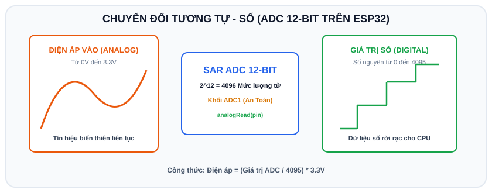

# BÀI 05: BỘ BIẾN ĐỔI TƯƠNG TỰ (ADC) VÀ XUẤT ĐIỆN ÁP (DAC) TRÊN ESP32

## 1. Khái Niệm Về Tín Hiệu Tương Tự (Analog) vs Số (Digital)

<p align="center">
  
</p>

- **Tín hiệu số (Digital)**: Chỉ tồn tại 2 trạng thái rời rạc là 0V (LOW) và 3.3V (HIGH).
- **Tín hiệu tương tự (Analog)**: Biến thiên liên tục trong một dải điện áp (từ 0V đến 3.3V). Các đại lượng tự nhiên như nhiệt độ, cường độ ánh sáng, âm thanh, áp suất đều là tín hiệu tương tự.

```
   Cảm biến (0V - 3.3V) ────► [ ADC (Analog to Digital) ] ────► Giá trị Số (0 - 4095) ──► ESP32
                                                                                           │
   Thiết bị phát âm thanh ◄── [ DAC (Digital to Analog) ] ◄──── Giá trị Số (0 - 255)  ◄───┘
```

---

## 2. Khối ADC (Analog to Digital Converter) Trên ESP32

ESP32 được trang bị bộ chuyển đổi ADC với độ phân giải mặc định lên tới **12-bit**:
$$2^{12} = 4096 	ext{ mức giá trị (từ 0 đến 4095)}$$

### 2.1 Cảnh Báo Sống Còn: Phân Biệt ADC1 và ADC2
- **Khối ADC1 (Gồm các chân: GPIO 32, 33, 34, 35, 36, 39)**:
  > **RẤT AN TOÀN**. Hoạt động độc lập trong mọi tình huống, kể cả khi bật Wi-Fi và Bluetooth. Hãy luôn luôn ưu tiên dùng các chân này để đọc cảm biến.
- **Khối ADC2 (Gồm các chân: GPIO 0, 2, 4, 12, 13, 14, 15, 25, 26, 27)**:
  > **CẢNH BÁO**: Bộ điều khiển ADC2 chia sẻ tài nguyên phần cứng với module **Wi-Fi**. Bất cứ khi nào Wi-Fi được kích hoạt (`WiFi.begin()`), **khối ADC2 sẽ bị vô hiệu hóa hoàn toàn**.

### 2.2 Công Thức Tính Điện Áp Thực Tế Từ Giá Trị ADC
$$	ext{Điện áp } (V) = rac{	ext{Giá trị ADC}}{4095} 	imes 3.3	ext{V}$$

---

## 3. Hướng Dẫn Giả Lập Mạch Biến Trở (Potentiometer) Trên Wokwi

Chiết áp/Biến trở là một điện trở có thể điều chỉnh giá trị bằng cách xoay núm vặn, tạo ra cầu phân áp ngõ ra từ 0V đến 3.3V.

### 3.1 Danh sách linh kiện
- 1 x Board ESP32 DevKit
- 1 x Biến trở xoay (Potentiometer - `wokwi-potentiometer`)
- 1 x Đèn LED + Điện trở 220 Ohm

### 3.2 Sơ đồ nối dây
1. **Biến trở**:
   - Chân **GND** nối vào chân **GND** của ESP32.
   - Chân **VCC** nối vào chân nguồn **3.3V** của ESP32.
   - Chân **SIG (ở giữa)** nối vào chân **GPIO 34** của ESP32 (thuộc khối ADC1 an toàn).
2. **Đèn LED**:
   - Nối chân Anode vào **GPIO 2**, Cathode qua trở 220 Ohm về **GND**.

### 3.3 Cấu hình `diagram.json` trên Wokwi
```json
{
  "version": 1,
  "author": "Advance_C_ESP32",
  "editor": "wokwi",
  "parts": [
    { "type": "board-esp32-devkit-c-v4", "id": "esp", "top": 0, "left": 0, "attrs": {} },
    { "type": "wokwi-potentiometer", "id": "pot1", "top": -80, "left": -100, "attrs": {} },
    { "type": "wokwi-led", "id": "led1", "top": -80, "left": 120, "attrs": { "color": "blue" } },
    { "type": "wokwi-resistor", "id": "r1", "top": -40, "left": 120, "attrs": { "value": "220" } }
  ],
  "connections": [
    [ "esp:TX", "$serialMonitor:RX", "", [] ],
    [ "esp:RX", "$serialMonitor:TX", "", [] ],
    [ "pot1:GND", "esp:GND.1", "black", [ "v0" ] ],
    [ "pot1:VCC", "esp:3V3", "red", [ "v0" ] ],
    [ "pot1:SIG", "esp:34", "gold", [ "v0" ] ],
    [ "esp:2", "led1:A", "green", [ "v0" ] ],
    [ "led1:C", "r1:1", "black", [ "v0" ] ],
    [ "r1:2", "esp:GND.2", "black", [ "v0" ] ]
  ],
  "dependencies": {}
}
```

---

## 4. Mã Nguồn Mẫu: Đọc Biến Trở Điều Khiển Độ Sáng LED

Chương trình đọc giá trị ADC từ 0 - 4095, tính ra điện áp thực tế và chuyển đổi tỉ lệ (Map) sang dải 8-bit (0 - 255) để điều khiển độ sáng LED qua PWM.

```cpp
/*
 * BÀI 05: ĐỌC ADC BIẾN TRỞ VÀ ĐIỀU CHỈNH ĐỘ SÁNG LED
 * Nền tảng: Arduino IDE / Wokwi Simulator
 */

#define POT_PIN   34  // Chân đọc cảm biến Analog (ADC1)
#define LED_PIN   2   // Chân xuất PWM ra đèn LED

void setup() {
  Serial.begin(115200);
  delay(500);

  // Cấu hình PWM cho LED với tần số 5000Hz, độ phân giải 8-bit
  ledcAttach(LED_PIN, 5000, 8);

  Serial.println("[ADC] He thong khoi dong thanh cong!");
}

void loop() {
  // 1. Đọc giá trị Analog thô (12-bit: từ 0 đến 4095)
  int adcValue = analogRead(POT_PIN);

  // 2. Tính toán điện áp quy đổi (0V - 3.3V)
  float voltage = (adcValue / 4095.0) * 3.3;

  // 3. Ánh xạ (Map) giá trị từ 0-4095 sang dải PWM 0-255
  int pwmDuty = map(adcValue, 0, 4095, 0, 255);

  // 4. Xuất xung PWM làm thay đổi độ sáng LED
  ledcWrite(LED_PIN, pwmDuty);

  // In thông số ra màn hình Serial Monitor
  Serial.print("[ADC RAW]: ");
  Serial.print(adcValue);
  Serial.print(" | [VOLTAGE]: ");
  Serial.print(voltage, 2);
  Serial.print(" V | [LED BRIGHTNESS]: ");
  Serial.println(pwmDuty);

  delay(200); // Đọc mẫu mỗi 200ms
}
```

---

## 5. Khối DAC (Digital to Analog Converter) Trên ESP32

Khác với các dòng chip rẻ tiền chỉ dùng PWM để giả lập Analog, ESP32 tích hợp sẵn **2 bộ chuyển đổi DAC 8-bit phần cứng thực thụ**:
- **DAC1**: Chân `GPIO 25`.
- **DAC2**: Chân `GPIO 26`.

Bộ DAC có độ phân giải 8-bit ($2^8 = 256$ mức: từ `0` đến `255`), chuyển đổi thành điện áp analog thực từ 0V đến 3.3V:
```cpp
// Xuất ra điện áp xấp xỉ 1.65V (chính giữa nguồn 3.3V)
dacWrite(25, 128);
```

Ứng dụng của DAC: Tạo sóng âm thanh phát ra loa, phát sóng sin, sóng tam giác cho các máy đo chức năng.

---

## 6. Bài Tập Thực Hành

1. **Bài 1 (Cơ bản)**: Thay thế biến trở bằng cảm biến quang trở **LDR** (Light Dependent Resistor) trên Wokwi (`wokwi-photoresistor-sensor`). Viết chương trình bật đèn LED khi trời tối (điện áp đọc về giảm dưới 1.5V) và tự động tắt đèn khi trời sáng.
2. **Bài 2 (Nâng cao)**: Lập trình **Bộ lọc trung bình động (Moving Average Filter)**: Lấy mẫu giá trị biến trở 10 lần liên tiếp để tính giá trị trung bình cộng. So sánh sự ổn định của kết quả đo trước và sau khi lọc nhiễu.