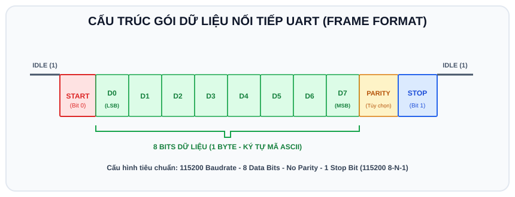

# BÀI 06: GIAO TIẾP NỐI TIẾP UART - SERIAL MONITOR VÀ ĐIỀU KHIỂN BẰNG TẬP LỆNH

## 1. Khái Niệm Về Giao Tiếp Nối Tiếp UART

UART (Universal Asynchronous Receiver-Transmitter) là chuẩn giao tiếp nối tiếp bất đồng bộ điểm - điểm. Dữ liệu được truyền tuần tự từng bit một qua 2 dây tín hiệu:
- **TX (Transmit)**: Chân truyền dữ liệu đi.
- **RX (Receive)**: Chân nhận dữ liệu đến.
- **GND (Ground)**: Dây nối đất chung để thống nhất mức điện áp tham chiếu.

```
   ESP32 (TX) ──────────────────────────────────► Thiết bị ngoài (RX)
   ESP32 (RX) ◄────────────────────────────────── Thiết bị ngoài (TX)
   ESP32 (GND) ───────────────────────────────── Thiết bị ngoài (GND)
```

<p align="center">
  
</p>

### Các thông số cơ bản:
- **Baudrate**: Tốc độ truyền (số bit trong 1 giây). Các tốc độ thông dụng: 9600, 115200 bps.
- **Data Frame**: Thường gồm 1 Start bit (mức 0), 8 bit dữ liệu, không kiểm tra chẵn lẻ (No Parity), và 1 Stop bit (mức 1).

---

## 2. Các Cổng HardwareSerial Trên ESP32

ESP32 có 3 bộ UART phần cứng:
- **Serial (UART0)**: Gắn trực tiếp với chip nạp USB sang máy tính qua GPIO 1 (TX) và GPIO 3 (RX). Đây là cổng dùng để nạp code và giao tiếp qua Serial Monitor.
- **Serial1 (UART1)**: Mặc định gắn vào các chân Flash nên hiếm khi dùng trực tiếp chân mặc định, nhưng có thể map tự do sang chân khác.
- **Serial2 (UART2)**: Cổng phần cứng tự do rất tiện lợi, mặc định tại chân `GPIO 17 (TX)` và `GPIO 16 (RX)`, thích hợp giao tiếp module SIM 4G, GPS, Bluetooth HC-05.

---

## 3. Kỹ Thuật Đọc Chuỗi Ký Tự Từ Serial Monitor

Khi người dùng gõ một dòng chữ trên máy tính và bấm gửi, các ký tự sẽ được lưu vào bộ đệm nhận (Rx Buffer) của ESP32.
Các hàm đọc dữ liệu:
- `Serial.available()`: Trả về số byte đang có sẵn trong bộ đệm chờ đọc.
- `Serial.read()`: Đọc 1 ký tự duy nhất (kiểu `char`).
- `Serial.readStringUntil('\n')`: Đọc toàn bộ chuỗi cho đến khi gặp ký tự xuống dòng `\n`.

---

## 4. Ví Dụ Mẫu: Hệ Thống Điều Khiển Thiết Bị Qua Tập Lệnh (Command Parser)

Chương trình nhận các lệnh dạng văn bản từ bàn phím qua Serial Monitor để điều khiển hệ thống:
- Gõ `"ON"` $\Rightarrow$ Bật đèn LED.
- Gõ `"OFF"` $\Rightarrow$ Tắt đèn LED.
- Gõ `"STATUS"` $\Rightarrow$ Báo cáo trạng thái hiện tại của LED và thời gian hoạt động của chip.
- Gõ các câu lệnh sai $\Rightarrow$ Báo lỗi và hướng dẫn cú pháp đúng.

### 4.1 Mã nguồn (`sketch.ino`)

```cpp
/*
 * BÀI 06: BỘ GIẢI MÃ LỆNH ĐIỀU KHIỂN QUA SERIAL MONITOR
 * Nền tảng: Arduino IDE / Wokwi Simulator
 */

#define LED_PIN 2

bool isLedOn = false;

void setup() {
  Serial.begin(115200);
  delay(500);

  pinMode(LED_PIN, OUTPUT);
  digitalWrite(LED_PIN, LOW);

  Serial.println("=================================================");
  Serial.println("   HE THONG DIEU KHIEN ESP32 QUA SERIAL MONITOR  ");
  Serial.println("=================================================");
  Serial.println("DANH SACH LENH:");
  Serial.println("  - 'ON'     : Bat den LED");
  Serial.println("  - 'OFF'    : Tat den LED");
  Serial.println("  - 'STATUS' : Kiem tra trang thai thiet bi");
  Serial.println("=================================================");
  Serial.print("Nhap lenh: ");
}

void loop() {
  // Kiểm tra xem máy tính có gửi dữ liệu đến không
  if (Serial.available() > 0) {
    // Đọc chuỗi cho đến khi gặp ký tự Enter (xuống dòng)
    String command = Serial.readStringUntil('\n');

    // Cắt bỏ khoảng trắng thừa hoặc ký tự \r ở cuối chuỗi
    command.trim();

    Serial.println(command); // In lại lệnh người dùng vừa gõ

    // Xử lý logic câu lệnh
    if (command.equalsIgnoreCase("ON")) {
      digitalWrite(LED_PIN, HIGH);
      isLedOn = true;
      Serial.println("[PHAN HOI]: Den LED da duoc BAT!");
    } 
    else if (command.equalsIgnoreCase("OFF")) {
      digitalWrite(LED_PIN, LOW);
      isLedOn = false;
      Serial.println("[PHAN HOI]: Den LED da duoc TAT!");
    } 
    else if (command.equalsIgnoreCase("STATUS")) {
      Serial.println("------ THONG SO HE THONG ------");
      Serial.print("Trang thai LED: ");
      Serial.println(isLedOn ? "DANG BAT" : "DANG TAT");
      Serial.print("Thoi gian hoat dong (Uptime): ");
      Serial.print(millis() / 1000);
      Serial.println(" giay");
      Serial.print("Bo nho Heap RAM trong: ");
      Serial.print(ESP.getFreeHeap());
      Serial.println(" bytes");
      Serial.println("--------------------------------");
    } 
    else {
      Serial.print("[LOI]: Khong hieu lenh '");
      Serial.print(command);
      Serial.println("'. Vui long dung: ON, OFF hoac STATUS.");
    }

    Serial.print("\nNhap lenh tiep theo: ");
  }
}
```

---

## 5. Hướng Dẫn Tương Tác Trên Wokwi
1. Nhấn nút **Play** để khởi động mô phỏng.
2. Nhìn vào cửa sổ **Serial Monitor** ở góc dưới màn hình Wokwi.
3. Click chuột vào thanh nhập văn bản ở đáy cửa sổ Serial Monitor, gõ chữ `ON` rồi bấm phím **Enter** $\Rightarrow$ Đèn LED trên mạch sẽ sáng lên tức thì.
4. Gõ chữ `STATUS` để xem ESP32 in ra các thống kê về bộ nhớ RAM và thời gian chạy.

---

## 6. Bài Tập Thực Hành

1. **Bài 1 (Cơ bản)**: Bổ sung câu lệnh `"BLINK"` vào chương trình: Khi nhận lệnh `"BLINK"`, đèn LED sẽ nhấp nháy 3 lần liên tiếp rồi trở về trạng thái ban đầu.
2. **Bài 2 (Nâng cao)**: Lập trình lệnh điều khiển góc động cơ Servo theo cú pháp:
   `"SERVO:<góc>"` (Ví dụ: người dùng gõ `SERVO:45`, `SERVO:120`, `SERVO:180`).
   Sử dụng hàm tách chuỗi `indexOf(':')` và `substring()` để trích xuất giá trị số và xoay Servo đến đúng góc yêu cầu.