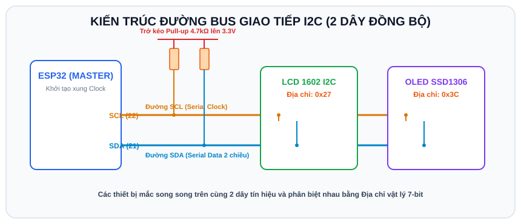

# BÀI 07: GIAO TIẾP I2C - MÀN HÌNH LCD 1602 VÀ OLED SSD1306

## 1. Khái Niệm Về Giao Thức Giao Tiếp I2C

<p align="center">
  
</p>

I2C (Inter-Integrated Circuit) là giao thức truyền thông nối tiếp 2 dây đồng bộ do Philips phát minh. Điểm đặc sắc nhất của I2C là **cho phép kết nối hàng chục linh kiện ngoại vi khác nhau chỉ với 2 chân tín hiệu duy nhất**:
- **SDA (Serial Data)**: Đường truyền tải dữ liệu nối tiếp 2 chiều.
- **SCL (Serial Clock)**: Đường phát xung nhịp đồng bộ từ thiết bị Master (ESP32).

```
   ESP32 (Master)
     SDA (GPIO 21) ────────┬──────────────┬──────────────► Đến các linh kiện khác
     SCL (GPIO 22) ──────┬─┼────────────┬─┼──────────────►
                         │ │            │ │
                 ┌───────┴─┴──────┐   ┌─┴─┴────────────┐
                 │  LCD 1602 I2C  │   │  OLED SSD1306  │
                 │ (Địa chỉ 0x27) │   │ (Địa chỉ 0x3C) │
                 └────────────────┘   └────────────────┘
```

Mỗi linh kiện I2C đều có một mã định danh **Địa chỉ vật lý 7-bit duy nhất** (ví dụ: màn hình LCD 1602 thường là `0x27` hoặc `0x3F`, màn hình OLED thường là `0x3C`). Khi ESP32 muốn nói chuyện với thiết bị nào, nó chỉ cần phát địa chỉ của thiết bị đó lên đường bus.

> **Chân I2C mặc định trên ESP32**:
> - **SDA**: Chân **GPIO 21**
> - **SCL**: Chân **GPIO 22**

---

## 2. Chương Trình Quét Địa Chỉ I2C (I2C Scanner)

Khi gắn một cảm biến hoặc màn hình mới mà không rõ địa chỉ là gì, hãy nạp đoạn code quét địa chỉ này:

```cpp
#include <Wire.h>

void setup() {
  Wire.begin(21, 22); // Khởi động I2C với chân SDA=21, SCL=22
  Serial.begin(115200);
  Serial.println("\n--- BAT DAU QUET DIA CHI I2C ---");

  for (byte address = 1; address < 127; address++) {
    Wire.beginTransmission(address);
    byte error = Wire.endTransmission();

    if (error == 0) {
      Serial.print("Tim thay thiet bi tai dia chi: 0x");
      if (address < 16) Serial.print("0");
      Serial.println(address, HEX);
    }
  }
  Serial.println("--- QUET HOAN TAT ---");
}

void loop() {}
```

---

## 3. Ứng Dụng 1: Hiển Thị Văn Bản Lên Màn Hình LCD 1602 I2C

Màn hình LCD 1602 hiển thị được 2 dòng chữ, mỗi dòng tối đa 16 ký tự.

### 3.1 Cài đặt thư viện trên Wokwi / Arduino IDE
Thêm thư viện: **`LiquidCrystal_I2C`**.

### 3.2 Sơ đồ nối dây LCD 1602 trên Wokwi
- Thêm linh kiện `wokwi-lcd1602`.
- Chân **GND** nối vào **GND** ESP32.
- Chân **VCC** nối vào **5V** (VIN) ESP32.
- Chân **SDA** nối vào **GPIO 21** ESP32.
- Chân **SCL** nối vào **GPIO 22** ESP32.

### 3.3 Mã nguồn mẫu LCD 1602

```cpp
/*
 * BÀI 07 - PHẦN 1: HIỂN THỊ DỮ LIỆU LÊN LCD 1602 I2C
 * Thư viện: LiquidCrystal_I2C
 */

#include <Wire.h>
#include <LiquidCrystal_I2C.h>

// Khởi tạo LCD với địa chỉ 0x27, 16 cột, 2 dòng
LiquidCrystal_I2C lcd(0x27, 16, 2);

int counter = 0;

void setup() {
  Serial.begin(115200);

  // Khởi tạo màn hình LCD
  lcd.init();
  lcd.backlight(); // Bật đèn nền màn hình

  // In dòng tiêu đề cố định ở dòng 0
  lcd.setCursor(0, 0); // Cột 0, Dòng 0
  lcd.print("ESP32 IOT LAB");
}

void loop() {
  // In biến đếm ở dòng 1
  lcd.setCursor(0, 1); // Cột 0, Dòng 1
  lcd.print("Count: ");
  lcd.print(counter);
  lcd.print(" s      "); // In thêm khoảng trắng để xóa ký tự cũ thừa

  counter++;
  delay(1000);
}
```

---

## 4. Ứng Dụng 2: Hiển Thị Đồ Họa Lên Màn Hình OLED 0.96 Inch SSD1306

Màn hình OLED SSD1306 có độ phân giải $128 	imes 64$ điểm ảnh (pixels), cho phép vẽ đồ thị, hiển thị các font chữ kích thước tùy chọn, icon pin, sóng Wi-Fi.

### 4.1 Cài đặt thư viện
Thêm 2 thư viện: **`Adafruit GFX Library`** và **`Adafruit SSD1306`**.

### 4.2 Sơ đồ nối dây OLED trên Wokwi
- Thêm linh kiện `wokwi-ssd1306`.
- Chân **VCC** nối nguồn **3.3V**.
- Chân **GND** nối **GND**.
- Chân **SDA** nối **GPIO 21**.
- Chân **SCL** nối **GPIO 22**.

### 4.3 Mã nguồn mẫu OLED SSD1306

```cpp
/*
 * BÀI 07 - PHẦN 2: HIỂN THỊ VĂN BẢN VÀ ĐỒ HỌA TRÊN OLED SSD1306
 * Thư viện: Adafruit_SSD1306, Adafruit_GFX
 */

#include <Wire.h>
#include <Adafruit_GFX.h>
#include <Adafruit_SSD1306.h>

#define SCREEN_WIDTH 128 // Chiều rộng pixel
#define SCREEN_HEIGHT 64 // Chiều cao pixel
#define OLED_RESET    -1 // Không dùng chân Reset riêng

Adafruit_SSD1306 display(SCREEN_WIDTH, SCREEN_HEIGHT, &Wire, OLED_RESET);

void setup() {
  Serial.begin(115200);

  // Khởi động OLED tại địa chỉ I2C 0x3C
  if (!display.begin(SSD1306_SWITCHCAPVCC, 0x3C)) {
    Serial.println("[LOI] Khong tim thay man hinh OLED!");
    for (;;); // Dừng lại nếu lỗi
  }

  // Xóa màn hình ban đầu
  display.clearDisplay();

  // Cấu hình chữ
  display.setTextSize(1);              // Cỡ chữ bình thường
  display.setTextColor(SSD1306_WHITE); // Màu trắng
  display.setCursor(10, 5);
  display.println("HE THONG IOT ESP32");

  // Vẽ 1 đường kẻ phân cách ngang
  display.drawLine(0, 18, 127, 18, SSD1306_WHITE);

  // Hiển thị chữ cỡ lớn
  display.setTextSize(2);
  display.setCursor(20, 28);
  display.println("READY!");

  // Vẽ khung hình chữ nhật trang trí
  display.drawRect(5, 23, 118, 28, SSD1306_WHITE);

  // Bắt buộc gọi display() để đẩy dữ liệu từ RAM ra màn hình hiển thị
  display.display();
}

void loop() {}
```

---

## 5. Bài Tập Thực Hành

1. **Bài 1 (Cơ bản)**: Kết hợp Nút bấm từ Bài 02 với màn hình LCD 1602: Mỗi lần bấm nút, giá trị số đếm trên LCD tăng lên 1 đơn vị.
2. **Bài 2 (Nâng cao)**: Kết hợp Biến trở từ Bài 05 với màn hình OLED SSD1306: Đọc giá trị điện áp từ biến trở và vẽ một **Thanh tiến trình đồ họa (Progress Bar)** hiển thị độ dài tương ứng từ 0% đến 100% bằng hàm `display.fillRect()`.