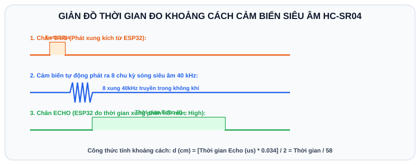

# BÀI 08: CẢM BIẾN MÔI TRƯỜNG - ĐỌC DHT22 VÀ CẢM BIẾN SIÊU ÂM HC-SR04

## 1. Cảm Biến Nhiệt Độ Và Độ Ẩm DHT11 / DHT22

Trong các dự án IoT thời tiết, nhà kính và điều hòa không khí, cảm biến dòng DHT là linh kiện thông dụng nhất:
- **DHT11**: Vỏ màu xanh dương, đo nhiệt độ $0^\circ	ext{C} - 50^\circ	ext{C}$ (sai số $\pm 2^\circ	ext{C}$), độ ẩm $20\% - 90\%$.
- **DHT22 (AM2302)**: Vỏ màu trắng, đo nhiệt độ $-40^\circ	ext{C} - 80^\circ	ext{C}$ (sai số $\pm 0.5^\circ	ext{C}$), độ ẩm $0\% - 100\%$. Độ chính xác cao hơn DHT11 rất nhiều.

### Nguyên lý giao tiếp 1-Wire của DHT:
DHT sử dụng giao thức truyền thông kỹ thuật số 1 dây (Single-bus):
ESP32 kéo chân tín hiệu xuống mức 0V trong khoảng 18ms để kích hoạt (Start Signal), sau đó cảm biến sẽ tự động phát lại chuỗi 40-bit dữ liệu chứa giá trị độ ẩm và nhiệt độ.

---

## 2. Cảm Biến Đo Khoảng Cách Siêu Âm HC-SR04

Cảm biến HC-SR04 dùng sóng siêu âm tần số 40 kHz để đo khoảng cách tới vật cản:
- **Chân Trig (Trigger)**: ESP32 phát 1 xung mức CAO (3.3V) dài ít nhất $10\mu s$ để kích cảm biến phát ra 8 chu kỳ sóng siêu âm.
- **Chân Echo**: Khi sóng siêu âm đập vào vật thể và phản xạ trở lại, chân Echo sẽ bật lên mức CAO. Bề rộng thời gian xung Echo ở mức CAO $(\Delta t)$ chính là thời gian sóng truyền đi và về.

```
                  ┌──────────────────────┐
                  │ Cảm biến HC-SR04    │
                  │   [Phát]     [Thu]   │
                  └─────┬──────────▲─────┘
                        │          │
         Sóng phát đi   │          │ Sóng phản xạ dội lại
                        ▼          │
                 ┌────────────────────────┐
                 │       VẬT CẢN          │
                 └────────────────────────┘
```

<p align="center">
  
</p>

### Công thức tính khoảng cách:
Vận tốc âm thanh trong không khí là xấp xỉ $340	ext{ m/s} = 0.034	ext{ cm/}\mu s$.
Vì sóng phải đi 2 chiều (tới vật và dội về), nên khoảng cách thực tế là:
$$	ext{Khoảng cách (cm)} = rac{	ext{Thời gian Echo } (\mu s) 	imes 0.034}{2} = rac{	ext{Thời gian Echo } (\mu s)}{58}$$

---

## 3. Mạch Thực Hành Kết Hợp Cảm Biến & LCD Trên Wokwi

Chúng ta sẽ xây dựng một **Trạm quan trắc nhỏ**: Đọc nhiệt độ, độ ẩm từ DHT22 và đo khoảng cách từ HC-SR04, hiển thị kết quả lên màn hình LCD 1602 I2C.

### 3.1 Danh sách linh kiện trên Wokwi
- 1 x Board ESP32
- 1 x Cảm biến DHT22 (`wokwi-dht22`)
- 1 x Cảm biến siêu âm HC-SR04 (`wokwi-hc-sr04`)
- 1 x Màn hình LCD 1602 I2C (`wokwi-lcd1602`)

### 3.2 Sơ đồ nối dây
1. **DHT22**:
   - VCC nối **3.3V**, GND nối **GND**.
   - SDA (Dữ liệu) nối vào chân **GPIO 15**.
2. **HC-SR04**:
   - VCC nối **5V**, GND nối **GND**.
   - TRIG nối vào **GPIO 13**.
   - ECHO nối vào **GPIO 12**.
3. **LCD 1602 I2C**:
   - VCC nối **5V**, GND nối **GND**.
   - SDA nối **GPIO 21**, SCL nối **GPIO 22**.

### 3.3 Khai báo thư viện cần thiết trong Wokwi
Thêm vào danh sách thư viện:
```text
LiquidCrystal_I2C
DHT sensor library
```

---

## 4. Mã Nguồn Hoàn Chỉnh (`sketch.ino`)

```cpp
/*
 * BÀI 08: ĐỌC CẢM BIẾN DHT22 VÀ HC-SR04 HIỂN THỊ LÊN LCD 1602
 * Nền tảng: Arduino IDE / Wokwi Simulator
 */

#include <Wire.h>
#include <LiquidCrystal_I2C.h>
#include "DHT.h"

// Định nghĩa chân cảm biến
#define DHT_PIN       15
#define DHT_TYPE      DHT22

#define TRIG_PIN      13
#define ECHO_PIN      12

// Khởi tạo các đối tượng điều khiển
LiquidCrystal_I2C lcd(0x27, 16, 2);
DHT dht(DHT_PIN, DHT_TYPE);

// Hàm đo khoảng cách từ cảm biến siêu âm (trả về cm)
float getDistanceCm() {
  // Phát xung Trigger 10 micro-giây
  digitalWrite(TRIG_PIN, LOW);
  delayMicroseconds(2);
  digitalWrite(TRIG_PIN, HIGH);
  delayMicroseconds(10);
  digitalWrite(TRIG_PIN, LOW);

  // Đọc thời gian xung Echo mức HIGH phản hồi về
  long duration = pulseIn(ECHO_PIN, HIGH, 30000); // Timeout 30ms

  if (duration == 0) {
    return -1.0; // Báo lỗi nếu quá tầm đo
  }

  // Tính khoảng cách theo công thức âm thanh
  return (duration * 0.034) / 2.0;
}

void setup() {
  Serial.begin(115200);

  // Cấu hình chân siêu âm
  pinMode(TRIG_PIN, OUTPUT);
  pinMode(ECHO_PIN, INPUT);

  // Khởi động màn hình LCD
  lcd.init();
  lcd.backlight();
  lcd.setCursor(0, 0);
  lcd.print("TRAM CAM BIEN");
  lcd.setCursor(0, 1);
  lcd.print("Dang khoi dong...");

  // Khởi động cảm biến DHT22
  dht.begin();
  delay(1500);
  lcd.clear();
}

void loop() {
  // 1. Đọc nhiệt độ và độ ẩm từ DHT22
  float humidity = dht.readHumidity();
  float temperature = dht.readTemperature();

  // 2. Đọc khoảng cách từ HC-SR04
  float distance = getDistanceCm();

  // Kiểm tra lỗi đọc DHT22
  if (isnan(humidity) || isnan(temperature)) {
    Serial.println("[LOI] Khong doc duoc du lieu tu DHT22!");
    lcd.setCursor(0, 0);
    lcd.print("Loi cam bien DHT!");
    delay(2000);
    return;
  }

  // In ra Serial Monitor
  Serial.print("Nhiet do: ");
  Serial.print(temperature);
  Serial.print(" C | Do am: ");
  Serial.print(humidity);
  Serial.print(" % | Khoang cach: ");
  Serial.print(distance);
  Serial.println(" cm");

  // Hiển thị lên màn hình LCD dòng 0: Nhiệt độ & Độ ẩm
  lcd.setCursor(0, 0);
  lcd.print("T:");
  lcd.print((int)temperature);
  lcd.print((char)223); // Ký tự độ tròn
  lcd.print("C  ");

  lcd.print("H:");
  lcd.print((int)humidity);
  lcd.print("%   ");

  // Hiển thị lên màn hình LCD dòng 1: Khoảng cách
  lcd.setCursor(0, 1);
  lcd.print("Dist: ");
  if (distance > 0) {
    lcd.print(distance, 1);
    lcd.print(" cm    ");
  } else {
    lcd.print("Out Range");
  }

  delay(1000); // DHT22 chỉ nên đọc mẫu mỗi 1-2 giây
}
```

---

## 5. Hướng Dẫn Tương Tác Cảm Biến Trên Wokwi
Khi bấm nút **Play** chạy mô phỏng:
1. **Thay đổi Nhiệt độ / Độ ẩm**: Dùng chuột click trực tiếp vào cảm biến DHT22 trên màn hình mạch điện. Một thanh trượt giả lập sẽ xuất hiện cho phép bạn kéo tăng/giảm nhiệt độ và độ ẩm tùy ý!
2. **Thay đổi Khoảng cách**: Click chuột vào cảm biến siêu âm HC-SR04. Một thước đo khoảng cách ảo sẽ mở ra cho bạn kéo thay đổi vị trí vật cản từ 2cm đến 400cm.
3. Quan sát màn hình LCD lập tức cập nhật thông số theo thời gian thực!

---

## 6. Bài Tập Thực Hành

1. **Bài 1 (Cơ bản)**: Lập trình tính năng cảnh báo nhiệt độ cao: Nếu nhiệt độ vượt quá $35^\circ	ext{C}$, bật đèn LED đỏ và xuất dòng chữ nhấp nháy `"CANH BAO NHIET!"` trên màn hình LCD.
2. **Bài 2 (Nâng cao)**: Thiết kế hệ thống **Cảm Biến Lùi Xe Ô Tô Thông Minh**:
   - Khoảng cách $> 50	ext{ cm}$: Đèn xanh sáng an toàn.
   - Khoảng cách từ $20	ext{ cm} - 50	ext{ cm}$: Đèn vàng sáng, còi Buzzer kêu ngắt quãng chậm.
   - Khoảng cách $< 20	ext{ cm}$: Đèn đỏ sáng, còi kêu liên tục cảnh báo nguy hiểm va chạm!