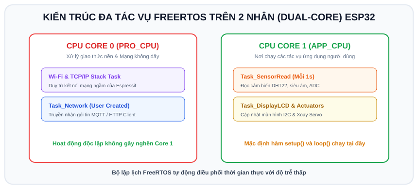

# BÀI 09: HỆ ĐIỀU HÀNH THỜI GIAN THỰC FREERTOS TRÊN ESP32 - TÁC VỤ VÀ ĐA NHÂN DUAL-CORE

## 1. Tại Sao Cần Hệ Điều Hành Thời Gian Thực (FreeRTOS)?

Trong cách lập trình vi điều khiển truyền thống (Bare-metal), toàn bộ chương trình chạy tuần tự bên trong hàm `loop()`:
```cpp
void loop() {
  docCamBien();   // Mất 2 giây
  guiDuLieuWifi(); // Mất 3 giây
  kiemTraNutNhan(); // Bị trễ đến 5 giây! Người dùng bấm nút không phản hồi!
}
```
Nếu có bất kỳ hàm nào chạy lâu hoặc dùng `delay()`, toàn bộ hệ thống sẽ bị "đóng băng".

**FreeRTOS (Real-Time Operating System)** giải quyết triệt để vấn đề này:
- Cho phép chia chương trình thành nhiều **Tác vụ độc lập (Tasks)**.
- Bộ điều phối (Scheduler) của FreeRTOS sẽ luân chuyển thực thi các tác vụ cực kỳ nhanh (mỗi vài mili-giây), tạo cảm giác các tác vụ đang chạy song song đồng thời.
- **ESP32 được tích hợp sẵn FreeRTOS ngay trong Arduino Core**, bạn không cần cài đặt thêm bất kỳ thư viện nào!

---

## 2. Khai Thác Sức Mạnh Vi Xử Lý 2 Nhân (Dual-Core) Của ESP32

<p align="center">
  
</p>

ESP32 sở hữu 2 lõi vi xử lý vật lý 32-bit:
- **Core 0 (PRO_CPU - Protocol CPU)**: Thường xử lý các tác vụ nền của hệ thống như Wi-Fi, Bluetooth stack.
- **Core 1 (APP_CPU - Application CPU)**: Mặc định là nơi hàm `setup()` và `loop()` của Arduino chạy.

Với FreeRTOS trên ESP32, ta có thể chỉ định chính xác một Task sẽ chạy trên Core 0 hay Core 1 bằng hàm:
```cpp
xTaskCreatePinnedToCore(
    TaskFunction,   // Tên hàm thực thi tác vụ
    "TaskName",     // Tên tác vụ (dùng khi gỡ lỗi)
    StackSize,      // Dung lượng ngăn xếp cấp cho Task (tính theo byte, ví dụ 2048 hoặc 4096)
    Parameters,     // Con trỏ tham số truyền vào (thường là NULL)
    Priority,       // Mức ưu tiên (từ 0 đến 24, số càng lớn ưu tiên càng cao)
    &TaskHandle,    // Con trỏ quản lý tác vụ (hoặc NULL)
    CoreId          // Nhân CPU thực thi: 0 hoặc 1
);
```

---

## 3. Thay Thế `delay()` Bằng `vTaskDelay()`

Trong FreeRTOS, **tuyệt đối không dùng `delay()`** bên trong các Task vì `delay()` bắt CPU phải chạy vòng lặp chờ vô ích.
Thay vào đó, hãy dùng:
```cpp
vTaskDelay(pdMS_TO_TICKS(1000)); // Nhường CPU cho Task khác trong 1000ms
```
Hàm này sẽ đưa Task hiện tại vào trạng thái "Ngủ" (Blocked), giải phóng 100% tài nguyên CPU để các Task khác thực thi.

---

## 4. Ví Dụ Mẫu: Chạy Đồng Thời 2 Task Trên 2 Nhân CPU Độc Lập

Chúng ta sẽ tạo:
- **Task 1 (Chạy trên Core 0)**: Nhấp nháy đèn LED liên tục mỗi 200ms với độ chính xác cao.
- **Task 2 (Chạy trên Core 1)**: Đọc cảm biến giả lập và in dữ liệu nặng ra Serial mỗi 2000ms mà **hoàn toàn không làm giật lag nhịp chớp của đèn LED**!

### 4.1 Mã nguồn (`sketch.ino`)

```cpp
/*
 * BÀI 09: ĐA TÁC VỤ VÀ ĐA NHÂN (FREERTOS DUAL-CORE) TRÊN ESP32
 * Nền tảng: Arduino IDE / Wokwi Simulator
 */

#define LED_PIN 2

// Khai báo hàm thực thi của 2 tác vụ
void TaskBlinkLED(void *pvParameters);
void TaskSensorRead(void *pvParameters);

void setup() {
  Serial.begin(115200);
  delay(500);

  Serial.println("=================================================");
  Serial.println("    KHOI TAO HE DIEU HANH FREERTOS DUAL-CORE     ");
  Serial.println("=================================================");

  // 1. Tạo Task 1 ghim vào Nhân 0 (Core 0)
  xTaskCreatePinnedToCore(
    TaskBlinkLED,       // Hàm thực thi
    "Blink_LED_Task",   // Tên task
    2048,               // Kích thước Stack (bytes)
    NULL,               // Tham số truyền vào
    1,                  // Mức ưu tiên (Priority 1)
    NULL,               // Task Handle
    0                   // Chạy trên Core 0
  );

  // 2. Tạo Task 2 ghim vào Nhân 1 (Core 1)
  xTaskCreatePinnedToCore(
    TaskSensorRead,     // Hàm thực thi
    "Sensor_Read_Task", // Tên task
    4096,               // Kích thước Stack (bytes)
    NULL,               // Tham số
    2,                  // Mức ưu tiên cao hơn (Priority 2)
    NULL,               // Task Handle
    1                   // Chạy trên Core 1
  );
}

// Tác vụ 1: Chớp tắt LED
void TaskBlinkLED(void *pvParameters) {
  pinMode(LED_PIN, OUTPUT);

  for (;;) { // Vòng lặp vĩnh cửu của Task (tương đương loop)
    digitalWrite(LED_PIN, HIGH);
    vTaskDelay(pdMS_TO_TICKS(200)); // Bật 200ms

    digitalWrite(LED_PIN, LOW);
    vTaskDelay(pdMS_TO_TICKS(200)); // Tắt 200ms
  }
}

// Tác vụ 2: Đọc cảm biến và in log
void TaskSensorRead(void *pvParameters) {
  int sampleCount = 0;

  for (;;) {
    sampleCount++;
    Serial.print("[TASK 2 - Core ");
    Serial.print(xPortGetCoreID()); // Lấy số hiệu nhân CPU đang chạy task này
    Serial.print("]: Mau du lieu thu ");
    Serial.print(sampleCount);
    Serial.println(" -> He thong dang hoat dong on dinh!");

    vTaskDelay(pdMS_TO_TICKS(2000)); // Lặp lại sau mỗi 2 giây
  }
}

void loop() {
  // Khi dùng FreeRTOS, hàm loop() có thể để trống hoặc dùng cho tác vụ khác
  vTaskDelete(NULL); // Xóa chính task loop() mặc định để tiết kiệm RAM
}
```

---

## 5. Hướng Dẫn Giả Lập Trên Wokwi
1. Nhấn nút **Play** trên Wokwi.
2. Bạn sẽ thấy đèn LED nhấp nháy cực kỳ nhanh và đều đặn (chu kỳ 400ms).
3. Serial Monitor in ra thông tin xác nhận rõ ràng: `Task 2` đang chạy độc lập trên **Core 1**, trong khi `Task 1` nhấp nháy đèn hoàn toàn trên **Core 0** mà không hề can thiệp lẫn nhau.

---

## 6. Bài Tập Thực Hành

1. **Bài 1 (Cơ bản)**: Tạo thêm **Task 3** chạy trên Core 1 có nhiệm vụ đọc liên tục nút nhấn (GPIO 18). Khi bấm nút, in ra dòng thông báo `"Nut nhan da duoc kich hoat tren Core 1!"`.
2. **Bài 2 (Nâng cao)**: Thiết lập giám sát mức tiêu thụ bộ nhớ Stack của Task bằng hàm `uxTaskGetStackHighWaterMark(NULL)`. In ra số byte Stack nhỏ nhất còn dư để đảm bảo Task không bị tràn bộ nhớ (Stack Overflow).