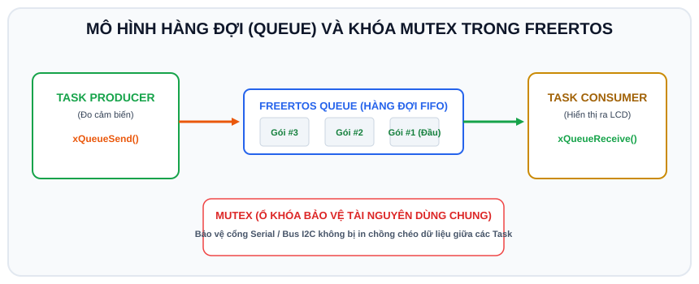

# BÀI 10: FREERTOS NÂNG CAO - ĐỒNG BỘ TASK VỚI HÀNG ĐỢI (QUEUE) VÀ MUTEX

## 1. Vấn Đề Tranh Chấp Tài Nguyên (Race Condition)

Khi nhiều Task cùng chạy song song và cùng truy cập vào một tài nguyên phần cứng chung (ví dụ: cùng in ra cổng Serial hoặc cùng giao tiếp qua bus I2C):
```
Task A: Đang in dòng chữ "NHIET DO: 30 C"
Task B: Chen ngang in dòng chữ "CANH BAO CHAY!"
==> Kết quả trên màn hình: "NHIET CANH BAOD DO: 3CHAY!0 C" (Dữ liệu bị vỡ vụn)
```

Để giải quyết vấn đề này, FreeRTOS cung cấp 2 công cụ cốt lõi:
1. **Mutex (Mutual Exclusion)**: Ổ khóa bảo vệ tài nguyên chia sẻ.
2. **Queue (Hàng đợi)**: Hộp thư truyền nhận dữ liệu an toàn giữa các Task theo cơ chế FIFO (First In, First Out).

---

## 2. Hàng Đợi (Queue) - Mô Hình Producer / Consumer

<p align="center">
  
</p>

```
[Task Thu Thập (Producer)] ──(Gửi dữ liệu)──► ┌───┬───┬───┐
                                              │ 3 │ 2 │ 1 │ (Queue FIFO)
[Task Hiển Thị (Consumer)] ◄──(Nhận dữ liệu)── └───┴───┴───┘
```
- **Task A (Producer)** đọc cảm biến, đóng gói dữ liệu vào Struct rồi gửi vào Queue bằng `xQueueSend()`.
- **Task B (Consumer)** đứng chờ ở đầu ra của Queue bằng `xQueueReceive()`. Khi có dữ liệu, Task B lập tức thức dậy lấy ra xử lý. Nếu Queue rỗng, Task B tự động chuyển sang chế độ ngủ, giải phóng 100% CPU.

---

## 3. Khóa Mutex - Bảo Vệ Vùng Găng (Critical Section)

Mutex giống như một chiếc chìa khóa phòng vệ sinh duy nhất:
- Task nào muốn in ra Serial thì phải "mượn chìa khóa" (`xSemaphoreTake`).
- Nếu chìa khóa đang có người giữ, Task đến sau bắt buộc phải xếp hàng chờ.
- Sau khi in xong, Task phải "trả lại chìa khóa" (`xSemaphoreGive`) cho người kế tiếp.

---

## 4. Ví Dụ Mẫu: Truyền Dữ Liệu Cảm Biến Giữa 2 Task Bằng Queue

Trong ví dụ này:
- Tạo một Struct chứa thông tin: Nhiệt độ, Độ ẩm và Mã số trạm.
- **TaskSensor**: Đóng gói dữ liệu và đẩy vào Queue.
- **TaskDisplay**: Nhận gói tin từ Queue và in ra màn hình có Mutex bảo vệ.

```cpp
/*
 * BÀI 10: TRUYỀN DỮ LIỆU BẰNG FREERTOS QUEUE VÀ MUTEX
 * Nền tảng: Arduino IDE / Wokwi Simulator
 */

// Định nghĩa cấu trúc dữ liệu truyền tin
struct SensorData {
  float temperature;
  float humidity;
  int stationId;
};

// Khai báo Handle quản lý Queue và Mutex
QueueHandle_t sensorQueue;
SemaphoreHandle_t serialMutex;

void TaskProducer(void *pvParameters);
void TaskConsumer(void *pvParameters);

void setup() {
  Serial.begin(115200);
  delay(500);

  // 1. Tạo hàng đợi chứa tối đa 5 phần tử kiểu struct SensorData
  sensorQueue = xQueueCreate(5, sizeof(struct SensorData));

  // 2. Tạo khóa Mutex bảo vệ cổng Serial
  serialMutex = xSemaphoreCreateMutex();

  if (sensorQueue != NULL && serialMutex != NULL) {
    // Tạo Task Producer (Gửi dữ liệu)
    xTaskCreate(TaskProducer, "Producer_Task", 2048, NULL, 1, NULL);

    // Tạo Task Consumer (Nhận dữ liệu)
    xTaskCreate(TaskConsumer, "Consumer_Task", 2048, NULL, 2, NULL);

    Serial.println("[SYSTEM] He thong Queue & Mutex da khoi tao thanh cong!");
  }
}

// Task Producer: Thu thập và đẩy vào hàng đợi
void TaskProducer(void *pvParameters) {
  struct SensorData data;
  data.stationId = 101;
  float fakeTemp = 25.0;

  for (;;) {
    fakeTemp += 0.5;
    if (fakeTemp > 40.0) fakeTemp = 25.0;

    data.temperature = fakeTemp;
    data.humidity = 65.0;

    // Gửi bản sao của 'data' vào Queue, chờ tối đa 100ms nếu Queue đầy
    if (xQueueSend(sensorQueue, &data, pdMS_TO_TICKS(100)) == pdPASS) {
      // Mượn khóa Serial để in thông báo
      if (xSemaphoreTake(serialMutex, pdMS_TO_TICKS(50)) == pdTRUE) {
        Serial.println("--> [PRODUCER]: Da gui goi tin moi vao Queue!");
        xSemaphoreGive(serialMutex); // Trả khóa
      }
    }

    vTaskDelay(pdMS_TO_TICKS(1500)); // Đo mỗi 1.5 giây
  }
}

// Task Consumer: Lấy dữ liệu ra xử lý
void TaskConsumer(void *pvParameters) {
  struct SensorData receivedData;

  for (;;) {
    // Chờ vô hạn (portMAX_DELAY) cho đến khi có dữ liệu rơi vào Queue
    if (xQueueReceive(sensorQueue, &receivedData, portMAX_DELAY) == pdPASS) {
      // Mượn khóa Serial để in báo cáo
      if (xSemaphoreTake(serialMutex, pdMS_TO_TICKS(50)) == pdTRUE) {
        Serial.println("==========================================");
        Serial.print("<-- [CONSUMER NHAN DU LIEU TRAM #");
        Serial.print(receivedData.stationId);
        Serial.println("]");
        Serial.print("    Nhiet do: ");
        Serial.print(receivedData.temperature, 1);
        Serial.println(" C");
        Serial.print("    Do am   : ");
        Serial.print(receivedData.humidity, 1);
        Serial.println(" %");
        Serial.println("==========================================");
        xSemaphoreGive(serialMutex); // Trả khóa
      }
    }
  }
}

void loop() {
  vTaskDelete(NULL);
}
```

---

## 5. Bài Tập Thực Hành

1. **Bài 1 (Cơ bản)**: Thêm nút nhấn bấm ngắt (từ Bài 03). Khi có sự kiện ngắt, gửi mã sự kiện `int eventId = 1;` từ hàm ISR vào Queue bằng hàm chuyên dụng `xQueueSendFromISR()`, để Task ngoài thức dậy bật tắt đèn LED.
2. **Bài 2 (Nâng cao)**: Tạo mô hình 2 trạm phát dữ liệu (Producer A và Producer B) cùng đẩy dữ liệu vào 1 Queue duy nhất, chứng minh tính toàn vẹn dữ liệu không bị xung đột nhờ cơ chế hàng đợi FreeRTOS.