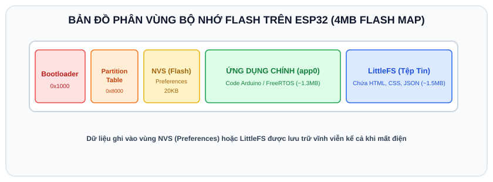

# BÀI 11: LƯU TRỮ DỮ LIỆU PHI KHẢ BIẾN - PREFERENCES (NVS) VÀ LITTLEFS

## 1. Khái Niệm Bộ Nhớ Khả Biến (RAM) vs Phi Khả Biến (Flash NVS)

<p align="center">
  
</p>

- **Bộ nhớ RAM (SRAM)**: Lưu trữ các biến thông thường trong code. Điểm hạn chế là **mất sạch dữ liệu khi mất điện hoặc khi vi điều khiển bị Reset**.
- **Bộ nhớ phi khả biến (Non-Volatile Storage - NVS)**: Lưu trữ dữ liệu trực tiếp lên chip nhớ Flash của ESP32. Dữ liệu **được bảo toàn vĩnh viễn** kể cả khi rút phích cắm điện.

Trong các dự án IoT thực tế, bộ nhớ phi khả biến được ứng dụng để:
- Lưu tên Wi-Fi (SSID) và Mật khẩu (Password) do người dùng cài đặt.
- Lưu trạng thái thiết bị (đèn đang bật hay tắt trước khi mất điện để khi có điện trở lại thì phục hồi trạng thái cũ).
- Đếm số giờ hoạt động của máy, lưu lịch sử cài đặt nhiệt độ phòng.

---

## 2. Thư Viện `Preferences` - Quản Lý Dữ Liệu Theo Dạng Key - Value

Trên ESP32, thư viện hiện đại và chuẩn mực nhất để lưu cấu hình là **`Preferences.h`** (thay thế cho thư viện `EEPROM.h` đã lỗi thời).

### Các hàm cốt lõi:
- `preferences.begin("my-app", false)`: Mở một phân vùng lưu trữ có tên (namespace). Tham số `false` nghĩa là cho phép Đọc & Ghi (Read/Write).
- `preferences.putInt("key", value)`: Ghi số nguyên `int`.
- `preferences.getInt("key", defaultValue)`: Đọc số nguyên. Nếu chưa có, trả về giá trị mặc định.
- `preferences.putString("ssid", "MyHomeWiFi")`: Ghi chuỗi văn bản.
- `preferences.getString("ssid", "")`: Đọc chuỗi văn bản.
- `preferences.end()`: Đóng phân vùng lưu trữ để giải phóng bộ nhớ.

---

## 3. Ví Dụ Mẫu: Bộ Đếm Số Lần Khởi Động & Ghi Nhớ Trạng Thái Đèn

Mỗi khi bạn bấm nút Reset trên ESP32 hoặc rút nguồn cắm lại, bộ đếm khởi động sẽ tự động tăng thêm 1 đơn vị và trạng thái đèn LED sẽ được phục hồi chính xác như trước khi tắt nguồn!

```cpp
/*
 * BÀI 11: LƯU TRỮ DỮ LIỆU VĨNH VIỄN VỚI THƯ VIỆN PREFERENCES
 * Nền tảng: Arduino IDE / Wokwi Simulator
 */

#include <Preferences.h>

#define LED_PIN    2
#define BUTTON_PIN 18

// Khởi tạo đối tượng Preferences
Preferences prefs;

int bootCount = 0;
bool ledStatus = false;
int lastBtn = HIGH;

void setup() {
  Serial.begin(115200);
  delay(500);

  pinMode(LED_PIN, OUTPUT);
  pinMode(BUTTON_PIN, INPUT_PULLUP);

  Serial.println("=================================================");
  Serial.println("       KIEM TRA BO NHO LUU TRU FLASH NVS         ");
  Serial.println("=================================================");

  // 1. Mở namespace "iot-settings" ở chế độ Read/Write (false)
  prefs.begin("iot-settings", false);

  // 2. Đọc số lần khởi động đã lưu trước đó (mặc định là 0 nếu lần đầu chạy)
  bootCount = prefs.getInt("boot_count", 0);
  bootCount++; // Tăng lên 1

  // Ghi giá trị mới vào Flash
  prefs.putInt("boot_count", bootCount);

  // 3. Đọc trạng thái đèn đã lưu từ lần trước
  ledStatus = prefs.getBool("led_state", false);
  digitalWrite(LED_PIN, ledStatus ? HIGH : LOW);

  // Đóng preferences
  prefs.end();

  Serial.print("[REPORT] So lan ESP32 da khoi dong: ");
  Serial.println(bootCount);
  Serial.print("[REPORT] Trang thai LED phuc hoi: ");
  Serial.println(ledStatus ? "DANG BAT" : "DANG TAT");
  Serial.println(">> Hay bam nut (GPIO 18) de doi trang thai LED");
  Serial.println(">> Sau do bam nut RESET tren board de kiem tra su luu tru!");
  Serial.println("=================================================");
}

void loop() {
  int currentBtn = digitalRead(BUTTON_PIN);

  // Khi nhấn nút: Đổi trạng thái LED và lưu ngay vào Flash
  if (lastBtn == HIGH && currentBtn == LOW) {
    ledStatus = !ledStatus;
    digitalWrite(LED_PIN, ledStatus ? HIGH : LOW);

    // Mở bộ nhớ và lưu trạng thái mới
    prefs.begin("iot-settings", false);
    prefs.putBool("led_state", ledStatus);
    prefs.end();

    Serial.print("[UPDATE] Da luu trang thai LED moi vao Flash: ");
    Serial.println(ledStatus ? "BAT" : "TAT");

    delay(50); // Chống rung phím
  }

  lastBtn = currentBtn;
  delay(10);
}
```

---

## 4. Hướng Dẫn Kiểm Tra Trên Wokwi
1. Nhấn nút **Play** trên Wokwi. Màn hình Serial sẽ hiện: `So lan ESP32 da khoi dong: 1`.
2. Bấm nút nhấn (GPIO 18) để bật đèn LED. Serial sẽ báo: `Da luu trang thai LED moi vao Flash: BAT`.
3. Bấm nút **Restart** (nút màu cam trên thanh điều khiển Wokwi) để khởi động lại chip ảo.
4. Quan sát: Đèn LED vẫn sáng ngay từ giây đầu tiên và `So lan ESP32 da khoi dong: 2`! Điều này chứng minh dữ liệu đã được ghi vĩnh viễn vào Flash ảo của Wokwi.

---

## 5. Giới Thiệu Hệ Thống Tệp Tin `LittleFS`

Khi bạn cần lưu trữ những dữ liệu lớn hơn nhiều dạng file (như trang Web HTML, file định dạng CSS, Javascript, file cấu hình JSON), ESP32 cung cấp hệ thống tệp tin **LittleFS** (thay thế SPIFFS cũ):
- Cho phép tạo, đọc, ghi, xóa file như một ổ đĩa USB thu nhỏ ngay trong chip Flash của ESP32:
```cpp
#include "LittleFS.h"

void demoLittleFS() {
  LittleFS.begin(true); // Tự động format nếu chưa có phân vùng
  File file = LittleFS.open("/config.json", "w");
  file.print("{\"device_name\":\"SmartLamp\"}");
  file.close();
}
```

---

## 6. Bài Tập Thực Hành

1. **Bài 1 (Cơ bản)**: Lập trình chức năng "Khôi phục cài đặt gốc" (Factory Reset): Nếu người dùng nhấn giữ nút bấm trong 5 giây lúc vừa bật nguồn, xóa sạch toàn bộ cấu hình đã lưu trong NVS bằng hàm `prefs.clear()`.
2. **Bài 2 (Nâng cao)**: Thiết kế tính năng ghi lại "Nhật ký hoạt động" (Event Log): Lưu mốc thời gian của 5 lần bấm nút gần nhất vào bộ nhớ Flash và in ra danh sách khi khởi động.