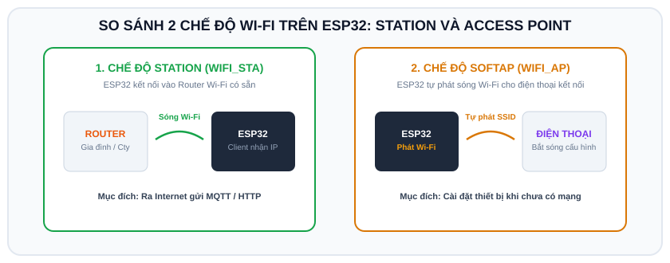

# BÀI 12: MẠNG KHÔNG DÂY WI-FI - CHẾ ĐỘ STATION, ACCESS POINT VÀ GIẢ LẬP TRÊN WOKWI

## 1. Khái Niệm Mạng Wi-Fi Trên ESP32

<p align="center">
  
</p>

Khả năng kết nối Wi-Fi chính là tính năng mạnh mẽ nhất biến ESP32 thành "Vua của các dòng vi điều khiển IoT". Thư viện tiêu chuẩn **`WiFi.h`** tích hợp sẵn trong Arduino Core cho phép ESP32 hoạt động ở 3 chế độ:

```
1. Chế độ STATION (STA)           2. Chế độ ACCESS POINT (AP)
┌──────────┐                     ┌──────────┐
│  Router  │ ◄──(Sóng Wi-Fi)───  │  ESP32   │ ──(Tự phát Wi-Fi)──► Điện thoại / Laptop
│ Gia đình │       ESP32         │ (SoftAP) │                      kết nối trực tiếp
└──────────┘                     └──────────┘
```

1. **Station Mode (WIFI_STA)**: ESP32 đóng vai trò là một máy trạm (Client) kết nối vào Router Wi-Fi nhà bạn để lấy địa chỉ IP cục bộ và truy cập Internet.
2. **Access Point Mode (WIFI_AP)**: ESP32 tự đóng vai trò như một điểm phát Wi-Fi mini (tự phát tên SSID và mật khẩu riêng). Điện thoại có thể bắt sóng này để truy cập trang cài đặt mà không cần Internet.
3. **Chế độ kết hợp (WIFI_AP_STA)**: Vừa phát Wi-Fi nội bộ vừa kết nối vào Router bên ngoài.

---

## 2. Tính Năng Giả Lập Wi-Fi Thật Độc Đáo Trên Wokwi (`Wokwi-GUEST`)

Một trong những tính năng kỳ diệu nhất của giả lập **Wokwi** là: **ESP32 ảo trên trình duyệt có thể kết nối Internet thật 100%!**

Để kết nối Wi-Fi trên Wokwi, bạn chỉ cần dùng cấu hình cố định sau:
- **Tên Wi-Fi (SSID)**: `"Wokwi-GUEST"`
- **Mật khẩu (Password)**: `""` (Để trống, không có mật khẩu)

Khi kết nối vào mạng ảo này, Wokwi sẽ cấp cho ESP32 một địa chỉ IP thật và thông tuyến Internet để ESP32 có thể gửi nhận HTTP, MQTT ra ngoài đời thực!

---

## 3. Ví Dụ 1: Quét Các Mạng Wi-Fi Xung Quanh (Wi-Fi Scanner)

Chương trình quét môi trường xung quanh và in ra danh sách các sóng Wi-Fi phát hiện được kèm theo cường độ tín hiệu (RSSI - tính theo dBm).

```cpp
/*
 * BÀI 12 - PHẦN 1: QUÉT SÓNG WI-FI XUNG QUANH
 * Nền tảng: Arduino IDE / Mạch thật ESP32
 */

#include <WiFi.h>

void setup() {
  Serial.begin(115200);
  delay(500);

  // Đặt Wi-Fi sang chế độ Station và ngắt kết nối cũ
  WiFi.mode(WIFI_STA);
  WiFi.disconnect();
  delay(100);

  Serial.println("[WIFI] Bat dau quet mang Wi-Fi...");

  // Hàm quét trả về số lượng mạng tìm thấy
  int n = WiFi.scanNetworks();
  Serial.println("[WIFI] Quet hoan tat!");

  if (n == 0) {
    Serial.println("Khong tim thay mang nao.");
  } else {
    Serial.print("Tim thay ");
    Serial.print(n);
    Serial.println(" mang Wi-Fi xung quanh:");
    Serial.println("---------------------------------------------");
    Serial.printf("%-4s | %-25s | %-6s | %s\n", "STT", "Ten Wi-Fi (SSID)", "RSSI", "Bao Mat");
    Serial.println("---------------------------------------------");

    for (int i = 0; i < n; ++i) {
      Serial.printf("%-4d | %-25.25s | %4d dBm | %s\n", 
                    i + 1, 
                    WiFi.SSID(i).c_str(), 
                    WiFi.RSSI(i), 
                    (WiFi.encryptionType(i) == WIFI_AUTH_OPEN) ? "Mo" : "Co Mat Khau");
    }
    Serial.println("---------------------------------------------");
  }
}

void loop() {}
```

---

## 4. Ví Dụ 2: Kết Nối Wi-Fi Chế Độ Station (Chạy Chuẩn Cả Trên Mạch Thật & Wokwi)

```cpp
/*
 * BÀI 12 - PHẦN 2: KẾT NỐI WI-FI STATION VÀ LẤY ĐỊA CHỈ IP
 * Nền tảng: Arduino IDE / Wokwi Simulator
 */

#include <WiFi.h>

// Cấu hình mạng Wi-Fi
// NẾU CHẠY TRÊN WOKWI: Giữ nguyên "Wokwi-GUEST" và mật khẩu rỗng ""
// NẾU CHẠY TRÊN MẠCH THẬT: Thay bằng tên Wi-Fi và mật khẩu nhà bạn
const char* ssid = "Wokwi-GUEST";
const char* password = "";

#define LED_WIFI_STATUS 2 // Đèn báo trạng thái kết nối

void setup() {
  Serial.begin(115200);
  delay(500);

  pinMode(LED_WIFI_STATUS, OUTPUT);
  digitalWrite(LED_WIFI_STATUS, LOW); // Tắt đèn khi chưa có mạng

  Serial.println("=================================================");
  Serial.print("Dang ket noi den mang Wi-Fi: ");
  Serial.println(ssid);

  // 1. Chuyển sang chế độ Station
  WiFi.mode(WIFI_STA);

  // 2. Bắt đầu kết nối
  WiFi.begin(ssid, password);

  // 3. Vòng lặp chờ cho đến khi kết nối thành công (WiFi.status() == WL_CONNECTED)
  int retryCount = 0;
  while (WiFi.status() != WL_CONNECTED) {
    delay(500);
    Serial.print(".");
    // Chớp tắt đèn báo hiệu đang kết nối
    digitalWrite(LED_WIFI_STATUS, !digitalRead(LED_WIFI_STATUS));
    
    retryCount++;
    if (retryCount > 40) { // Quá 20 giây không nối được
      Serial.println("\n[LOI] Ket noi Wi-Fi that bai! Vui long kiem tra lai pass.");
      return;
    }
  }

  // Kết nối thành công -> Sáng đèn cố định
  digitalWrite(LED_WIFI_STATUS, HIGH);

  Serial.println("\n=================================================");
  Serial.println("[THANH CONG] ESP32 da ket noi vao mang Wi-Fi!");
  Serial.print("[THONG TIN] Dia chi IP cuc bo: ");
  Serial.println(WiFi.localIP()); // In địa chỉ IP được cấp phát
  Serial.print("[THONG TIN] Dia chi MAC cua chip: ");
  Serial.println(WiFi.macAddress());
  Serial.print("[THONG TIN] Cuong do tin hieu (RSSI): ");
  Serial.print(WiFi.RSSI());
  Serial.println(" dBm");
  Serial.println("=================================================");
}

void loop() {
  // Duy trì kiểm tra trạng thái mạng
  if (WiFi.status() == WL_CONNECTED) {
    // Kết nối vẫn đang tốt
    delay(5000);
  } else {
    Serial.println("[CANH BAO] Mat ket noi Wi-Fi! Dang thu ket noi lai...");
    digitalWrite(LED_WIFI_STATUS, LOW);
    WiFi.reconnect();
    delay(5000);
  }
}
```

---

## 5. Ví Dụ 3: Chế Độ Soft Access Point (Tự Phát Sóng Wi-Fi)

Khi cần người dùng kết nối điện thoại vào cấu hình mà nhà chưa có Wi-Fi:
```cpp
#include <WiFi.h>

void setup() {
  Serial.begin(115200);

  // Phát sóng Wi-Fi tên "ESP32_CONFIG", mật khẩu "12345678"
  WiFi.softAP("ESP32_CONFIG", "12345678");

  Serial.print("Da phat Wi-Fi AP! Dia chi IP cua ESP32 la: ");
  Serial.println(WiFi.softAPIP()); // Mặc định là 192.168.4.1
}

void loop() {}
```

---

## 6. Bài Tập Thực Hành

1. **Bài 1 (Cơ bản)**: Nạp code Bài 12 trên Wokwi, kiểm tra xem địa chỉ IP ảo mà Wokwi cấp phát cho ESP32 là bao nhiêu.
2. **Bài 2 (Nâng cao)**: Lập trình tính năng **Tự động chuyển chế độ (Smart Config Fallback)**:
   - Ban đầu thử kết nối Wi-Fi gia đình trong 15 giây.
   - Nếu kết nối thất bại (do mất mạng hoặc sai mật khẩu), ESP32 sẽ tự động chuyển sang chế độ **SoftAP** phát sóng Wi-Fi tên `"ESP32_SOS_SETUP"` để người dùng dùng điện thoại truy cập kiểm tra lỗi.