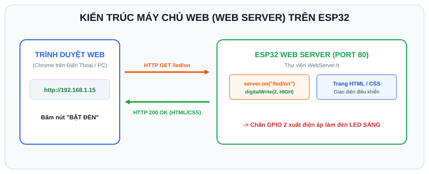

# BÀI 13: XÂY DỰNG WEB SERVER TRÊN ESP32 - ĐIỀU KHIỂN THIẾT BỊ QUA TRÌNH DUYỆT

## 1. Khái Niệm Về Web Server Trong Hệ Thống Nhúng IoT

<p align="center">
  
</p>

Một trong những ứng dụng phổ biến nhất của ESP32 là biến chính nó thành một **Máy chủ Web (Web Server)** mini:
- Bất kỳ thiết bị nào cùng mạng Wi-Fi (điện thoại thông minh, máy tính bảng, laptop) chỉ cần mở trình duyệt web (Chrome, Safari, Edge) và gõ địa chỉ IP của ESP32.
- ESP32 sẽ phản hồi lại một giao diện đồ họa gồm nút bấm, thanh trượt, biểu đồ nhiệt độ.
- Người dùng bấm nút trên màn hình điện thoại $\Rightarrow$ Trình duyệt gửi lệnh HTTP về ESP32 $\Rightarrow$ ESP32 bật tắt đèn hoặc mở cửa rơ-le ngay lập tức mà không cần cài đặt thêm bất kỳ ứng dụng (App) nào!

```
 ┌───────────────────────┐
 │ Điện thoại / Laptop   │
 │ Mở Chrome: 192.168.x.x│
 └───────────┬───────────┘
             │ HTTP Request (GET /led/on)
             ▼
 ┌───────────────────────┐
 │ ESP32 Web Server      │ ──► Bật chân GPIO 2 (LED SÁNG)
 │ (Thư viện WebServer.h)│ ◄── Phản hồi trang Web HTML xác nhận
 └───────────────────────┘
```

---

## 2. Thư Viện `WebServer.h` Trên ESP32 Arduino Core

Thư viện `WebServer.h` cung cấp cơ chế định tuyến (Routing) rất trực quan:
- `server.on("/", handleRoot)`: Khi người dùng truy cập trang chủ, gọi hàm `handleRoot` để gửi mã HTML.
- `server.on("/led/on", handleLedOn)`: Khi người dùng bấm nút Bật LED.
- `server.on("/led/off", handleLedOff)`: Khi người dùng bấm nút Tắt LED.
- `server.begin()`: Bắt đầu lắng nghe các kết nối ở cổng mặc định 80.
- `server.handleClient()`: Đặt trong vòng lặp để tiếp nhận và phục vụ các yêu cầu từ trình duyệt.

---

## 3. Thiết Kế Giao Diện Web Đẹp Mắt Với CSS Hiện Đại

Chúng ta sử dụng tính năng **Raw String Literal** trong C++ (`R"rawliteral(...)rawliteral"`) để nhúng trực tiếp toàn bộ mã HTML, CSS và JavaScript vào code mà không bị lỗi dấu ngoặc kép:

```html
<!DOCTYPE html>
<html>
<head>
  <meta name="viewport" content="width=device-width, initial-scale=1">
  <title>ESP32 SMART HOME</title>
  <style>
    body { font-family: Arial; text-align: center; background: #121212; color: #fff; padding: 20px; }
    .btn { padding: 15px 30px; font-size: 18px; border: none; border-radius: 8px; cursor: pointer; text-decoration: none; display: inline-block; margin: 10px; }
    .btn-on { background: #00e676; color: #000; font-weight: bold; }
    .btn-off { background: #ff1744; color: #fff; font-weight: bold; }
  </style>
</head>
<body>
  <h2>ESP32 DIEU KHIEN THIET BI</h2>
  <a href="/led/on" class="btn btn-on">BAT DEN</a>
  <a href="/led/off" class="btn btn-off">TAT DEN</a>
</body>
</html>
```

---

## 4. Mã Nguồn Hoàn Chỉnh (`sketch.ino`)

```cpp
/*
 * BÀI 13: XÂY DỰNG WEB SERVER ĐIỀU KHIỂN THIẾT BỊ QUA WI-FI
 * Nền tảng: Arduino IDE / Wokwi Simulator
 */

#include <WiFi.h>
#include <WebServer.h>

#define LED_PIN 2

// Cấu hình Wi-Fi (Giữ Wokwi-GUEST nếu chạy trên Wokwi)
const char* ssid = "Wokwi-GUEST";
const char* password = "";

// Khởi tạo Web Server lắng nghe tại cổng chuẩn 80
WebServer server(80);

bool ledState = false;

// Hàm tạo trang HTML giao diện người dùng
String getHTMLPage() {
  String html = "<!DOCTYPE html><html><head>";
  html += "<meta name='viewport' content='width=device-width, initial-scale=1'>";
  html += "<meta charset='UTF-8'>";
  html += "<title>ESP32 Web Server</title>";
  html += "<style>";
  html += "body { font-family: 'Segoe UI', sans-serif; text-align: center; background: #0f172a; color: #f8fafc; margin-top: 50px; }";
  html += ".card { background: #1e293b; max-width: 400px; margin: auto; padding: 30px; border-radius: 16px; box-shadow: 0 10px 25px rgba(0,0,0,0.5); }";
  html += "h1 { color: #38bdf8; font-size: 24px; margin-bottom: 20px; }";
  html += ".status { font-size: 20px; margin: 20px 0; font-weight: bold; }";
  html += ".btn { display: block; width: 80%; margin: 15px auto; padding: 15px; font-size: 18px; border-radius: 8px; text-decoration: none; transition: 0.3s; }";
  html += ".btn-on { background: #22c55e; color: white; }";
  html += ".btn-off { background: #ef4444; color: white; }";
  html += ".btn:hover { opacity: 0.85; }";
  html += "</style></head><body>";
  html += "<div class='card'>";
  html += "<h1>ESP32 SMART HOME</h1>";
  html += "<div class='status'>TRANG THAI DEN: <span style='color: " + String(ledState ? "#22c55e" : "#ef4444") + ";'>";
  html += (ledState ? "DANG BAT" : "DANG TAT");
  html += "</span></div>";
  html += "<a href='/led/on' class='btn btn-on'>BAT DEN</a>";
  html += "<a href='/led/off' class='btn btn-off'>TAT DEN</a>";
  html += "</div></body></html>";
  return html;
}

// Xử lý khi truy cập trang chủ ("/")
void handleRoot() {
  server.send(200, "text/html", getHTMLPage());
}

// Xử lý khi bấm nút "Bật Đèn" ("/led/on")
void handleLedOn() {
  ledState = true;
  digitalWrite(LED_PIN, HIGH);
  Serial.println("[WEB] Yeu cau: BAT DEN");
  // Chuyển hướng người dùng quay lại trang chủ để cập nhật giao diện
  server.sendHeader("Location", "/");
  server.send(303);
}

// Xử lý khi bấm nút "Tắt Đèn" ("/led/off")
void handleLedOff() {
  ledState = false;
  digitalWrite(LED_PIN, LOW);
  Serial.println("[WEB] Yeu cau: TAT DEN");
  server.sendHeader("Location", "/");
  server.send(303);
}

// Xử lý khi đường dẫn không tồn tại (Lỗi 404)
void handleNotFound() {
  server.send(404, "text/plain", "404: Trang khong ton tai!");
}

void setup() {
  Serial.begin(115200);
  delay(500);

  pinMode(LED_PIN, OUTPUT);
  digitalWrite(LED_PIN, LOW);

  Serial.println("[WIFI] Dang ket noi...");
  WiFi.begin(ssid, password);
  while (WiFi.status() != WL_CONNECTED) {
    delay(500);
    Serial.print(".");
  }

  Serial.println("\n[WIFI] Ket noi thanh cong!");
  Serial.print("[WEB SERVER] Hay mo trinh duyet va truy cap dia chi: http://");
  Serial.println(WiFi.localIP());

  // Đăng ký các hàm định tuyến đường dẫn
  server.on("/", handleRoot);
  server.on("/led/on", handleLedOn);
  server.on("/led/off", handleLedOff);
  server.onNotFound(handleNotFound);

  // Khởi động Web Server
  server.begin();
  Serial.println("[WEB SERVER] May chu HTTP da san sang phuc vu!");
}

void loop() {
  // Lắng nghe và xử lý các yêu cầu từ trình duyệt gửi đến
  server.handleClient();
  delay(2);
}
```

---

## 5. Hướng Dẫn Trải Nghiệm Web Server Trên Mạch Thật & Wokwi

1. **Trên Mạch Thật (ESP32 DevKit)**:
   - Nạp code vào ESP32. Mở Serial Monitor, ghi lại địa chỉ IP (ví dụ: `192.168.1.15`).
   - Đảm bảo điện thoại và ESP32 đang bắt chung 1 mạng Wi-Fi gia đình.
   - Mở Safari/Chrome trên điện thoại, gõ `http://192.168.1.15` và bấm nút điều khiển đèn LED!

2. **Trên Wokwi Simulator**:
   - Khi chạy trên Wokwi, Wokwi hỗ trợ giao tiếp qua **Wokwi IoT Gateway**.
   - Đối với tài khoản Wokwi Club, hệ thống sẽ cấp cho bạn một đường link Web công khai dạng `https://*.wokwi.net` để truy cập trực tiếp từ trình duyệt ngoài.

---

## 6. Bài Tập Thực Hành

1. **Bài 1 (Cơ bản)**: Thêm một thiết bị thứ hai (ví dụ Quạt làm mát gắn tại GPIO 18). Bổ sung 2 nút bấm trên giao diện Web: `BẬT QUẠT` và `TẮT QUẠT`.
2. **Bài 2 (Nâng cao)**: Tích hợp đọc cảm biến DHT22 (từ Bài 08): Cứ mỗi khi người dùng tải lại trang Web hoặc dùng JavaScript Ajax (`setInterval`), cập nhật thông số Nhiệt độ và Độ ẩm hiển thị trên thẻ Card mà không cần tải lại toàn bộ trang.