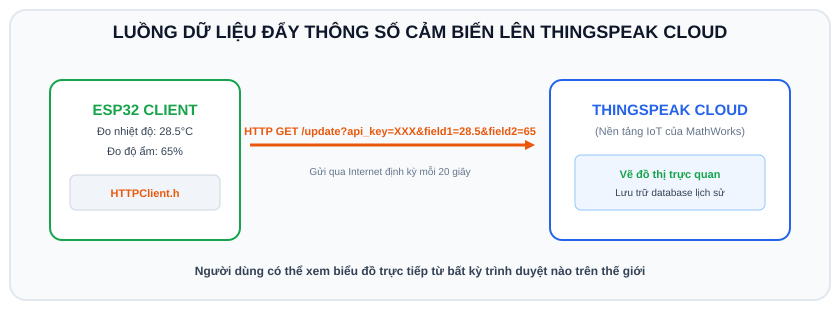

# BÀI 14: LẬP TRÌNH HTTP CLIENT - GỬI DỮ LIỆU LÊN THINGSPEAK VÀ WEBHOOK

## 1. Khái Niệm Về HTTP Client Trong IoT

<p align="center">
  
</p>

Trong bài trước, ESP32 đóng vai trò là **Server** (chờ người khác gửi yêu cầu tới).
Trong bài này, ESP32 sẽ đóng vai trò là **Client (Khách)**:
- Tự động chủ động đóng gói dữ liệu cảm biến đo được thành một yêu cầu HTTP (GET hoặc POST).
- Gửi lên các nền tảng máy chủ đám mây (Cloud Platform) qua Internet để vẽ đồ thị thống kê, lưu trữ cơ sở dữ liệu dài hạn hoặc kích hoạt gửi tin nhắn cảnh báo về điện thoại.

```
 ┌──────────────────────┐                     ┌───────────────────────────┐
 │ Cảm biến đo được:    │  HTTP GET / POST    │ Nền tảng IoT Cloud        │
 │ Nhiệt độ = 31.5 C    │ ──────────────────► │ (ThingSpeak / Webhook)    │
 │ ESP32 (HTTP Client)  │                     │ Vẽ biểu đồ & Báo động SMS │
 └──────────────────────┘                     └───────────────────────────┘
```

---

## 2. Giới Thiệu Nền Tảng IoT Cloud ThingSpeak

**ThingSpeak** (`https://thingspeak.com`) là nền tảng đám mây IoT miễn phí hàng đầu thế giới do MathWorks phát triển:
- Cho phép tạo các Kênh (Channel) lưu trữ dữ liệu thời gian thực.
- Tự động vẽ biểu đồ trực quan (nhiệt độ theo giờ, độ ẩm theo ngày).
- Cung cấp sẵn hàm API HTTP cực kỳ đơn giản để đẩy dữ liệu lên:
```text
GET https://api.thingspeak.com/update?api_key=YOUR_API_KEY&field1=31.5&field2=70.2
```

### Các bước tạo Channel trên ThingSpeak:
1. Truy cập `https://thingspeak.com`, đăng ký một tài khoản miễn phí.
2. Vào mục **Channels -> My Channels -> New Channel**.
3. Đặt tên Channel: `ESP32 Weather Station`.
4. Bật:
   - `Field 1`: Đặt tên là `Temperature`
   - `Field 2`: Đặt tên là `Humidity`
5. Bấm **Save Channel**.
6. Chuyển sang tab **API Keys**, sao chép dòng **Write API Key** (một chuỗi gồm 16 ký tự).

---

## 3. Thư Viện `HTTPClient.h` Trên ESP32

Để thực hiện gửi yêu cầu HTTP từ ESP32:
```cpp
#include <HTTPClient.h>

HTTPClient http;
http.begin("http://api.thingspeak.com/update?api_key=XXX&field1=30"); // Khởi tạo kết nối URL
int httpCode = http.GET(); // Thực hiện lệnh gửi HTTP GET

if (httpCode > 0) {
  // Máy chủ phản hồi thành công (mã 200 OK)
  String payload = http.getString();
  Serial.println(payload);
}
http.end(); // Đóng kết nối giải phóng bộ nhớ
```

---

## 4. Mã Nguồn Hoàn Chỉnh: Đẩy Dữ Liệu Lên ThingSpeak (Chạy Tốt Cả Trên Wokwi)

ESP32 trên Wokwi kết nối qua mạng `Wokwi-GUEST` có sẵn kết nối Internet thật, do đó hoàn toàn có thể bắn dữ liệu thật lên tài khoản ThingSpeak của bạn!

```cpp
/*
 * BÀI 14: ESP32 HTTP CLIENT ĐẨY DỮ LIỆU LÊN THINGSPEAK CLOUD
 * Nền tảng: Arduino IDE / Wokwi Simulator
 */

#include <WiFi.h>
#include <HTTPClient.h>

// Thông tin Wi-Fi
const char* ssid = "Wokwi-GUEST";
const char* password = "";

// Cấu hình ThingSpeak
// THAY BẰNG WRITE API KEY THẬT CỦA BẠN TỪ THINGSPEAK
const char* apiKey = "YOUR_WRITE_API_KEY";
const char* serverName = "http://api.thingspeak.com/update";

// Chu kỳ gửi dữ liệu (ThingSpeak bản miễn phí yêu cầu cách nhau tối thiểu 15 giây)
const unsigned long sendInterval = 20000; // 20 giây
unsigned long lastTime = 0;

void setup() {
  Serial.begin(115200);
  delay(500);

  Serial.println("[SYSTEM] Khoi tao he thong...");
  WiFi.begin(ssid, password);

  Serial.print("[WIFI] Dang ket noi den Internet");
  while (WiFi.status() != WL_CONNECTED) {
    delay(500);
    Serial.print(".");
  }

  Serial.println("\n[WIFI] Da thong tuyen Internet thanh cong!");
  Serial.println("[READY] San sang truyen du lieu len ThingSpeak Cloud!");
}

void loop() {
  // Kiểm tra chu kỳ 20 giây một lần
  if ((millis() - lastTime) > sendInterval) {
    lastTime = millis();

    // Kiểm tra kết nối Wi-Fi còn duy trì không
    if (WiFi.status() == WL_CONNECTED) {
      HTTPClient http;

      // Tạo dữ liệu cảm biến ngẫu nhiên (hoặc đọc từ DHT22 thật)
      float fakeTemp = 26.5 + (random(-20, 20) / 10.0);
      float fakeHumi = 60.0 + (random(-50, 50) / 10.0);

      // Tạo chuỗi URL hoàn chỉnh chứa các tham số Query
      String url = String(serverName) + "?api_key=" + apiKey + 
                   "&field1=" + String(fakeTemp, 1) + 
                   "&field2=" + String(fakeHumi, 1);

      Serial.println("\n[HTTP] Dang gui yeu cau den ThingSpeak...");
      Serial.println("[URL]: " + url);

      // Bắt đầu phiên HTTP
      http.begin(url);

      // Gửi yêu cầu HTTP GET
      int httpResponseCode = http.GET();

      if (httpResponseCode > 0) {
        Serial.print("[HTTP SUCCESS] Ma phan hoi tu Server: ");
        Serial.println(httpResponseCode);

        String response = http.getString();
        Serial.print("[THINGSPEAK ENTRY ID]: ");
        Serial.println(response); // Trả về số thứ tự của bản ghi vừa thêm
      } else {
        Serial.print("[HTTP ERROR] Gui that bai! Ma loi: ");
        Serial.println(httpResponseCode);
      }

      // Đóng kết nối
      http.end();
    } else {
      Serial.println("[CANH BAO] Mat ket noi Wi-Fi!");
    }
  }
}
```

---

## 5. Mở Rộng: Gửi Cảnh Báo Khẩn Cấp Về Telegram Qua Webhook

Bên cạnh ThingSpeak, ta có thể dùng HTTP Client gửi một gói tin `HTTP POST` với định dạng JSON đến dịch vụ Webhook (như Telegram Bot API) để gửi tin nhắn thẳng về điện thoại người dùng khi có sự cố:

```cpp
// Cú pháp gửi tin nhắn Telegram Bot từ ESP32
String telegramUrl = "https://api.telegram.org/bot<TOKEN>/sendMessage?chat_id=<CHAT_ID>&text=CANH_BAO_CHAY!";
http.begin(telegramUrl);
http.GET();
http.end();
```

---

## 6. Bài Tập Thực Hành

1. **Bài 1 (Cơ bản)**: Đăng ký một tài khoản ThingSpeak cá nhân, tạo Channel với 2 trường Nhiệt độ và Độ ẩm. Chạy code Bài 14 trên Wokwi, quan sát biểu đồ trên trang web ThingSpeak tự động vẽ đường cong dữ liệu theo thời gian thực.
2. **Bài 2 (Nâng cao)**: Kết hợp Nút nhấn ngắt ngoài: Khi có người nhấn nút bấm khẩn cấp trên ESP32, lập tức gửi một yêu cầu HTTP POST cảnh báo lên Webhook để kích hoạt gửi thông báo về ứng dụng điện thoại.