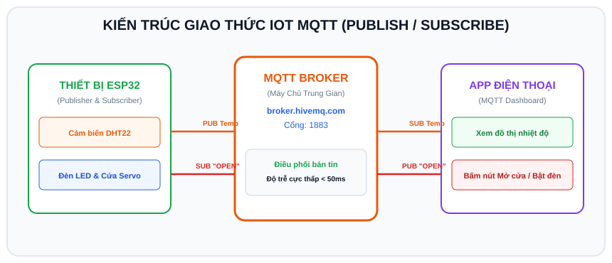

# BÀI 15: GIAO THỨC IOT MQTT VÀ KẾT NỐI CLOUD MQTT BROKER

## 1. Tại Sao Giao Thức MQTT Là Tiêu Chuẩn Vàng Của IoT?

<p align="center">
  
</p>

Trong bài trước, chúng ta dùng giao thức HTTP. Tuy nhiên, HTTP bộc lộ những nhược điểm lớn trong các hệ thống IoT:
- **Tiêu tốn băng thông lớn**: Mỗi yêu cầu HTTP gửi kèm hàng trăm byte Header dư thừa.
- **Không hỗ trợ Push thời gian thực từ Cloud xuống thiết bị**: Khi bạn muốn bấm nút trên điện thoại để bật đèn nhà, ESP32 nếu dùng HTTP sẽ phải liên tục gửi request thăm dò (Polling) mỗi giây, gây hao pin và nghẽn mạng.

**MQTT (Message Queuing Telemetry Transport)** ra đời để khắc phục toàn bộ nhược điểm này:
- Cực kỳ nhẹ (Header chỉ vỏn vẹn **2 byte**).
- Hoạt động theo mô hình **Xuất bản / Đăng ký (Publish / Subscribe)**.
- **Độ trễ cực thấp (< 50ms)**: Bấm nút trên điện thoại là đèn bật gần như ngay lập tức!

```
 ┌──────────────────────┐                               ┌──────────────────────┐
 │ Cảm biến ESP32       │                               │ Điện thoại / App IoT │
 │ (Publisher)          │                               │ (Subscriber)         │
 └──────────┬───────────┘                               └──────────▲───────────┘
            │                                                      │
            │ Publish: "home/temp" (30 C)                          │ Nhận tin nhắn
            ▼                                                      │
 ┌─────────────────────────────────────────────────────────────────┴───────────┐
 │                           MQTT BROKER (Máy Chủ Trung Gian)                  │
 │                      (broker.hivemq.com / broker.emqx.io)                   │
 └─────────────────────────────────────────────────────────────────────────────┘
```

### Các thuật ngữ cốt lõi trong MQTT:
- **MQTT Broker**: Máy chủ trung tâm đóng vai trò điều phối thư viện tin nhắn.
- **Publisher (Người gửi)**: Thiết bị phát một gói tin lên một chủ đề xác định.
- **Subscriber (Người nhận)**: Thiết bị đăng ký lắng nghe một chủ đề. Khi có tin mới, Broker lập tức đẩy thẳng về thiết bị.
- **Topic (Chủ đề)**: Đường dẫn phân cấp để phân loại tin nhắn, ví dụ:
  - `myhome/livingroom/temperature`
  - `myhome/livingroom/led`

---

## 2. Thư Viện `PubSubClient` Trên Arduino IDE & Wokwi

Thư viện MQTT phổ biến nhất trong cộng đồng Arduino là **`PubSubClient`**.
Trong Wokwi, chỉ cần thêm dòng sau vào tab `libraries.txt`:
```text
PubSubClient
```

---

## 3. Mã Nguồn Mẫu: Điều Khiển 2 Chiều Giữa ESP32 Và MQTT Cloud

Trong ví dụ này, ESP32 sẽ:
1. **Publish**: Định kỳ mỗi 5 giây gửi giá trị nhiệt độ lên Topic: `esp32_iot_lab/sensor`.
2. **Subscribe**: Đăng ký lắng nghe Topic: `esp32_iot_lab/control`.
   - Nếu nhận chuỗi `"1"` $\Rightarrow$ Bật đèn LED.
   - Nếu nhận chuỗi `"0"` $\Rightarrow$ Tắt đèn LED.

```cpp
/*
 * BÀI 15: GIAO TIẾP MQTT HAI CHIỀU VỚI CLOUD BROKER
 * Nền tảng: Arduino IDE / Wokwi Simulator
 * Thư viện: PubSubClient
 */

#include <WiFi.h>
#include <PubSubClient.h>

#define LED_PIN 2

// Cấu hình Wi-Fi
const char* ssid = "Wokwi-GUEST";
const char* password = "";

// Địa chỉ máy chủ MQTT Broker công cộng miễn phí
const char* mqtt_server = "broker.hivemq.com";
const int   mqtt_port   = 1883;

// Các Topic trao đổi dữ liệu (Nên đổi chuỗi tiền tố để không trùng với người khác)
const char* topic_publish   = "khoahoc_esp32/phongkhach/nhietdo";
const char* topic_subscribe = "khoahoc_esp32/phongkhach/denled";

WiFiClient espClient;
PubSubClient client(espClient);

unsigned long lastMsg = 0;

// Hàm Callback: Tự động kích hoạt khi có tin nhắn mới gửi từ Broker về thiết bị
void mqttCallback(char* topic, byte* payload, unsigned int length) {
  Serial.print("\n[MQTT NHAN DU LIEU] Tu Topic: ");
  Serial.println(topic);

  // Chuyển đổi payload byte sang chuỗi String
  String message = "";
  for (int i = 0; i < length; i++) {
    message += (char)payload[i];
  }
  Serial.print("[NOI DUNG]: ");
  Serial.println(message);

  // Điều khiển thiết bị dựa trên nội dung nhận được
  if (message == "1" || message.equalsIgnoreCase("ON")) {
    digitalWrite(LED_PIN, HIGH);
    Serial.println("--> DA BAT DEN LED!");
  } else if (message == "0" || message.equalsIgnoreCase("OFF")) {
    digitalWrite(LED_PIN, LOW);
    Serial.println("--> DA TAT DEN LED!");
  }
}

// Hàm kết nối lại MQTT Broker nếu bị rớt mạng
void reconnect() {
  while (!client.connected()) {
    Serial.print("[MQTT] Dang ket noi den Broker...");
    
    // Tạo một Client ID ngẫu nhiên duy nhất
    String clientId = "ESP32Client-" + String(random(0xffff), HEX);

    if (client.connect(clientId.c_str())) {
      Serial.println(" THANH CONG!");
      // Đăng ký nhận tin nhắn từ Topic điều khiển
      client.subscribe(topic_subscribe);
      Serial.print("[MQTT] Da dang ky lang nghe Topic: ");
      Serial.println(topic_subscribe);
    } else {
      Serial.print(" That bai, ma loi rc=");
      Serial.print(client.state());
      Serial.println(". Thu lai sau 3 giay...");
      delay(3000);
    }
  }
}

void setup() {
  Serial.begin(115200);
  delay(500);

  pinMode(LED_PIN, OUTPUT);
  digitalWrite(LED_PIN, LOW);

  // 1. Kết nối Wi-Fi
  Serial.print("[WIFI] Dang ket noi");
  WiFi.begin(ssid, password);
  while (WiFi.status() != WL_CONNECTED) {
    delay(500);
    Serial.print(".");
  }
  Serial.println("\n[WIFI] Da ket noi!");

  // 2. Cấu hình máy chủ MQTT
  client.setServer(mqtt_server, mqtt_port);
  client.setCallback(mqttCallback); // Đăng ký hàm xử lý khi có tin nhắn đến
}

void loop() {
  // Duy trì kết nối MQTT
  if (!client.connected()) {
    reconnect();
  }
  // Bắt buộc gọi hàm loop() của MQTT để giữ liên lạc với Broker
  client.loop();

  // Định kỳ mỗi 5 giây gửi một gói tin nhiệt độ lên Cloud
  unsigned long now = millis();
  if (now - lastMsg > 5000) {
    lastMsg = now;

    float fakeTemp = 28.0 + (random(0, 50) / 10.0);
    char tempString[8];
    dtostrf(fakeTemp, 1, 2, tempString);

    Serial.print("[MQTT GUI] Publish nhiet do: ");
    Serial.println(tempString);

    // Xuất bản dữ liệu lên topic
    client.publish(topic_publish, tempString);
  }
}
```

---

## 4. Hướng Dẫn Kiểm Tra Gửi Nhận Trực Tuyến Bằng HiveMQ Web Client

Bạn có thể dùng chính máy tính hoặc điện thoại của mình để điều khiển ESP32 ảo trên Wokwi:
1. Mở trình duyệt trên máy tính, truy cập trang công cụ kiểm thử MQTT miễn phí:
   `http://www.hivemq.com/demos/websocket-client/`
2. Bấm nút **Connect**.
3. Tại mục **Subscriptions**: Bấm **Add New Topic Subscription**, nhập:
   `khoahoc_esp32/phongkhach/nhietdo` $\Rightarrow$ Bạn sẽ thấy nhiệt độ từ ESP32 trên Wokwi bắn về màn hình web liên tục mỗi 5 giây!
4. Tại mục **Publish**:
   - Topic: `khoahoc_esp32/phongkhach/denled`
   - Message: Nhập số `1` rồi bấm **Publish** $\Rightarrow$ Đèn LED trên mạch Wokwi sáng lên ngay lập tức!
   - Nhập số `0` rồi bấm **Publish** $\Rightarrow$ Đèn LED tắt!

---

## 5. Bài Tập Thực Hành

1. **Bài 1 (Cơ bản)**: Nạp chạy code Bài 15 trên Wokwi, dùng HiveMQ Web Client để bật tắt đèn LED và theo dõi nhiệt độ.
2. **Bài 2 (Nâng cao)**: Đóng gói dữ liệu nhiệt độ, độ ẩm và cường độ ánh sáng thành một chuỗi **JSON** chuẩn:
   `{"temp": 29.5, "humi": 70, "light": 850}`
   trước khi gửi lên MQTT Broker bằng thư viện `ArduinoJson`.