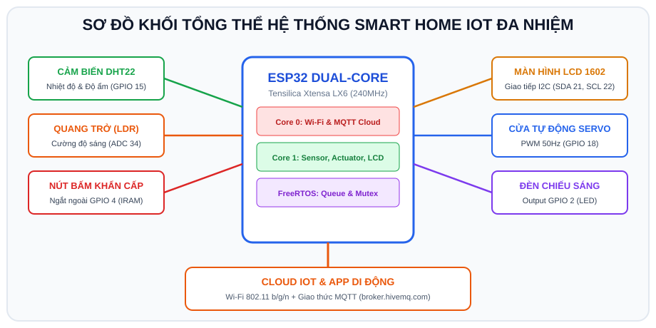

# BÀI 16: ĐỒ ÁN TỔNG KẾT - HỆ THỐNG SMART HOME IOT ĐA NHIỆM TRÊN WOKWI

## 1. Giới Thiệu Đồ Án Tổng Kết Khóa Học

<p align="center">
  
</p>

Đồ án tổng kết là một hệ thống **Nhà Thông Minh & Giám Sát Môi Trường Đa Nhiệm (Smart Home IoT)** kết hợp toàn bộ kiến thức đã tích lũy từ Buổi 01 đến Buổi 15:
- **Kiến trúc phần mềm**: Đa nhiệm thời gian thực với **FreeRTOS** chạy trên 2 nhân vi xử lý.
- **Ngoại vi & Cảm biến**:
  - Đọc nhiệt độ và độ ẩm qua cảm biến số **DHT22**.
  - Đọc cường độ ánh sáng qua cảm biến quang trở **LDR (ADC 12-bit)**.
  - Hiển thị thông số và trạng thái hoạt động lên màn hình **LCD 1602 giao tiếp I2C**.
  - Nút bấm khẩn cấp kích hoạt **Ngắt ngoài phần cứng (GPIO Interrupt Debounce)**.
  - Điều khiển mở/đóng cửa tự động bằng **Động cơ Servo RC SG90 (PWM LEDC)**.
  - Đèn chiếu sáng thông minh và còi còi báo động.
- **Kết nối IoT Cloud**:
  - Kết nối mạng không dây **Wi-Fi**.
  - Truyền dữ liệu telemetry và nhận lệnh điều khiển 2 chiều qua giao thức **MQTT**.

---

## 2. Sơ Đồ Khối Kiến Trúc Đa Tác Vụ FreeRTOS

```
                 ESP32 DUAL-CORE FREERTOS ARCHITECTURE
 ┌─────────────────────────────────────────────────────────────────────────────┐
 │ CORE 0: PROTOCOL & CLOUD COMMUNICATION                                      │
 │                                                                             │
 │  ┌───────────────────────────────────────────────────────────────────────┐  │
 │  │ Task_Network: Duy trì Wi-Fi & Giao tiếp MQTT Cloud (broker.hivemq.com)│  │
 │  │   - Nhận lệnh từ Cloud -> Gửi vào System Event Queue                  │  │
 │  │   - Lấy dữ liệu Sensor từ Queue -> Publish lên Cloud mỗi 5 giây       │  │
 │  └───────────────────────────────────────────────────────────────────────┘  │
 ├─────────────────────────────────────────────────────────────────────────────┤
 │ CORE 1: SENSOR ACQUISITION, UI & ACTUATOR CONTROL                           │
 │                                                                             │
 │  ┌─────────────────────────┐   ┌───────────────────────┐   ┌─────────────┐  │
 │  │ Task_SensorRead (1s)    │   │ Task_DisplayLCD (0.5s)│   │ Task_Actuator│ │
 │  │ Đọc DHT22 + LDR Analog  │   │ Cập nhật màn hình I2C │   │ Quản lý     │  │
 │  │ Kiểm tra ngưỡng quá nhiệt│   │ Có Mutex bảo vệ bus   │   │ Cửa Servo & │  │
 │  └─────────────────────────┘   └───────────────────────┘   │ Đèn LED     │  │
 │                                                            └─────────────┘  │
 └─────────────────────────────────────────────────────────────────────────────┘
```

---

## 3. Cấu Hình Mạch Giả Lập Trên Wokwi (`diagram.json`)

Dán trực tiếp cấu hình này vào tab `diagram.json` trên Wokwi để có trọn bộ mạch điện được kết nối chuẩn xác chỉ sau 1 click:

```json
{
  "version": 1,
  "author": "Advance_C_ESP32_Capstone",
  "editor": "wokwi",
  "parts": [
    { "type": "board-esp32-devkit-c-v4", "id": "esp", "top": 0, "left": 0, "attrs": {} },
    { "type": "wokwi-dht22", "id": "dht", "top": -120, "left": -80, "attrs": {} },
    { "type": "wokwi-lcd1602", "id": "lcd", "top": -120, "left": 140, "attrs": {} },
    { "type": "wokwi-servo", "id": "servo", "top": 140, "left": -80, "attrs": {} },
    { "type": "wokwi-led", "id": "led_light", "top": 140, "left": 140, "attrs": { "color": "yellow" } },
    { "type": "wokwi-resistor", "id": "r_led", "top": 180, "left": 140, "attrs": { "value": "220" } },
    { "type": "wokwi-pushbutton", "id": "btn_sos", "top": 240, "left": 0, "attrs": { "color": "red" } }
  ],
  "connections": [
    [ "esp:TX", "$serialMonitor:RX", "", [] ],
    [ "esp:RX", "$serialMonitor:TX", "", [] ],
    [ "dht:VCC", "esp:3V3", "red", [ "v0" ] ],
    [ "dht:GND", "esp:GND.1", "black", [ "v0" ] ],
    [ "dht:SDA", "esp:15", "green", [ "v0" ] ],
    [ "lcd:GND", "esp:GND.1", "black", [ "v0" ] ],
    [ "lcd:VCC", "esp:5V", "red", [ "v0" ] ],
    [ "lcd:SDA", "esp:21", "blue", [ "v0" ] ],
    [ "lcd:SCL", "esp:22", "yellow", [ "v0" ] ],
    [ "servo:GND", "esp:GND.2", "black", [ "v0" ] ],
    [ "servo:V+ ;", "esp:5V", "red", [ "v0" ] ],
    [ "servo:PWM", "esp:18", "orange", [ "v0" ] ],
    [ "esp:2", "led_light:A", "gold", [ "v0" ] ],
    [ "led_light:C", "r_led:1", "black", [ "v0" ] ],
    [ "r_led:2", "esp:GND.2", "black", [ "v0" ] ],
    [ "esp:4", "btn_sos:2.r", "purple", [ "v0" ] ],
    [ "btn_sos:1.r", "esp:GND.2", "black", [ "v0" ] ]
  ],
  "dependencies": {}
}
```

### Khai báo thư viện cần thiết trong tab `libraries.txt`:
```text
LiquidCrystal_I2C
DHT sensor library
ESP32Servo
PubSubClient
```

---

## 4. Mã Nguồn Hoàn Chỉnh Của Đồ Án (`sketch.ino`)

```cpp
/*
 * ==============================================================================
 * BÀI 16: ĐỒ ÁN TỔNG KẾT - HỆ THỐNG SMART HOME IOT ĐA NHIỆM TRÊN ESP32
 * Nền tảng: Arduino IDE / Wokwi Simulator
 * Tác giả: Khóa học Lập trình ESP32 IoT - Advance_C
 * ==============================================================================
 */

#include <WiFi.h>
#include <PubSubClient.h>
#include <Wire.h>
#include <LiquidCrystal_I2C.h>
#include "DHT.h"
#include <ESP32Servo.h>

// Định nghĩa phần cứng
#define PIN_DHT          15
#define PIN_SERVO        18
#define PIN_LED          2
#define PIN_BUTTON_SOS   4

#define DHT_TYPE         DHT22
#define DEBOUNCE_MS      250

// Cấu hình mạng Wi-Fi và MQTT Broker
const char* ssid        = "Wokwi-GUEST";
const char* password    = "";
const char* mqtt_server = "broker.hivemq.com";
const int   mqtt_port   = 1883;

// Các Topic MQTT
const char* TOPIC_TELEMETRY = "smarthome_lab/telemetry";
const char* TOPIC_DOOR_CMD  = "smarthome_lab/door";
const char* TOPIC_LIGHT_CMD = "smarthome_lab/light";

// Cấu trúc dữ liệu trạng thái hệ thống
struct SystemState {
  float temperature;
  float humidity;
  bool  doorOpen;
  bool  lightOn;
  bool  alarmTriggered;
};

// Biến toàn cục được bảo vệ bởi Mutex
SystemState globalState = { 25.0, 60.0, false, false, false };

// Các công cụ đồng bộ FreeRTOS
SemaphoreHandle_t stateMutex;
QueueHandle_t     commandQueue;

// Khởi tạo các ngoại vi
LiquidCrystal_I2C lcd(0x27, 16, 2);
DHT dht(PIN_DHT, DHT_TYPE);
Servo doorServo;
WiFiClient espClient;
PubSubClient mqttClient(espClient);

// Biến ngắt nút bấm khẩn cấp
volatile unsigned long lastSosInterruptTime = 0;

// Hàm phục vụ ngắt nút nhấn khẩn cấp SOS (IRAM)
void IRAM_ATTR isrSosButton() {
  unsigned long now = millis();
  if (now - lastSosInterruptTime > DEBOUNCE_MS) {
    lastSosInterruptTime = now;
    int cmd = 99; // Mã lệnh khẩn cấp SOS
    BaseType_t xHigherPriorityTaskWoken = pdFALSE;
    xQueueSendFromISR(commandQueue, &cmd, &xHigherPriorityTaskWoken);
    if (xHigherPriorityTaskWoken) {
      portYIELD_FROM_ISR();
    }
  }
}

// Xử lý gói tin MQTT nhận được từ Cloud
void mqttCallback(char* topic, byte* payload, unsigned int length) {
  String message = "";
  for (int i = 0; i < length; i++) message += (char)payload[i];
  message.trim();

  Serial.printf("[MQTT CLOUD IN] Topic: %s -> Msg: %s\n", topic, message.c_str());

  int cmd = 0;
  if (String(topic) == TOPIC_DOOR_CMD) {
    if (message == "OPEN") cmd = 1;
    else if (message == "CLOSE") cmd = 2;
  } 
  else if (String(topic) == TOPIC_LIGHT_CMD) {
    if (message == "ON") cmd = 3;
    else if (message == "OFF") cmd = 4;
  }

  if (cmd > 0) {
    xQueueSend(commandQueue, &cmd, 0);
  }
}

// TASK 1 (Core 1): Thu thập cảm biến & Điều khiển chấp hành
void TaskSensorsAndControl(void *pvParameters) {
  dht.begin();
  doorServo.attach(PIN_SERVO, 500, 2400);
  doorServo.write(0); // Ban đầu đóng cửa

  for (;;) {
    // 1. Đọc dữ liệu từ DHT22
    float t = dht.readTemperature();
    float h = dht.readHumidity();

    if (!isnan(t) && !isnan(h)) {
      if (xSemaphoreTake(stateMutex, pdMS_TO_TICKS(100)) == pdTRUE) {
        globalState.temperature = t;
        globalState.humidity = h;

        // Logic tự động bảo vệ: Quá nhiệt > 38 độ C -> Mở cửa giải nhiệt
        if (t > 38.0 && !globalState.doorOpen) {
          globalState.doorOpen = true;
          doorServo.write(90);
          Serial.println("[CANH BAO] Qua nhiet phong! Tu dong mo cua!");
        }
        xSemaphoreGive(stateMutex);
      }
    }

    // 2. Kiểm tra hàng đợi lệnh điều khiển
    int incomingCmd;
    if (xQueueReceive(commandQueue, &incomingCmd, 0) == pdPASS) {
      if (xSemaphoreTake(stateMutex, pdMS_TO_TICKS(100)) == pdTRUE) {
        switch (incomingCmd) {
          case 1: // Mở cửa
            globalState.doorOpen = true;
            doorServo.write(90);
            Serial.println("[ACTUATOR] Cua da duoc MO!");
            break;
          case 2: // Đóng cửa
            globalState.doorOpen = false;
            doorServo.write(0);
            Serial.println("[ACTUATOR] Cua da duoc DONG!");
            break;
          case 3: // Bật đèn
            globalState.lightOn = true;
            digitalWrite(PIN_LED, HIGH);
            Serial.println("[ACTUATOR] Den da duoc BAT!");
            break;
          case 4: // Tắt đèn
            globalState.lightOn = false;
            digitalWrite(PIN_LED, LOW);
            Serial.println("[ACTUATOR] Den da duoc TAT!");
            break;
          case 99: // Báo động khẩn cấp SOS
            globalState.alarmTriggered = !globalState.alarmTriggered;
            Serial.printf("[ALARM SOS] Trang thai bao dong: %s\n", 
                          globalState.alarmTriggered ? "KICH HOAT!" : "DA TAT!");
            break;
        }
        xSemaphoreGive(stateMutex);
      }
    }

    vTaskDelay(pdMS_TO_TICKS(1000)); // Chu kỳ 1 giây
  }
}

// TASK 2 (Core 1): Cập nhật màn hình LCD 1602 I2C
void TaskDisplay(void *pvParameters) {
  lcd.init();
  lcd.backlight();

  for (;;) {
    float temp = 0, humi = 0;
    bool door = false, light = false, alarm = false;

    if (xSemaphoreTake(stateMutex, pdMS_TO_TICKS(50)) == pdTRUE) {
      temp = globalState.temperature;
      humi = globalState.humidity;
      door = globalState.doorOpen;
      light = globalState.lightOn;
      alarm = globalState.alarmTriggered;
      xSemaphoreGive(stateMutex);
    }

    // Dòng 0: Thông số môi trường
    lcd.setCursor(0, 0);
    lcd.printf("T:%.1fC H:%.0f%% ", temp, humi);

    // Dòng 1: Trạng thái thiết bị
    lcd.setCursor(0, 1);
    if (alarm) {
      lcd.print("** CANH BAO SOS **");
    } else {
      lcd.printf("D:%s L:%s   ", door ? "OPEN " : "CLOSE", light ? "ON " : "OFF");
    }

    vTaskDelay(pdMS_TO_TICKS(500)); // Cập nhật màn hình mỗi 500ms
  }
}

// TASK 3 (Core 0): Quản lý Wi-Fi và truyền thông MQTT Cloud
void TaskNetwork(void *pvParameters) {
  WiFi.begin(ssid, password);
  while (WiFi.status() != WL_CONNECTED) {
    vTaskDelay(pdMS_TO_TICKS(500));
  }
  Serial.println("[NETWORK] Wi-Fi da thong tuyen!");

  mqttClient.setServer(mqtt_server, mqtt_port);
  mqttClient.setCallback(mqttCallback);

  unsigned long lastPublish = 0;

  for (;;) {
    if (!mqttClient.connected()) {
      String clientId = "ESP32-SmartHome-" + String(random(0xffff), HEX);
      if (mqttClient.connect(clientId.c_str())) {
        Serial.println("[MQTT] Da ket noi Cloud thanh cong!");
        mqttClient.subscribe(TOPIC_DOOR_CMD);
        mqttClient.subscribe(TOPIC_LIGHT_CMD);
      } else {
        vTaskDelay(pdMS_TO_TICKS(3000));
        continue;
      }
    }
    mqttClient.loop();

    // Mỗi 5 giây đẩy dữ liệu Telemetry lên MQTT
    if (millis() - lastPublish > 5000) {
      lastPublish = millis();

      char payload[128];
      if (xSemaphoreTake(stateMutex, pdMS_TO_TICKS(50)) == pdTRUE) {
        snprintf(payload, sizeof(payload),
                 "{\"temp\":%.1f,\"humi\":%.1f,\"door\":\"%s\",\"light\":\"%s\"}",
                 globalState.temperature, globalState.humidity,
                 globalState.doorOpen ? "OPEN" : "CLOSED",
                 globalState.lightOn ? "ON" : "OFF");
        xSemaphoreGive(stateMutex);

        mqttClient.publish(TOPIC_TELEMETRY, payload);
        Serial.printf("[MQTT TELEMETRY PUB] %s\n", payload);
      }
    }

    vTaskDelay(pdMS_TO_TICKS(10));
  }
}

void setup() {
  Serial.begin(115200);
  delay(500);

  pinMode(PIN_LED, OUTPUT);
  pinMode(PIN_BUTTON_SOS, INPUT_PULLUP);
  attachInterrupt(digitalPinToInterrupt(PIN_BUTTON_SOS), isrSosButton, FALLING);

  // Khởi tạo Mutex và Queue
  stateMutex = xSemaphoreCreateMutex();
  commandQueue = xQueueCreate(10, sizeof(int));

  Serial.println("=================================================");
  Serial.println("   KHOI DONG CAPSTONE PROJECT - SMART HOME IOT   ");
  Serial.println("=================================================");

  // Phân bổ Task lên 2 nhân CPU
  xTaskCreatePinnedToCore(TaskSensorsAndControl, "Sensors_Control", 4096, NULL, 3, NULL, 1);
  xTaskCreatePinnedToCore(TaskDisplay,           "Display_LCD",     2048, NULL, 1, NULL, 1);
  xTaskCreatePinnedToCore(TaskNetwork,           "Network_MQTT",    4096, NULL, 2, NULL, 0);
}

void loop() {
  vTaskDelete(NULL); // Xóa task loop để giải phóng bộ nhớ
}
```

---

## 5. Hướng Dẫn Vận Hành Thử Nghiệm Toàn Diện

1. **Khởi động**: Bấm nút **Play** trên Wokwi.
   - Màn hình LCD lập tức hiển thị nhiệt độ và trạng thái ban đầu: `D:CLOSE L:OFF`.
   - Serial Monitor in ra quá trình kết nối Wi-Fi và MQTT Broker.
2. **Kích hoạt Ngắt nút nhấn SOS**: Click nút màu đỏ `btn_sos` $\Rightarrow$ Màn hình LCD lập tức chớp dòng chữ `** CANH BAO SOS **`.
3. **Thử nghiệm mở cửa và bật đèn từ xa qua Cloud**:
   - Mở trình duyệt ngoài vào `http://www.hivemq.com/demos/websocket-client/`.
   - Kết nối vào `broker.hivemq.com`.
   - Gửi tin nhắn `OPEN` vào topic `smarthome_lab/door` $\Rightarrow$ Động cơ Servo trên Wokwi lập tức quay $90^\circ$ và LCD đổi thành `D:OPEN`.
   - Gửi tin nhắn `ON` vào topic `smarthome_lab/light` $\Rightarrow$ Đèn LED sáng lên và LCD đổi thành `L:ON`.
4. **Theo dõi Telemetry**: Đăng ký nhận tin nhắn từ topic `smarthome_lab/telemetry` $\Rightarrow$ Xem gói tin JSON chứa đầy đủ nhiệt độ, độ ẩm được ESP32 tự động bắn lên mỗi 5 giây.

---

## 6. Tổng Kết Khóa Học & Hướng Phát Triển Tiếp Theo

Chúc mừng bạn đã hoàn thành trọn vẹn 16 buổi học về lập trình vi điều khiển **ESP32 & IoT**! Từ một người chưa biết gì về phần cứng, bạn đã làm chủ được:
1. Bản đồ chân phần cứng, ngắt GPIO, chống rung phím và PWM.
2. Đo đạc các loại cảm biến Analog, I2C, 1-Wire, siêu âm và điều khiển màn hình hiển thị.
3. Kỹ năng lập trình hệ điều hành thời gian thực FreeRTOS đa nhiệm, phân bổ Core và đồng bộ an toàn.
4. Xây dựng các giải pháp IoT hoàn chỉnh với Wi-Fi, Web Server cục bộ, HTTP Client và giao thức Cloud thời gian thực MQTT.

**Các bước phát triển mở rộng trong tương lai**:
- Tích hợp thêm trợ lý ảo giọng nói (Google Home / Amazon Alexa thông qua nền tảng Sinric Pro hoặc Adafruit IO).
- Nghiên cứu sâu hơn về chuẩn kết nối Bluetooth Low Energy (BLE Mesh) và chuẩn nhà thông minh tương lai **Matter**.
- Áp dụng các kỹ thuật tiết kiệm năng lượng sâu (Deep Sleep, ULP Co-processor) cho các thiết bị chạy bằng pin nhiều năm.