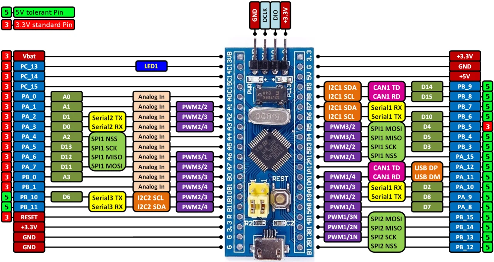

# LESSON 01: STM32F103 OVERVIEW, KEIL C / SPL TOOLCHAIN SETUP AND FIRST BLINK LED PROJECT

Welcome to the **Deep-Dive STM32F103 Microcontroller Programming Course**. The entire curriculum is built solidly upon two core foundational pillars:
1. **Bare-Metal Register & Raw Memory Pointer Programming (CMSIS / Direct Register)**: Giving you an in-depth understanding of hardware architecture, Memory-Mapped I/O, and CPU cycle-accurate optimization.
2. **Standard Peripheral Library (SPL - STSW-STM32054)**: A lightweight, deterministic foundation without complex abstraction overhead (No HAL), intuitive, easy to debug, and widely adopted in mission-critical embedded systems requiring strict real-time determinism.

---

## 1. Toolchain, Driver & SPL Library Download Links

> [!NOTE]
> **All-in-One Software, Driver, and SPL Package (High-speed direct download):**  
> 📥 **Google Drive Repository:** [STM32F103 Toolchain Installation (Google Drive)](https://drive.google.com/drive/folders/16sOEv58T-pTNdUQKuu2fwyhj0MC2kBx4?usp=drive_link)  
> *(Includes: Keil MDK, STM32F10x Standard Peripheral Library, ST-Link V2 USB Drivers, F1xx Device Family Pack, and flashing tools).*

Here are the official manufacturer download links from STMicroelectronics and ARM for reference and latest updates:

### 1.1 Development Environment (IDE) & Flash Drivers
1. **Keil MDK-ARM v5 (Recommended IDE for Bare-Metal & SPL)**:
   - *Features*: Industry-standard ARM Compiler (AC5/AC6) producing ultra-compact binaries with real-time hardware peripheral register inspection during debug.
   - *Official Download*: [Arm Keil | MDK Downloads](https://www.keil.arm.com/mdk-community/)
2. **STM32F1xx DFP (Device Family Pack for Keil C)**:
   - *Features*: Device header files, CMSIS support, startup assembly code `.s`, and system clock initialization routines.
   - *Direct Download*: [Keil STM32F1xx_DFP](https://pack-flat.keil.arm.com/Keil.STM32F1xx_DFP.2.4.1.pack) (or install via Keil Pack Installer).
3. **ST-LINK USB Driver (STSW-LINK009)**:
   - *Features*: Mandatory USB driver for Windows to recognize ST-Link V2 / V3 debug probes.
   - *Official Download*: [STMicroelectronics - STSW-LINK009 Driver](https://www.st.com/en/development-tools/stsw-link009.html)
4. **STM32CubeProgrammer**:
   - *Features*: Standalone utility to inspect full Flash memory, perform Full Chip Erase, and flash `.hex` / `.bin` firmware rapidly.
   - *Official Download*: [STMicroelectronics - STM32CubeProgrammer](https://www.st.com/en/development-tools/stm32cubeprog.html)

### 1.2 Standard Peripheral Library (SPL)
- **STM32F10x Standard Peripheral Library (STSW-STM32054)**:
   - *Description*: Official driver library from STMicroelectronics (Version 3.5.0 / 3.6.0), covering all on-chip peripherals (GPIO, USART, SPI, I2C, TIM, ADC, DMA, CAN...) and ARM Cortex-M3 core CMSIS files.
   - *Official ST Download*: [STMicroelectronics - STSW-STM32054](https://www.st.com/en/embedded-software/stsw-stm32054.html)

---

## 2. STM32F103C8T6 Architecture ("Blue Pill" Board)

The **STM32F103C8T6** MCU integrates an **ARM Cortex-M3** processor core running up to 72MHz connected through a multi-layer internal bus system:
- **AHB Bus (Advanced High-performance Bus)**: Max 72MHz, interconnecting CPU core, DMA Controller, Flash Memory controller, and internal SRAM.
- **APB2 Bus (Advanced Peripheral Bus 2)**: Max 72MHz, governing GPIOA, GPIOB, GPIOC, GPIOD, USART1, SPI1, TIM1, ADC1, and ADC2.
- **APB1 Bus (Advanced Peripheral Bus 1)**: Max 36MHz, governing TIM2, TIM3, TIM4, USART2, USART3, I2C1, I2C2, SPI2, CAN, and USB 2.0 Full-Speed.

---

<p align="center">
  
</p>

---

### 2.1 ST-Link V2 Debugger Connection & PC13 LED Circuit

<p align="center">
  
</p>

> [!IMPORTANT]
> **Active-Low LED Circuit on Blue Pill:**  
> The onboard green LED on the Blue Pill is hardwired to **Pin PC13** via an **Active-Low** configuration.  
> - Outputting logic **0 (LOW / 0V)** turns the LED **ON** (current sinks into PC13 from VDD).  
> - Outputting logic **1 (HIGH / 3.3V)** turns the LED **OFF** (no voltage drop across the diode).

---

## 3. Cortex-M3 Memory Map (RM0008 Reference Manual)

Per the ARM Cortex-M3 architecture specification, the entire 4GB linear address space (`0x0000_0000` to `0xFFFF_FFFF`) is mapped into standardized memory regions:

<p align="center">
  
</p>

### Key Memory Address Ranges:
1. **Flash ROM (`0x0800_0000` - `0x0801_FFFF`)**: Up to 64KB (or 128KB on Medium-density devices), aliased to address `0x0000_0000` upon Boot Mode selection (BOOT0 = 0).
2. **SRAM (`0x2000_0000` - `0x2000_4FFF`)**: 20KB internal high-speed Static RAM for variables, stack, and heap.
3. **Peripheral Region (`0x4000_0000` - `0x4002_3FFF`)**:
   - **APB1 Base**: `0x4000_0000`
   - **APB2 Base**: `0x4001_0000` (GPIOC Base: `0x4001_1000`)
   - **AHB Base / RCC**: `0x4002_1000`

---

## 4. Practical Hands-On: Bare-Metal Register vs SPL Comparison

### Method A: Pure Bare-Metal Register Programming (Pointer Arithmetic)

```c
#include <stdint.h>

// Direct Hardware Peripheral Addresses
#define RCC_BASE      0x40021000UL
#define RCC_APB2ENR   (*(volatile uint32_t *)(RCC_BASE + 0x18))

#define GPIOC_BASE    0x40011000UL
#define GPIOC_CRH     (*(volatile uint32_t *)(GPIOC_BASE + 0x04))
#define GPIOC_ODR     (*(volatile uint32_t *)(GPIOC_BASE + 0x0C))

void delay_cycles(volatile uint32_t count) {
    while (count--) {
        __asm("nop");
    }
}

int main(void) {
    // 1. Enable APB2 clock for GPIOC (Bit 4 = 1)
    RCC_APB2ENR |= (1 << 4);

    // 2. Configure PC13 as Output Push-Pull 2MHz:
    // Clear bits 20-23 and set MODE13 = 10b (2MHz), CNF13 = 00b (Push-pull)
    GPIOC_CRH &= ~(0xF << 20);
    GPIOC_CRH |=  (0x2 << 20);

    while (1) {
        // Toggle PC13 LED (Active-Low)
        GPIOC_ODR ^= (1 << 13);
        delay_cycles(1000000);
    }
}
```

### Method B: Professional Standard Peripheral Library (SPL)

```c
#include "stm32f10x.h"

void GPIO_Configuration(void) {
    GPIO_InitTypeDef GPIO_InitStructure;

    // 1. Enable clock for GPIOC
    RCC_APB2PeriphClockCmd(RCC_APB2Periph_GPIOC, ENABLE);

    // 2. Configure PC13 as Output Push-Pull, 2MHz
    GPIO_InitStructure.GPIO_Pin   = GPIO_Pin_13;
    GPIO_InitStructure.GPIO_Mode  = GPIO_Mode_Out_PP;
    GPIO_InitStructure.GPIO_Speed = GPIO_Speed_2MHz;
    GPIO_Init(GPIOC, &GPIO_InitStructure);
}

void Delay_ms(uint32_t ms) {
    volatile uint32_t i;
    for (; ms > 0; ms--) {
        for (i = 0; i < 7200; i++) {
            __NOP();
        }
    }
}

int main(void) {
    // Initialize system clock (HSE 8MHz -> PLL 72MHz)
    SystemInit();

    // Initialize GPIO peripherals
    GPIO_Configuration();

    while (1) {
        // Turn LED ON (Active-Low: output logic 0)
        GPIO_ResetBits(GPIOC, GPIO_Pin_13);
        Delay_ms(500);

        // Turn LED OFF (Active-Low: output logic 1)
        GPIO_SetBits(GPIOC, GPIO_Pin_13);
        Delay_ms(500);
    }
}
```

---

## 5. Summary & Key Takeaways

1. **Hardware Understanding**: Direct register manipulation demystifies how memory addresses control physical transitor gates on silicon.
2. **Library Selection**: Standard Peripheral Library (SPL) provides a clear balance between hardware transparency and rapid development without HAL's bloated runtime overhead.
3. **Next Steps**: In **Lesson 02**, we explore the internal CMOS structure of GPIO pins (P-MOS / N-MOS push-pull vs open-drain), Schmitt triggers, and the ARM Cortex-M3 **Bit-Banding** hardware mechanism.
