# BÀI 01: TỔNG QUAN STM32F103, THIẾT LẬP MÔI TRƯỜNG KEIL C / SPL VÀ DỰ ÁN BLINK LED

Chào mừng bạn đến với **Khóa học lập trình vi điều khiển STM32F103 chuyên sâu**. Toàn bộ chương trình được xây dựng hoàn toàn dựa trên các nền tảng cốt lõi:
1. **Lập trình con trỏ bộ nhớ & Thanh ghi thuần (Raw Memory Pointer / Bare-metal Register / CMSIS)**: Giúp bạn hiểu sâu cấu trúc phần cứng, ánh xạ bộ nhớ (Memory-Mapped I/O) và tối ưu hóa hiệu năng đến từng chu kỳ clock CPU.
2. **Thư viện ngoại vi chuẩn SPL (Standard Peripheral Library - STSW-STM32054)**: Thư viện nền tảng gọn nhẹ, không có lớp trừu tượng phức tạp (No HAL), trực quan, dễ gỡ lỗi và được dùng phổ biến trong các sản phẩm nhúng yêu cầu độ tin cậy và phản ứng thời gian thực cao.

---

## 1. Link Tải Phần Mềm, Driver Và Thư Viện SPL

> [!NOTE]
> **Kho lưu trữ trọn bộ phần mềm, Driver và Thư viện SPL (Tải trực tiếp tốc độ cao):**  
> 📥 **Link Google Drive:** [Thư mục cài đặt STM32F103 (Google Drive)](https://drive.google.com/drive/folders/16sOEv58T-pTNdUQKuu2fwyhj0MC2kBx4?usp=drive_link)  
> *(Bao gồm sẵn: Keil MDK, Thư viện chuẩn SPL STM32F10x, Driver ST-Link, Device Pack F1xx và công cụ nạp).*

Dưới đây là liên kết tải chính thức từ STMicroelectronics và ARM để bạn tham khảo hoặc cập nhật phiên bản mới nhất:

### 1.1 Môi trường lập trình (IDE) & Driver nạp
1. **Keil MDK-ARM v5 (Phần mềm lập trình tối ưu nhất cho SPL & Register)**:
   - *Tính năng*: Trình biên dịch ARM Compiler (AC5/AC6) cực kỳ tối ưu kích thước mã nguồn, hỗ trợ xem thanh ghi Peripherals trực quan thời gian thực khi debug.
   - *Link tải chính thức*: [Arm Keil | MDK Downloads](https://www.keil.arm.com/mdk-community/)
2. **STM32F1xx DFP (Device Family Pack cho Keil C)**:
   - *Tính năng*: Gói hỗ trợ chip dòng STM32F1 cho Keil MDK (chứa header CMSIS, startup code `.s`, file system).
   - *Link tải*: [Keil STM32F1xx_DFP](https://pack-flat.keil.arm.com/Keil.STM32F1xx_DFP.2.4.1.pack) (hoặc cài trực tiếp trong Keil Pack Installer).
3. **ST-LINK USB Driver (STSW-LINK009)**:
   - *Tính năng*: Driver bắt buộc để máy tính Windows nhận mạch nạp ST-Link V2.
   - *Link tải chính thức*: [STMicroelectronics - STSW-LINK009 Driver](https://www.st.com/en/development-tools/stsw-link009.html)
4. **STM32CubeProgrammer**:
   - *Tính năng*: Công cụ xem toàn bộ bộ nhớ Flash, xóa trắng chip (Full Erase), nạp file `.hex`/`.bin` nhanh.
   - *Link tải*: [STMicroelectronics - STM32CubeProgrammer](https://www.st.com/en/development-tools/stm32cubeprog.html)

### 1.2 Thư viện chuẩn SPL (Standard Peripheral Library)
- **STM32F10x Standard Peripheral Library (STSW-STM32054)**:
   - *Mô tả*: Thư viện chuẩn nguyên bản từ STMicroelectronics (Version 3.5.0 / 3.6.0), bao gồm toàn bộ driver ngoại vi (GPIO, USART, SPI, I2C, TIM, ADC, DMA, CAN...) và các file CMSIS lõi ARM Cortex-M3.
   - *Link tải chính thức từ ST*: [STMicroelectronics - STSW-STM32054](https://www.st.com/en/embedded-software/stsw-stm32054.html)

---

## 2. Kiến Trúc STM32F103C8T6 (Board "Blue Pill")

Vi điều khiển **STM32F103C8T6** gồm lõi xử lý **ARM Cortex-M3** tốc độ 72MHz kết hợp hệ thống bus nội:
- **Bus AHB (Advanced High-performance Bus)**: Tốc độ tối đa 72MHz, kết nối CPU, DMA Controller, Flash Memory và SRAM.
- **Bus APB2 (Advanced Peripheral Bus 2)**: Tốc độ tối đa 72MHz, điều khiển GPIOA, GPIOB, GPIOC, GPIOD, USART1, SPI1, TIM1, ADC1, ADC2.
- **Bus APB1 (Advanced Peripheral Bus 1)**: Tốc độ tối đa 36MHz, điều khiển TIM2, TIM3, TIM4, USART2, USART3, I2C1, I2C2, SPI2, CAN, USB.

---

<p align="center">
  
</p>

---

### 2.1 Sơ Đồ Kết Nối Mạch Nạp ST-Link V2 Và Mạch Nguyên Lý LED PC13

<p align="center">
  
</p>

> [!IMPORTANT]
> **Lưu ý phần cứng tối quan trọng:**
> - Hai jumper vàng trên bo mạch Blue Pill:
>   - **BOOT0**: Luôn gạt về mức **0** (vị trí gần cổng micro-USB) để vi điều khiển boot và thực thi chương trình từ bộ nhớ Flash nội.
>   - **BOOT1**: Luôn gạt về mức **0**.
> - Đèn LED tích hợp trên board nối với chân **PC13** theo sơ đồ **Active-Low**:
>   - Xuất mức logic **0 (LOW / GND)**: Đèn LED **SÁNG**.
>   - Xuất mức logic **1 (HIGH / 3.3V)**: Đèn LED **TẮT**.

---

## 3. Phân Tích Kỹ Thuật: Bản Chất Thanh Ghi Điều Khiển GPIO PC13

Trước khi viết mã nguồn, hãy mở tài liệu **STM32F10xxx Reference Manual (RM0008)** để xem bản chất hoạt động của phần cứng:

### 3.1 Cơ chế Memory-Mapped I/O và nguyên lý con trỏ phần cứng
Trong kiến trúc **ARM Cortex-M3**, tất cả ngoại vi (RCC, GPIO, Timer, UART...) không dùng các tập lệnh vào/ra đặc biệt (như lệnh `IN`/`OUT` trên x86) mà được **ánh xạ trực tiếp vào không gian địa chỉ bộ nhớ 32-bit (Memory-Mapped I/O)**:
- CPU truy xuất, đọc và ghi giá trị vào thanh ghi ngoại vi hoàn toàn giống hệt như đọc/ghi một ô nhớ RAM thông qua **con trỏ C (`pointer`)**.
- Bảng phân bổ địa chỉ vật lý liên quan đến chân PC13:

| Ngoại Vi / Thanh Ghi | Địa Chỉ Cơ Sở (Base Address) | Offset | Địa Chỉ Tuyệt Đối (Absolute Address) | Chức Năng |
| :--- | :--- | :--- | :--- | :--- |
| **Bus APB2 Peripheral** | `0x4001 0000` | - | - | Bus chứa ngoại vi GPIOC |
| **Bus AHB Peripheral** | `0x4001 8000` | - | - | Bus chứa khối điều khiển xung nhịp RCC |
| **`RCC_APB2ENR`** | `0x4002 1000` (RCC Base) | `0x18` | **`0x4002 1018`** | Cấp xung nhịp cho GPIOC (Bit 4) |
| **`GPIOC_CRH`** | `0x4001 1000` (GPIOC Base) | `0x04` | **`0x4001 1004`** | Cấu hình chân PC8 - PC15 (PC13 dùng bit 20-23) |
| **`GPIOC_ODR`** | `0x4001 1000` (GPIOC Base) | `0x0C` | **`0x4001 100C`** | Dữ liệu ngõ ra (Output Data Register) |
| **`GPIOC_BSRR`** | `0x4001 1000` (GPIOC Base) | `0x10` | **`0x4001 1010`** | Kéo chân lên mức High (`1`) |
| **`GPIOC_BRR`** | `0x4001 1000` (GPIOC Base) | `0x14` | **`0x4001 1014`** | Kéo chân xuống mức Low (`0`) |

---

<p align="center">
  
</p>

> [!TIP]
> **Tóm tắt cốt lõi dành cho người mới học C:**
> - **Trên máy tính thông thường (PC)**: Khi viết `*ptr = 10;`, CPU ghi số `10` vào một ô nhớ trên RAM chỉ để lưu trữ biến tạm thời.
> - **Trên vi điều khiển (MCU)**: Nhà sản xuất đã nối sẵn các vi mạch từ những ô nhớ đặc biệt (gọi là **Thanh ghi phần cứng - Hardware Register**) chạy thẳng ra các chân kim loại bên ngoài thân chip.
> - **Bản chất lập trình MCU**: Ví dụ với thanh ghi xuất dữ liệu **`GPIOC_ODR` (`0x4001 100C`)**, mỗi bit đại diện 1-1 cho một chân:
>   - Ghi **bit 13 = 0** → Chân PC13 hạ về **0V** → **LED SÁNG**.
>   - Ghi **bit 13 = 1** → Chân PC13 kéo lên **3.3V** → **LED TẮT**.
>   - Đảo trạng thái: `*REG_ODR ^= (1 << 13);` → **Chớp tắt LED**.

---

### 3.2 Thanh ghi cấp xung nhịp ngoại vi: `RCC_APB2ENR`
Mặc định khi chip khởi động, tất cả ngoại vi đều bị ngắt xung nhịp để tiết kiệm năng lượng. Muốn Port C hoạt động, ta phải cấp xung nhịp từ bus APB2.
- Địa chỉ: `0x4002 1018`
- Bit 4: `IOPCEN` (IO port C clock enable).
- Thao tác: Ghi `1` vào bit 4.

### 3.3 Thanh ghi cấu hình chân: `GPIOC_CRH` (Port Configuration Register High)
Mỗi Port GPIO có 16 chân. Chân 0 đến 7 được cấu hình bởi thanh ghi `CRL`, chân 8 đến 15 được cấu hình bởi thanh ghi `CRH`.
Chân 13 nằm trong `CRH`, tương ứng với 4 bit cấu hình `[23:20]`:
- **MODE13[1:0]** (Tốc độ và hướng):
  - `00`: Chế độ Input.
  - `01`: Output mode, tốc độ 10 MHz.
  - `10`: Output mode, tốc độ 2 MHz.
  - `11`: Output mode, tốc độ 50 MHz.
- **CNF13[1:0]** (Cấu hình ngõ ra khi ở Output Mode):
  - `00`: General purpose output push-pull (Đẩy - kéo).
  - `01`: General purpose output Open-drain.
  - `10`: Alternate function output Push-pull.
  - `11`: Alternate function output Open-drain.
- Để cấu hình PC13 làm **Output Push-pull tốc độ 2MHz**:
  - `CNF13 = 00`, `MODE13 = 10` → Mã nhị phân `0010b` (tương ứng `0x2`).

### 3.4 Thanh ghi điều khiển trạng thái ngõ ra: `ODR`, `BSRR` và `BRR`
- **Thanh ghi `ODR` (Output Data Register - `0x4001 100C`)**: Mỗi bit đại diện cho trạng thái xuất ra của chân tương ứng (bit 13 cho PC13). Ta có thể đảo trạng thái bằng phép toán XOR `^= (1 << 13)`.
- **Thanh ghi `BRR` (Port Bit Reset Register - `0x4001 1014`)**: Ghi bit `1` vào vị trí bit 13 sẽ kéo PC13 về mức `0` (GND) → Đèn LED sáng (Active-Low).
- **Thanh ghi `BSRR` (Port Bit Set/Reset Register - `0x4001 1010`)**: Ghi bit `1` vào vị trí bit 13 sẽ kéo PC13 lên mức `1` (3.3V) → Đèn LED tắt.

---

## 4. Viết Mã Nguồn

Dưới đây là 3 phương pháp lập trình từ bản chất phần cứng thấp nhất cho đến thư viện chuẩn cấp cao.

---

### PHƯƠNG PHÁP 1: GHI TRỰC TIẾP ĐỊA CHỈ Ô NHỚ (RAW MEMORY / DIRECT POINTER ACCESS)

Đây là **phương pháp thuần túy và nguyên bản nhất** trong ngôn ngữ C dành cho hệ thống nhúng. Bạn **không cần bất kỳ file thư viện hay file header nào** (không cần cả `stm32f10x.h`). Chúng ta ép kiểu trực tiếp địa chỉ số nguyên 32-bit thành con trỏ bộ nhớ và ghi giá trị xuống.

#### 1. Bản chất cú pháp con trỏ ép kiểu bộ nhớ:
```c
*((volatile unsigned int *)0x40021018) |= (1 << 4);
```
- `0x40021018`: Hằng số nguyên biểu diễn địa chỉ vật lý của thanh ghi `RCC_APB2ENR`.
- `(volatile unsigned int *)`: Ép kiểu số nguyên này thành một **con trỏ trỏ tới vùng nhớ 32-bit (unsigned int / uint32_t)**.
- `volatile`: Từ khóa **bắt buộc**. Nó báo cho trình biên dịch biết ô nhớ này có thể thay đổi bất kỳ lúc nào bởi phần cứng ngoại vi, ngăn chặn compiler tự ý tối ưu hóa (ví dụ: gộp lệnh, bỏ qua lệnh ghi hoặc xóa vòng lặp delay vô nghĩa).
- `*`: Toán tử giải tham chiếu (dereference) để truy xuất và ghi dữ liệu trực tiếp vào ô nhớ đó.

#### 2. Toàn bộ mã nguồn `main.c`:

File: `main.c`

```c
#define REG_RCC_APB2ENR   (*((volatile unsigned int *)0x40021018))
#define REG_GPIOC_CRH     (*((volatile unsigned int *)0x40011004))
#define REG_GPIOC_ODR     (*((volatile unsigned int *)0x4001100C))
#define REG_GPIOC_BSRR    (*((volatile unsigned int *)0x40011010))
#define REG_GPIOC_BRR     (*((volatile unsigned int *)0x40011014))

void delay_raw(volatile unsigned int count)
{
    while (count--)
    {
        __asm("nop");
    }
}

int main(void)
{
    // Cấp xung nhịp cho GPIOC
    REG_RCC_APB2ENR |= (1 << 4);

    // Cấu hình PC13: Output Push-Pull 2MHz
    REG_GPIOC_CRH &= ~(0x0F << 20);
    REG_GPIOC_CRH |= (0x02 << 20);

    while (1)
    {
        REG_GPIOC_BRR = (1 << 13);   // Bật LED (Active-Low)
        delay_raw(500000);

        REG_GPIOC_BSRR = (1 << 13);  // Tắt LED
        delay_raw(500000);
    }
}
```

---

### PHƯƠNG PHÁP 2: LẬP TRÌNH THANH GHI QUA CMSIS STRUCT (BARE-METAL REGISTER)

Đây là chuẩn lập trình Bare-metal công nghiệp do ARM và STMicroelectronics định nghĩa trong file `stm32f10x.h`. Thay vì tự tính địa chỉ từng thanh ghi, các thanh ghi liền kề nhau của một ngoại vi được gom lại thành một cấu trúc C (`struct`) khớp với các độ lệch Offset phần cứng:

```c
typedef struct {
  __IO uint32_t CRL;   // Offset 0x00
  __IO uint32_t CRH;   // Offset 0x04
  __IO uint32_t IDR;   // Offset 0x08
  __IO uint32_t ODR;   // Offset 0x0C
  __IO uint32_t BSRR;  // Offset 0x10
  __IO uint32_t BRR;   // Offset 0x14
  __IO uint32_t LCKR;  // Offset 0x18
} GPIO_TypeDef;

#define GPIOC ((GPIO_TypeDef *) 0x40011000)
```

File: `main.c`

```c
#include "stm32f10x.h"

void delay(volatile uint32_t count)
{
    while (count--)
    {
        __NOP();
    }
}

int main(void)
{
    // Cấp xung nhịp GPIOC
    RCC->APB2ENR |= (1 << 4);

    // Cấu hình PC13: Output Push-Pull 2MHz
    GPIOC->CRH &= ~(0x0F << 20);
    GPIOC->CRH |= (0x02 << 20);

    while (1)
    {
        GPIOC->BRR = (1 << 13);    // Bật LED
        delay(1000000);

        GPIOC->BSRR = (1 << 13);   // Tắt LED
        delay(1000000);
    }
}
```

---

### PHƯƠNG PHÁP 3: LẬP TRÌNH BẰNG THƯ VIỆN CHUẨN SPL (STANDARD PERIPHERAL LIBRARY)

File: `main.c`

```c
#include "stm32f10x.h"
#include "stm32f10x_rcc.h"
#include "stm32f10x_gpio.h"

void delay_ms(volatile uint32_t count)
{
    volatile uint32_t i;
    for (; count > 0; count--)
    {
        for (i = 0; i < 7200; i++)
        {
            __NOP();
        }
    }
}

void GPIO_Configuration(void)
{
    GPIO_InitTypeDef GPIO_InitStructure;

    RCC_APB2PeriphClockCmd(RCC_APB2Periph_GPIOC, ENABLE);

    GPIO_InitStructure.GPIO_Pin   = GPIO_Pin_13;
    GPIO_InitStructure.GPIO_Mode  = GPIO_Mode_Out_PP;
    GPIO_InitStructure.GPIO_Speed = GPIO_Speed_2MHz;
    GPIO_Init(GPIOC, &GPIO_InitStructure);
}

int main(void)
{
    GPIO_Configuration();

    while (1)
    {
        GPIO_ResetBits(GPIOC, GPIO_Pin_13);  // Bật LED
        delay_ms(500);

        GPIO_SetBits(GPIOC, GPIO_Pin_13);    // Tắt LED
        delay_ms(500);
    }
}
```

---

## 5. So Sánh Bản Chất: Ghi Thẳng Bộ Nhớ vs Thanh Ghi CMSIS vs SPL

| Tiêu Chí | 1. Ghi Thẳng Ô Nhớ (Raw Pointer) | 2. Thanh Ghi CMSIS (Struct Pointer) | 3. Thư Viện Chuẩn (SPL) |
| :--- | :--- | :--- | :--- |
| **Phụ thuộc thư viện / Header** | **Không cần bất kỳ file nào** | Cần `stm32f10x.h`, `core_cm3.h` | Cần `stm32f10x_gpio.h`, `stm32f10x_rcc.h`... |
| **Kích thước mã nhị phân (Binary Size)** | Tối thiểu tuyệt đối (~ vài chục bytes) | Cực nhỏ (chỉ vài trăm bytes) | Rất nhỏ gọn (~ 1-2 KB), nhỏ hơn HAL rất nhiều |
| **Tốc độ thực thi** | Trực tiếp 1 lệnh máy `STR` vào địa chỉ vật lý | Trực tiếp 1 lệnh máy `STR` với địa chỉ cơ sở + offset | Nhanh, có bước assert tham số và gọi hàm |
| **Khả năng đọc hiểu mã (Readability)** | Khó đọc nhất, phải tự nhớ địa chỉ hex | Dễ đọc hơn nhờ tên thanh ghi gợi nhớ (`GPIOC->ODR`) | Code tiếng Anh cực kỳ rõ nghĩa (`GPIO_Mode_Out_PP`) |
| **Bảo trì & chuyển đổi chip** | Khó bảo trì nếu đổi dòng vi điều khiển khác | Dễ bảo trì trong cùng kiến trúc ARM | Dễ bảo trì, phát triển ứng dụng quy mô lớn |

---

## 6. Biên Dịch, Nạp Code Và Debug

1. **Biên dịch mã nguồn**:
   - Nhấn phím `F7` hoặc bấm biểu tượng **Build Target**.
   - Kiểm tra cửa sổ Build Output: `0 Error(s), 0 Warning(s)`.
2. **Nạp code vào chip**:
   - Nhấn phím `F8` hoặc biểu tượng **Download**.
   - Keil C sẽ kết nối qua ST-Link V2, xóa sector Flash và nạp file nhị phân vào vi điều khiển.
   - Nhờ tùy chọn `Reset and Run`, đèn LED xanh PC13 trên board Blue Pill sẽ bắt đầu chớp tắt ngay lập tức!
3. **Debug chuyên sâu (Xem trạng thái thanh ghi phần cứng)**:
   - Nhấn tổ hợp phím `Ctrl + F5` để vào chế độ Debug.
   - Trên thanh menu của Keil C, vào mục **Peripherals -> General Purpose I/O -> GPIOC**.
   - Bạn sẽ nhìn thấy một cửa sổ hiển thị trực tiếp giá trị của các thanh ghi `CRL`, `CRH`, `IDR`, `ODR`, `BSRR`, `BRR`.
   - Nhấn phím `F11` (Step) hoặc `F10` (Step Over) để chạy từng dòng lệnh và quan sát các bit trong cửa sổ thanh ghi đổi màu từ đỏ sang đen tương ứng với từng câu lệnh C được thực thi!

---

## 7. Bài Tập Thực Hành Chuyên Sâu

1. **Bài tập 1 (Ghi thẳng ô nhớ - Raw Memory Pointer)**: Hãy viết một macro hoặc hàm 1 dòng duy nhất để đảo trạng thái LED PC13 bằng cách thao tác toán tử XOR `^=` trực tiếp trên địa chỉ vật lý của thanh ghi `GPIOC_ODR` (`0x4001100C`) mà không khai báo biến trung gian hay dùng header.
2. **Bài tập 2 (Thanh ghi CMSIS Struct)**: Thay vì dùng thanh ghi `BRR` và `BSRR`, hãy viết một dòng lệnh duy nhất để đảo trạng thái của đèn LED PC13 bằng cách tác động trực tiếp vào thanh ghi dữ liệu xuất **`GPIOC->ODR`** (gợi ý: sử dụng toán tử XOR `^`).
3. **Bài tập 3 (SPL)**: Cắm thêm 1 đèn LED rời vào chân **PB0** (chân nối cực dương LED, cực âm qua trở 330Ω xuống GND). Viết cấu hình chân `GPIO_Pin_0` trên `GPIOB` và lập trình cho 2 đèn LED chớp tắt so le nhau.
