# BÀI 02: PHÂN TÍCH CHUYÊN SÂU GPIO VÀ KỸ THUẬT BIT-BANDING

Chào mừng bạn đến với bài học thứ 2 trong chuỗi đào tạo lập trình **STM32F103 chuyên sâu**. Nếu như ở Bài 01, chúng ta đã tiếp cận ngoại vi GPIO ở mức cơ bản để chớp tắt LED, thì trong bài học này, chúng ta sẽ mổ xẻ tường tận kiến trúc điện tử bên trong từng chân I/O, các chế độ hoạt động đặc biệt, và khai thác tính năng cực kỳ mạnh mẽ của lõi ARM Cortex-M3: **Kỹ thuật định địa chỉ Bit-Banding (Atomic Bit Manipulation)**.

---

## 1. Cấu Trúc Vật Lý Bên Trong Chân GPIO STM32F103

Để làm chủ GPIO ở cấp độ kỹ sư thiết kế nhúng, bạn không thể chỉ ghi nhận chân là "Input" hay "Output", mà phải hiểu sơ đồ khối transistor tích hợp bên trong vi điều khiển:

<p align="center">
  
</p>

### 1.1 Khối bảo vệ ngõ vào (Protection Diodes)
Mỗi chân I/O đều có 2 Diode kẹp bảo vệ chống sốc tĩnh điện (ESD):
- Một Diode nối lên VDD (3.3V) và một Diode nối xuống VSS (GND).
- **Lưu ý chân chịu áp 5V (5V-Tolerant - FT)**: Các chân có ký hiệu **FT** trong datasheet (ví dụ PA8, PB6, PB7...) không có Diode nối lên VDD 3.3V kiểu thông thường mà dùng mạch bảo vệ chuyên dụng, cho phép nhận mức logic 5V an toàn khi cấu hình ở chế độ Input Floating hoặc Open-Drain.

### 1.2 Khối đệm ngõ ra (Output Driver): Push-Pull vs Open-Drain

1. **Chế độ Push-Pull (Đẩy - Kéo)**:
   - Sử dụng cả 2 transistor **P-MOS** (kéo lên VDD) và **N-MOS** (kéo xuống VSS).
   - Khi xuất mức `1`: P-MOS dẫn, N-MOS ngắt → Chân cấp dòng điện (Source current).
   - Khi xuất mức `0`: N-MOS dẫn, P-MOS ngắt → Chân hút dòng điện (Sink current).
   - *Ứng dụng*: Điều khiển LED, xuất xung clock SPI, điều khiển chân chọn chip CS, chân logic thông thường.
2. **Chế độ Open-Drain (Cực máng hở)**:
   - Transistor P-MOS bị ngắt hoàn toàn, chỉ còn **N-MOS** hoạt động.
   - Khi xuất mức `0`: N-MOS dẫn → Chân kéo mạnh xuống GND.
   - Khi xuất mức `1`: N-MOS ngắt → Chân ở trạng thái **thả nổi (High-Impedance / Hi-Z)**. Muốn có mức 1, bắt buộc phải có điện trở kéo lên bên ngoài (External Pull-up resistor).
   - *Ứng dụng*: Chuẩn giao tiếp đường truyền dây chung nhiều thiết bị như bus I2C (SDA, SCL), 1-Wire, hoặc chuyển đổi mức điện áp (Level Shifting từ 3.3V lên 5V).

### 1.3 Khối Schmitt Trigger và Đọc Dữ Liệu Ngõ Vào
- Tín hiệu tương tự từ bên ngoài qua khối lọc Schmitt Trigger để khử nhiễu dạng sóng, chuyển thành tín hiệu logic số `0` hoặc `1` rõ ràng.
- Giá trị này được cập nhật vào thanh ghi **`GPIOx_IDR`** sau mỗi chu kỳ xung nhịp APB2.

---

## 2. Bản Chất Các Thanh Ghi GPIO Theo RM0008

Mỗi cổng GPIO (từ GPIOA đến GPIOG) quản lý tối đa 16 chân vật lý (Pin 0 → Pin 15), điều khiển thông qua 7 thanh ghi 32-bit:

| Thanh Ghi | Tên Đầy Đủ | Offset | Mô Tả Chức Năng |
| :--- | :--- | :---: | :--- |
| **`GPIOx_CRL`** | Port Configuration Register Low | `0x00` | Cấu hình Pin 0 đến Pin 7 (4 bit / pin) |
| **`GPIOx_CRH`** | Port Configuration Register High | `0x04` | Cấu hình Pin 8 đến Pin 15 (4 bit / pin) |
| **`GPIOx_IDR`** | Input Data Register | `0x08` | Đọc trạng thái logic ngõ vào (Chỉ đọc) |
| **`GPIOx_ODR`** | Output Data Register | `0x0C` | Ghi/Đọc trạng thái logic ngõ ra |
| **`GPIOx_BSRR`**| Bit Set/Reset Register | `0x10` | Kéo chân lên High hoặc kéo chân xuống Low |
| **`GPIOx_BRR`** | Bit Reset Register | `0x14` | Chỉ kéo chân xuống Low |
| **`GPIOx_LCKR`**| Port Configuration Lock Register | `0x18` | Khóa cấu hình chân cho đến lần Reset kế tiếp |

### 2.1 Ma trận cấu hình 4 bit: `CNF[1:0]` và `MODE[1:0]`
Để cấu hình một chân bất kỳ, ta cần xác định 4 bit trong `CRL` hoặc `CRH`:

| MODE[1:0] (Tốc độ / Hướng) | CNF[1:0] khi MODE = 00 (Input) | CNF[1:0] khi MODE > 00 (Output) |
| :---: | :--- | :--- |
| `00`: Input mode (Reset state) | `00`: Analog mode | `00`: General purpose Output Push-Pull |
| `01`: Output mode, max speed 10MHz | `01`: Floating input (thả nổi) | `01`: General purpose Output Open-Drain |
| `10`: Output mode, max speed 2MHz | `10`: Input with Pull-up / Pull-down | `10`: Alternate function Output Push-Pull |
| `11`: Output mode, max speed 50MHz | `11`: Dự trữ | `11`: Alternate function Output Open-Drain |

> [!NOTE]
> **Phân biệt Pull-up và Pull-down ở chế độ Input:**
> Khi chọn `MODE = 00` và `CNF = 10` (Input with pull-up/pull-down):
> - Nếu ghi `ODR = 1`: Kích hoạt điện trở **Pull-up** nội (kéo lên 3.3V).
> - Nếu ghi `ODR = 0`: Kích hoạt điện trở **Pull-down** nội (kéo xuống 0V).

---

## 3. Kỹ Thuật Bit-Banding Trong Kiến Trúc ARM Cortex-M3

Trong các hệ thống đơn luồng hoặc đa nhiệm thời gian thực, thao tác đọc-sửa-ghi (Read-Modify-Write) thông thường trên thanh ghi như sau:
```c
GPIOC->ODR |= (1 << 13); // Read ODR -> Perform bitwise OR -> Write back to ODR
```
Thao tác này tốn **3 chu kỳ lệnh assembly (`LDR`, `ORR`, `STR`)**. Nếu một ngắt (Interrupt) xuất hiện chen ngang giữa lệnh `LDR` và `STR`, trạng thái thanh ghi sẽ bị sai lệch hoàn toàn (Race Condition).

Để giải quyết triệt để vấn đề này ở mức phần cứng, ARM Cortex-M3 cung cấp **Cơ chế Bit-Banding**:
- Ánh xạ mỗi **bit đơn lẻ** trong vùng nhớ chuẩn (Bit-band region) thành **một ô nhớ 32-bit nguyên vẹn** trong vùng nhớ bí danh (Bit-band alias region).
- Khi CPU ghi giá trị `0` hoặc `1` vào ô nhớ alias 32-bit này, phần cứng bộ nhớ sẽ tự động cập nhật duy nhất 1 bit tương ứng trong thanh ghi gốc chỉ với **1 chu kỳ lệnh duy nhất (Atomic Operation)**!

<p align="center">
  
</p>

### 3.1 Công Thức Tính Địa Chỉ Bit-Banding

Cortex-M3 hỗ trợ 2 vùng Bit-banding:
1. **SRAM Bit-band Region**: `0x2000 0000` → `0x200F FFFF` (1MB RAM) ánh xạ sang Alias: `0x2200 0000` → `0x23FF FFFF` (32MB).
2. **Peripheral Bit-band Region**: `0x4000 0000` → `0x400F FFFF` (1MB Ngoại vi) ánh xạ sang Alias: `0x4200 0000` → `0x43FF FFFF` (32MB).

Công thức toán học tổng quát:
`Alias_Address = Alias_Base + (Byte_Offset × 32) + (Bit_Number × 4)`

Trong đó:
- Đối với ngoại vi STM32 (GPIO, Timer, USART...): `Alias_Base = 0x42000000`.
- `Byte_Offset = Peripheral_Address - 0x40000000`.
- `Bit_Number = 0 → 31`.

### 3.2 Macro Tính Toán Bit-Banding Chuẩn C
```c
#define BITBAND_PERI_BASE  0x40000000
#define BITBAND_ALIAS_BASE 0x42000000

#define BITBAND_PERI(RegAddr, Bit) \
    ((volatile uint32_t *)(BITBAND_ALIAS_BASE + (((uint32_t)(RegAddr) - BITBAND_PERI_BASE) * 32) + ((Bit) * 4)))
```

Ví dụ đối với chân PC13 xuất ngõ ra trên thanh ghi `GPIOC_ODR` (`0x4001100C`):
- Byte Offset = `0x4001100C` - `0x40000000` = `0x1100C` = 69644 bytes.
- Bit = 13.
- `Alias_Address` = `0x42000000` + (69644 × 32) + (13 × 4) = `0x42000000` + `0x220180` + `0x34` = `0x422201B4`.

Chỉ cần thao tác:
```c
*((volatile uint32_t *)0x422201B4) = 0; // PC13 = 0 -> Turn on LED
*((volatile uint32_t *)0x422201B4) = 1; // PC13 = 1 -> Turn off LED
```

---

## 4. Xử Lý Nút Nhấn Và Thuật Toán Chống Rung (Debounce)

Khi bấm nút cơ học, hai lá kim loại tiếp xúc sẽ tạo ra các dao động điện áp ngẫu nhiên trong khoảng 5ms → 20ms trước khi ổn định:

<p align="center">
  
</p>

Nếu không xử lý chống rung (Debounce), CPU có tốc độ 72MHz sẽ hiểu lần nảy xung đó là hàng chục lần nhấn phím liên tục.

### Thuật toán Debounce bằng phần mềm (Lấy mẫu thời gian):
1. Đọc trạng thái nút nhấn.
2. Nếu trạng thái thay đổi, đợi một khoảng thời gian trễ ngắn (15ms - 20ms).
3. Đọc lại lần thứ hai: Nếu trạng thái vẫn giữ nguyên mức mới, xác nhận nút đã được bấm hợp lệ.

---

## 5. Triển Khai Mã Nguồn Thực Chiến

### Kịch bản thực hành:
- Đèn LED kết nối chân **PC13** (Active-Low).
- Nút nhấn rời kết nối chân **PA0**: Một đầu nối PA0, một đầu nối xuống GND.
- Cấu hình PA0 ở chế độ **Input Pull-up** (khi thả nút PA0 = 1, khi bấm nút PA0 = 0).
- Mỗi lần nhấn nút, trạng thái LED PC13 sẽ đảo (Toggle).

---

### PHƯƠNG PHÁP 1: BARE-METAL REGISTER KẾT HỢP BIT-BANDING

File: `main.c`

```c
#include "stm32f10x.h"

// Bit-Banding macro for peripheral region
#define BITBAND_PERI_BASE  0x40000000
#define BITBAND_ALIAS_BASE 0x42000000

#define BITBAND_PERI(RegAddr, Bit) \
    ((volatile uint32_t *)(BITBAND_ALIAS_BASE + (((uint32_t)(RegAddr) - BITBAND_PERI_BASE) * 32) + ((Bit) * 4)))

// Declare direct Bit-Banding pointer
#define PC13_OUT  (*BITBAND_PERI(&GPIOC->ODR, 13))
#define PA0_IN    (*BITBAND_PERI(&GPIOA->IDR, 0))

void delay_ms(volatile uint32_t ms)
{
    volatile uint32_t i;
    for (; ms > 0; ms--)
    {
        for (i = 0; i < 7200; i++)
        {
            __NOP();
        }
    }
}

void GPIO_Init_Register(void)
{
    // 1. Enable clocks for PORT A and PORT C via RCC_APB2ENR
    RCC->APB2ENR |= (1 << 2) | (1 << 4); // Bit 2: IOPAEN, Bit 4: IOPCEN

    // 2. Configure PC13: Output Push-Pull at 2MHz speed
    GPIOC->CRH &= ~(0x0F << 20); // Clear bits [23:20]
    GPIOC->CRH |= (0x02 << 20);  // MODE13 = 10, CNF13 = 00

    // Initial state: turn off LED (write HIGH)
    PC13_OUT = 1;

    // 3. Configure PA0: Input with Pull-up
    GPIOA->CRL &= ~(0x0F << 0);  // Clear bits [3:0]
    GPIOA->CRL |= (0x08 << 0);   // MODE0 = 00, CNF0 = 10 (Input Pull-up/down)
    GPIOA->ODR |= (1 << 0);      // ODR0 = 1 -> Enable internal PULL-UP resistor
}

int main(void)
{
    GPIO_Init_Register();

    while (1)
    {
        // Check button PA0 (pressed = LOW via GND connection)
        if (PA0_IN == 0)
        {
            delay_ms(20); // Key debounce delay
            if (PA0_IN == 0) // Confirm button is still held down
            {
                // Toggle LED PC13 atomically using Bit-Banding
                PC13_OUT = !PC13_OUT;

                // Wait for button release to prevent continuous toggling
                while (PA0_IN == 0);
                delay_ms(20); // Button release debounce delay
            }
        }
    }
}
```

---

### PHƯƠNG PHÁP 2: LẬP TRÌNH BẰNG THƯ VIỆN CHUẨN SPL

File: `main.c`

```c
#include "stm32f10x.h"
#include "stm32f10x_rcc.h"
#include "stm32f10x_gpio.h"

void delay_ms(volatile uint32_t ms)
{
    volatile uint32_t i;
    for (; ms > 0; ms--)
    {
        for (i = 0; i < 7200; i++)
        {
            __NOP();
        }
    }
}

void GPIO_Configuration(void)
{
    GPIO_InitTypeDef GPIO_InitStructure;

    // 1. Enable clocks for GPIOA and GPIOC
    RCC_APB2PeriphClockCmd(RCC_APB2Periph_GPIOA | RCC_APB2Periph_GPIOC, ENABLE);

    // 2. Configure PC13 pin: Output Push-Pull 2MHz
    GPIO_InitStructure.GPIO_Pin   = GPIO_Pin_13;
    GPIO_InitStructure.GPIO_Mode  = GPIO_Mode_Out_PP;
    GPIO_InitStructure.GPIO_Speed = GPIO_Speed_2MHz;
    GPIO_Init(GPIOC, &GPIO_InitStructure);

    // Default: turn off LED
    GPIO_SetBits(GPIOC, GPIO_Pin_13);

    // 3. Configure PA0 pin: Input Pull-Up
    GPIO_InitStructure.GPIO_Pin  = GPIO_Pin_0;
    GPIO_InitStructure.GPIO_Mode = GPIO_Mode_IPU; // Input Pull-Up
    GPIO_Init(GPIOA, &GPIO_InitStructure);
}

int main(void)
{
    GPIO_Configuration();

    while (1)
    {
        // Read PA0 input state
        if (GPIO_ReadInputDataBit(GPIOA, GPIO_Pin_0) == Bit_RESET)
        {
            delay_ms(20); // Button debounce filter
            if (GPIO_ReadInputDataBit(GPIOA, GPIO_Pin_0) == Bit_RESET)
            {
                // Toggle PC13 by reading ODR and writing inverted state
                if (GPIO_ReadOutputDataBit(GPIOC, GPIO_Pin_13) == Bit_SET)
                {
                    GPIO_ResetBits(GPIOC, GPIO_Pin_13); // Turn on LED
                }
                else
                {
                    GPIO_SetBits(GPIOC, GPIO_Pin_13);   // Turn off LED
                }

                // Wait for key release
                while (GPIO_ReadInputDataBit(GPIOA, GPIO_Pin_0) == Bit_RESET);
                delay_ms(20);
            }
        }
    }
}
```

---

## 6. Những Lỗi Thường Gặp Và Lưu Ý Sống Còn Về Phần Cứng

> [!WARNING]
> **1. Quên cấp xung nhịp bus APB2:**
> Nếu không bật bit `IOPAEN` hoặc `IOPCEN` trong thanh ghi `RCC->APB2ENR`, toàn bộ thao tác ghi vào thanh ghi `CRL`, `CRH`, `ODR` sẽ bị phần cứng bỏ qua và chân GPIO sẽ hoàn toàn tê liệt.

> [!IMPORTANT]
> **2. Cấu hình nhầm chân nạp JTAG / SWD (PA13, PA14, PA15, PB3, PB4):**
> Các chân này mặc định sau khi reset chip được phần cứng gán cho chức năng nạp và debug JTAG/SWD:
> - **PA13**: JTMS / SWDIO
> - **PA14**: JTCK / SWCLK
> - **PB3**: JTDO (muốn dùng làm GPIO thường phải Remap giải phóng JTAG)
> - **PB4**: JNTRST
> Nếu bạn vô tình cấu hình PA13/PA14 thành GPIO thông thường mà không giữ chế độ SWD, bạn sẽ mất kết nối với mạch nạp ST-Link V2 và không thể nạp code tiếp theo (phải giữ nút Reset cứng trên board rồi bấm Download trong Keil mới khôi phục được).

---

## 7. Hướng Dẫn Debug Trên Keil MDK

1. Nhấn `Ctrl + F5` để khởi động Debug Session.
2. Mở cửa sổ **Watch 1** (`View -> Watch Windows -> Watch 1`).
3. Thêm biến hoặc biểu thức Bit-Banding: `PA0_IN` và `PC13_OUT`.
4. Mở cửa sổ thanh ghi GPIO: **Peripherals -> General Purpose I/O -> GPIOA** và **GPIOC**.
5. Nhấn phím `F10` để chạy từng dòng lệnh:
   - Khi bấm nút vật lý nối PA0 xuống GND, quan sát bit `IDR0` trên cửa sổ GPIOA chuyển từ `1` sang `0`.
   - Quan sát bit `ODR13` trên GPIOC đổi trạng thái tương ứng.

---

## 8. Bài Tập Thực Hành

1. **Bài tập 1 (Bit-Banding SRAM)**: Khai báo một biến cờ trạng thái 32-bit trong RAM `uint32_t system_flags = 0;`. Viết công thức Bit-Banding để truy xuất và bật bit thứ 7 của biến này lên mức `1` mà không làm ảnh hưởng tới 31 bit còn lại.
2. **Bài tập 2 (Phím bấm nhiều chế độ)**: Sử dụng PA0 làm nút bấm đơn. Viết chương trình phân biệt giữa:
   - **Bấm nhanh (Short Press < 500ms)**: LED PC13 chớp tắt 1 lần.
   - **Bấm giữ lâu (Long Press > 1000ms)**: LED PC13 nhấp nháy liên tục với tần số 5Hz.
3. **Bài tập 3 (Chế độ Open-Drain)**: Cấu hình chân PB7 ở chế độ Open-Drain tốc độ 10MHz. Kết nối PB7 với nguồn 5V ngoài thông qua một điện trở kéo lên 4.7kΩ. Dùng đồng hồ VOM đo điện áp tại chân PB7 khi xuất mức `0` và mức `1` để kiểm chứng khả năng chuyển đổi mức logic của STM32.
