# BÀI 07: ĐIỀU CHẾ ĐỘ RỘNG XUNG PWM (PULSE WIDTH MODULATION)

Chào mừng bạn đến với bài học thứ 7 trong chuỗi đào tạo **STM32F103 chuyên sâu**. **PWM (Pulse Width Modulation - Điều chế độ rộng xung)** là kỹ thuật điều khiển công suất cơ bản nhưng quan trọng bậc nhất trong thế giới nhúng: từ việc điều chỉnh độ sáng đèn LED, kiểm soát tốc độ động cơ DC, điều khiển góc quay động cơ Servo, đến các bộ nghịch lưu Inverter và nguồn xung (SMPS).

Trong bài học này, bạn sẽ nắm vững cơ chế so sánh ngõ ra (**Output Compare**), cách tính toán cấu hình tần số và hệ số công tác (Duty Cycle), đồng thời làm chủ việc điều khiển độ sáng LED mượt mà và góc quay **Servo SG90** bằng cả Thanh ghi thuần lẫn Thư viện chuẩn SPL.

---

## 1. Nguyên Lý Điều Chế Độ Rộng Xung (PWM)

PWM là phương pháp tạo ra điện áp tương tự giả lập (Pseudo-Analog Voltage) từ một tín hiệu số bật/tắt liên tục ở tần số cao:

<p align="center">
  
</p>

- Nếu **Duty Cycle = 0%**: Chân luôn ở mức 0V → LED tắt hoàn toàn.
- Nếu **Duty Cycle = 50%**: Nửa chu kỳ 3.3V, nửa chu kỳ 0V → Điện áp tương đương 1.65V → LED sáng 50%.
- Nếu **Duty Cycle = 100%**: Chân luôn ở mức 3.3V → LED sáng tối đa.

---

## 2. Khối So Sánh Ngõ Ra (Output Compare) Của STM32 Timer

Khối Timer của STM32F103 có thể tạo ra PWM hoàn toàn bằng **phần cứng độc lập (Zero CPU Overhead)** nhờ vào mạch so sánh giữa 2 thanh ghi:
1. **`TIMx_CNT`**: Bộ đếm thời gian chạy từ `0` đến `ARR`.
2. **`TIMx_CCRx` (Capture/Compare Register)**: Thanh ghi lưu giá trị ngưỡng do người dùng thiết lập để quyết định độ rộng xung T_on.

<p align="center">
  
</p>

### 2.1 Các chế độ PWM chính:
- **PWM Mode 1 (Active-High)**:
  - Khi CNT < CCR: Chân ngõ ra ở mức **CAO (HIGH - 3.3V)**.
  - Khi CNT ≥ CCR: Chân ngõ ra ở mức **THẤP (LOW - 0V)**.
- **PWM Mode 2 (Active-Low)**:
  - Ngược lại hoàn toàn với PWM Mode 1: Khi CNT < CCR xuất LOW, khi CNT ≥ CCR xuất HIGH.

---

## 3. Công Thức Tính Tần Số PWM Và Duty Cycle

1. **Tần số phát xung (f_PWM)**:
   f_PWM = (f_TIM_CLK / (PSC + 1) × (ARR + 1))
   *(Trong đó f_TIM_CLK = 72MHz đối với TIM2, TIM3, TIM4 trên APB1).*

2. **Hệ số công tác (Duty Cycle %)**:
   Duty Cycle = (CCR / ARR + 1) × 100%

---

## 4. Bảng Kênh PWM Và Chân Phần Cứng Trên STM32F103

| Timer | Kênh 1 (CH1) | Kênh 2 (CH2) | Kênh 3 (CH3) | Kênh 4 (CH4) |
| :---: | :---: | :---: | :---: | :---: |
| **TIM2** | `PA0` | `PA1` | `PA2` | `PA3` |
| **TIM3** | `PA6` | `PA7` | `PB0` | `PB1` |
| **TIM4** | `PB6` | `PB7` | `PB8` | `PB9` |

> [!IMPORTANT]
> **Chế độ chân GPIO bắt buộc cho ngõ ra PWM:**
> Để tín hiệu xung từ bộ so sánh Timer bên trong chip có thể nối thẳng ra chân kim loại bên ngoài, chân GPIO tương ứng **bắt buộc phải cấu hình ở chế độ Alternate Function Output Push-Pull (AF_PP)**. Nếu bạn cấu hình nhầm thành Output Push-Pull thông thường (Out_PP), chân chỉ có thể điều khiển qua thanh ghi ODR và khối PWM sẽ hoàn toàn không xuất được tín hiệu ra ngoài!

---

## 5. Các Thanh Ghi Output Compare Theo RM0008

| Thanh Ghi | Offset | Bit Quan Trọng | Chức Năng |
| :--- | :---: | :--- | :--- |
| **`TIMx_CCMR1`** | `0x18` | `OC1M[2:0]` (Bits 4-6)<br>`OC1PE` (Bit 3) | **Capture/Compare Mode Register 1** (cho CH1 & CH2):<br>- `OC1M = 110b`: Chọn chế độ PWM Mode 1.<br>- `OC1PE = 1`: Bật tính năng Preload cho CCR1. |
| **`TIMx_CCER`**  | `0x20` | `CC1E` (Bit 0)<br>`CC1P` (Bit 1) | **Capture/Compare Enable Register**:<br>- `CC1E = 1`: Kích hoạt xuất tín hiệu kênh 1 ra chân I/O.<br>- `CC1P`: Cực tính (0 = Active High, 1 = Active Low). |
| **`TIMx_CCR1`**  | `0x34` | Bits [15:0] | Thanh ghi nạp ngưỡng so sánh kênh 1 (Độ rộng xung). |

---

## 6. Ứng Dụng 1: Hiệu Ứng LED Thở (LED Breathing) Mượt Mà

Sử dụng kênh **TIM2 Channel 2 (chân PA1)** nối với cực dương của một đèn LED rời (qua trở 330Ω xuống GND). Ta cấu hình tần số PWM là **1kHz** (f = 1000Hz) để mắt người không thấy hiện tượng nhấp nháy:
- Chọn `PSC = 71` → (PSC + 1) = 72 \implies f_CK_CNT = 1MHz (mỗi nhịp đếm là 1µs).
- Chọn `ARR = 999` → (ARR + 1) = 1000 \implies f_PWM = (1MHz / 1000) = 1000Hz (1kHz).
- Thay đổi `CCR2` từ `0` đến `999` sẽ điều chỉnh độ sáng từ 0% đến 100%.

### PHƯƠNG PHÁP 1: BARE-METAL REGISTER & CMSIS

File: `main.c`

<p align="center">
  
</p>

### Tính toán tham số Timer cho chu kỳ 20ms:
- f_TIM_CLK = 72MHz.
- Cần độ phân giải cực mịn đến từng micro-giây (1µs cho mỗi nhịp đếm):
  Chọn `PSC = 71` → (PSC + 1) = 72 \implies f_CK_CNT = 1MHz (1 tick = 1µs).
- Chu kỳ 20ms = 20,000µs \implies ARR = 20000 - 1 = 19999.
- Khi đó:
  - Góc 0^°: `CCR = 1000` (đúng 1000µs).
  - Góc 90^°: `CCR = 1500` (đúng 1500µs).
  - Góc 180^°: `CCR = 2000` (đúng 2000µs).

---

### PHƯƠNG PHÁP 2: LẬP TRÌNH BẰNG THƯ VIỆN CHUẨN SPL

File: `servo.c`

```c
#include "stm32f10x.h"
#include "stm32f10x_rcc.h"
#include "stm32f10x_gpio.h"
#include "stm32f10x_tim.h"

void Servo_Init_SPL(void)
{
    GPIO_InitTypeDef        GPIO_InitStructure;
    TIM_TimeBaseInitTypeDef TIM_TimeBaseStructure;
    TIM_OCInitTypeDef       TIM_OCInitStructure;

    // 1. Enable clocks for GPIOA and TIM2
    RCC_APB2PeriphClockCmd(RCC_APB2Periph_GPIOA, ENABLE);
    RCC_APB1PeriphClockCmd(RCC_APB1Periph_TIM2, ENABLE);

    // 2. Configure PA1 pin (TIM2_CH2): Alternate Function Push-Pull
    GPIO_InitStructure.GPIO_Pin   = GPIO_Pin_1;
    GPIO_InitStructure.GPIO_Mode  = GPIO_Mode_AF_PP;
    GPIO_InitStructure.GPIO_Speed = GPIO_Speed_50MHz;
    GPIO_Init(GPIOA, &GPIO_InitStructure);

    // 3. Time-base 50Hz (20ms period)
    TIM_TimeBaseStructure.TIM_Prescaler     = 72 - 1;    // 1us tick rate
    TIM_TimeBaseStructure.TIM_Period        = 20000 - 1; // 20000us = 20ms
    TIM_TimeBaseStructure.TIM_ClockDivision = TIM_CKD_DIV1;
    TIM_TimeBaseStructure.TIM_CounterMode   = TIM_CounterMode_Up;
    TIM_TimeBaseInit(TIM2, &TIM_TimeBaseStructure);

    // 4. Configure Channel 2 PWM Output Mode 1
    TIM_OCInitStructure.TIM_OCMode      = TIM_OCMode_PWM1;
    TIM_OCInitStructure.TIM_OutputState = TIM_OutputState_Enable;
    TIM_OCInitStructure.TIM_Pulse       = 1500; // Initialize at 90 degrees (1.5ms pulse)
    TIM_OCInitStructure.TIM_OCPolarity  = TIM_OCPolarity_High;
    TIM_OC2Init(TIM2, &TIM_OCInitStructure);

    // Enable Preload register for Channel 2
    TIM_OC2PreloadConfig(TIM2, TIM_OCPreload_Enable);
    TIM_ARRPreloadConfig(TIM2, ENABLE);

    // 5. Enable TIM2
    TIM_Cmd(TIM2, ENABLE);
}

// Convert angle (0-180 deg) to CCR2 reload value
void Servo_SetAngle(uint8_t angle)
{
    if (angle > 180) angle = 180;
    // Map [0 - 180] degrees to [1000 - 2000] us
    uint16_t pulse = 1000 + ((uint32_t)angle * 1000) / 180;
    TIM_SetCompare2(TIM2, pulse);
}

int main(void)
{
    Servo_Init_SPL();

    while (1)
    {
        Servo_SetAngle(0);   // Rotate to 0 degrees
        for (volatile int i = 0; i < 3000000; i++);

        Servo_SetAngle(90);  // Rotate to 90 degrees
        for (volatile int i = 0; i < 3000000; i++);

        Servo_SetAngle(180); // Rotate to 180 degrees
        for (volatile int i = 0; i < 3000000; i++);
    }
}
```

---

## 8. Hướng Dẫn Debug Bằng Logic Analyzer Trong Keil MDK

Keil MDK tích hợp công cụ máy đo logic phần mềm cực mạnh giúp bạn kiểm tra dạng sóng PWM mà không cần Oscilloscope thật:
1. Vào mục Options for Target (`Alt + F7`) → tab **Debug**: Chọn Simulator nếu chạy mô phỏng.
2. Khởi động Debug (`Ctrl + F5`).
3. Mở cửa sổ **Logic Analyzer** (`View -> Analysis Windows -> Logic Analyzer`).
4. Bấm **Setup** → Thêm tín hiệu: `PORTA.1`.
5. Chọn kiểu hiển thị **State** hoặc **Bit**.
6. Bấm **Run (F5)**: Bạn sẽ thấy dạng sóng xung vuông hiện ra rõ ràng trên màn hình với chu kỳ đúng 20ms và độ rộng xung thay đổi từ 1ms đến 2ms!

---

## 9. Bài Tập Thực Hành

1. **Bài tập 1 (Bộ trộn màu LED RGB 3 kênh)**: Sử dụng TIM3 phát đồng thời 3 kênh PWM trên các chân PA6 (Đỏ), PA7 (Xanh lục) và PB0 (Xanh lam). Viết thuật toán biến thiên tuần hoàn để tạo hiệu ứng đổi 16 triệu màu cầu vồng mượt mà.
2. **Bài tập 2 (Bộ điều tốc động cơ DC H-Bridge)**: Sử dụng 2 kênh PWM của TIM4 điều khiển mạch cầu H (L298N hoặc L9110) để kiểm soát tốc độ và chiều quay của động cơ DC theo 3 nút nhấn: Tăng tốc, Giảm tốc và Đảo chiều.
3. **Bài tập 3 (Remap kênh PWM)**: Tìm hiểu tính năng Remap chân trong khối AFIO. Chuyển đổi ngõ ra TIM2 CH1/CH2 từ cổng mặc định PA0/PA1 sang cổng thay thế PA15/PB3 để giải phóng các chân Analog.
