# BÀI 10: WATCHDOG TIMERS - CHỐNG TREO HỆ THỐNG CÔNG NGHIỆP

Chào mừng bạn đến với bài học thứ 10 trong chuỗi đào tạo **STM32F103 chuyên sâu**. Trong môi trường công nghiệp, thiết bị nhúng phải hoạt động liên tục 24/7/365 dưới sự tác động của nhiệt độ khắc nghiệt, sụt áp nguồn và nhiễu điện từ (EMI). Một xung nhiễu ngẫu nhiên có thể làm sai lệch con trỏ lệnh của CPU, đẩy chương trình vào vòng lặp vô tận hoặc trạng thái treo cứng (Deadlock).

Để đảm bảo hệ thống tự phục hồi mà không cần con người tới bấm nút Reset, các kỹ sư nhúng bắt buộc phải sử dụng **Watchdog Timers ("Chó canh cổng")**. STM32F103 trang bị 2 bộ Watchdog độc lập: **IWDG (Independent Watchdog)** và **WWDG (Window Watchdog)**.

---

## 1. So Sánh IWDG (Độc Lập) vs WWDG (Cửa Sổ)

| Tiêu Chí So Sánh | Independent Watchdog (IWDG) | Window Watchdog (WWDG) |
| :--- | :--- | :--- |
| **Nguồn xung nhịp** | **LSI nội riêng biệt (~40kHz)**, hoàn toàn độc lập với xung hệ thống. | Bus ngoại vi **APB1** (PCLK1), phụ thuộc vào xung nhịp chính của chip. |
| **Độ chính xác thời gian** | Thấp (do dao động RC của LSI có sai số từ 30kHz đến 60kHz). | Rất cao (chính xác tuyệt đối theo xung thạch anh hệ thống). |
| **Độ an toàn / Độc lập** | **Cực cao**: Vẫn hoạt động bình thường ngay cả khi thạch anh chính HSE bị đứt hoặc CPU ngủ. | Trung bình: Dừng hoạt động nếu xung nhịp hệ thống APB1 gặp sự cố. |
| **Cơ chế kích hoạt Reset** | Chỉ Reset khi **bộ đếm đếm lùi về 0** (cho ăn quá trễ). | Reset khi **cho ăn quá trễ** HOẶC **cho ăn quá sớm** (ngoài khung cửa sổ thời gian). |
| **Ứng dụng tiêu biểu** | Bảo vệ hệ thống tổng thể chống treo vô hạn trong các sản phẩm độc lập ngoài trời. | Giám sát các tiến trình phần mềm đòi hỏi độ chuẩn xác thời gian nghiêm ngặt (y tế, ô tô). |

---

## 2. Bản Chất Khối Independent Watchdog (IWDG) Theo ST RM0008

Theo tài liệu **STMicroelectronics RM0008 (Section 17.2, Figure 149)**, khối IWDG hoạt động trên một miền điện áp độc lập với lõi dao động LSI riêng biệt:

<p align="center">
  
</p>

Nếu trước khi bộ đếm chạm mốc `0`, phần mềm định kỳ ghi lệnh "nuôi chó" (Refresh/Feed Watchdog), bộ đếm sẽ lập tức được nạp lại giá trị ban đầu và chip tiếp tục chạy bình thường.

---

## 3. Công Thức Tính Thời Gian Timeout Của IWDG

Tần số danh định của nguồn xung LSI là f_LSI ≈ 40kHz (chu kỳ T_LSI = 0.025ms).
Thời gian trễ tối đa trước khi xảy ra Reset (T_timeout) được tính theo công thức:

$$T_{\text{timeout}} = \frac{\text{Prescaler} \times (\text{RLR} + 1)}{f_{\text{LSI}}}$$

Trong đó:
- **Prescaler**: Chọn một trong các hệ số chia: 4, 8, 16, 32, 64, 128, 256.
- **RLR (Reload Register)**: Giá trị 12-bit nạp lại (0 → 4095).

### Ví dụ: Cấu hình IWDG Timeout đúng xấp xỉ 1 giây (1000ms):
- Chọn Prescaler = 64.
- T_tick = (64 / 40,000 Hz) = 0.0016s = 1.6ms cho mỗi nhịp đếm.
- Để đạt 1000ms:
  RLR = (1000ms / 1.6ms) - 1 = 625 - 1 = 624
- Nếu trong vòng 1 giây, phần mềm không gọi lệnh xóa Watchdog, chip sẽ tự động khởi động lại ngay lập tức!

---

## 4. Các Thanh Ghi IWDG & Cơ Chế Khóa Key Register (`IWDG_KR`)

Địa chỉ cơ sở IWDG: `0x4000 3000`.

Để ngăn chặn các đoạn mã bị lỗi ghi nhầm vào làm thay đổi cấu hình hoặc vô hiệu hóa Watchdog, STM32 bảo vệ IWDG bằng một thanh ghi khóa mang tên **`IWDG_KR` (Key Register)**:

| Giá Trị Ghi Vào `IWDG_KR` | Hành Động Phần Cứng |
| :---: | :--- |
| **`0x5555`** | **Mở khóa ghi**: Cho phép quyền ghi vào hai thanh ghi cấu hình `IWDG_PR` và `IWDG_RLR`. |
| **`0xAAAA`** | **"Cho chó ăn" (Refresh)**: Nạp lại giá trị từ `IWDG_RLR` vào bộ đếm lùi để tránh Reset. |
| **`0xCCCC`** | **Kích hoạt IWDG**: Bật bộ đếm bắt đầu chạy (Một khi đã bật, phần mềm **không có cách nào tắt được IWDG** ngoại trừ việc mất nguồn hoặc Reset chip!). |

---

## 5. Bản Chất Khối Window Watchdog (WWDG) Theo ST RM0008

Khác với IWDG chạy bằng xung nội LSI và có thể cho ăn bất kỳ lúc nào, **Window Watchdog (WWDG)** theo **ST RM0008 Section 18.2 & 18.3 (Figure 150 & 151)** chạy trực tiếp bằng xung nhịp bus APB1 và đòi hỏi phần mềm phải cho ăn trong một **khung cửa sổ thời gian nghiêm ngặt (Refresh Window)**:

<p align="center">
  
</p>

### Hai điều kiện kích hoạt Hard Reset của WWDG:
1. **Cho ăn quá sớm (Too Early)**: Nếu phần mềm ghi giá trị mới vào `WWDG_CR` khi bộ đếm `T[6:0]` vẫn còn lớn hơn ngưỡng cửa sổ `W[6:0]`, phần cứng coi đây là bất thường (ví dụ vòng lặp bị lặp sai nhịp) và **lập tức kích hoạt Reset**!
2. **Cho ăn quá muộn (Too Late / Timeout)**: Nếu bộ đếm lùi đếm qua mốc `0x40` xuống `0x3F` (bit MSB $T_6$ chuyển từ `1` sang `0`), phần cứng kích hoạt **Hard Reset do hết giờ**!

> [!TIP]
> **Ngắt Cảnh Báo Sớm EWI (Early Wakeup Interrupt):**
> Khi bộ đếm chạm đúng mốc `0x40` (ngay trước thời điểm xảy ra Reset ở `0x3F`), nếu bit `EWI` được bật trong `WWDG_CFR`, vi điều khiển sẽ nhảy vào hàm ngắt `WWDG_IRQHandler`. Đây là "cơ hội cuối cùng" để CPU kịp lưu trạng thái quan trọng vào Flash/EEPROM hoặc ngắt role công nghiệp trước khi chip khởi động lại.

---

## 6. Nhận Biết Nguồn Gốc Khởi Động Qua Thanh Ghi `RCC_CSR`

Làm sao để chương trình của bạn biết lần khởi động này là do người dùng vừa cắm nguồn (Power-On Reset) hay do hệ thống vừa bị sập treo và IWDG/WWDG vừa kích hoạt Reset?
Thanh ghi **`RCC_CSR` (Control/Status Register)** lưu lại nguyên nhân gây ra lần Reset gần nhất:
- Bit 29: **`IWDGRSTF`** (Independent Watchdog Reset Flag): Đặt lên `1` nếu lần Reset vừa rồi do IWDG gây ra.
- Bit 30: **`WWDGRSTF`** (Window Watchdog Reset Flag): Đặt lên `1` nếu lần Reset vừa rồi do WWDG gây ra.
- Bit 31: **`LPWRRSTF`** (Low-power reset flag).
- Bit 24: **`RMVF`**: Ghi `1` vào bit này để xóa sạch các cờ báo nguyên nhân Reset.

---

## 7. Triển Khai Mã Nguồn Thực Chiến

### Kịch bản thực hành:
- Đèn LED **PC13** nháy nhanh 3 lần khi vi điều khiển vừa khởi động để báo hiệu chip vừa Reset.
- Nếu nguyên nhân Reset là do IWDG, ta có thể ghi log cảnh báo ra UART hoặc lưu vào Flash.
- Cấu hình IWDG với chu kỳ timeout là **1000ms (1 giây)**.
- Trong vòng lặp `while(1)`, ta định kỳ "cho chó ăn" mỗi 200ms.
- Nút bấm **PA0**: Khi bấm nút PA0, chương trình sẽ cố tình rơi vào một vòng lặp vô tận `while(1)` để giả lập hiện tượng phần mềm bị treo. Quan sát xem sau đúng 1 giây, chip có tự động khởi động lại hay không!

---

### PHƯƠNG PHÁP 1: BARE-METAL REGISTER & CMSIS

File: `main.c`

```c
#include "stm32f10x.h"

void delay_ms(volatile uint32_t ms)
{
    volatile uint32_t i;
    for (; ms > 0; ms--)
        for (i = 0; i < 7200; i++)
            __NOP();
}

void IWDG_Init_Register(uint8_t prescaler, uint16_t reload)
{
    // 1. Start Watchdog by writing key 0xCCCC to IWDG_KR
    // This command also automatically starts internal LSI oscillator
    IWDG->KR = 0xCCCC;

    // 2. Unlock write access to PR and RLR registers by writing 0x5555
    IWDG->KR = 0x5555;

    // 3. Configure Prescaler divider
    // 000: /4, 001: /8, 010: /16, 011: /32, 100: /64, 101: /128, 110: /256
    IWDG->PR = prescaler;

    // 4. Load reload timeout value (max 4095)
    IWDG->RLR = reload;

    // 5. Wait until SR indicates reload value updated
    while (IWDG->SR != 0);

    // 6. Reload initial counter value (Initial watchdog feed)
    IWDG->KR = 0xAAAA;
}

void IWDG_Feed(void)
{
    // Write 0xAAAA key to reload downcounter
    IWDG->KR = 0xAAAA;
}

int main(void)
{
    // Enable clocks for PORT A and PORT C
    RCC->APB2ENR |= (1 << 2) | (1 << 4);

    // PC13: Output Push-Pull 2MHz
    GPIOC->CRH &= ~(0x0F << 20);
    GPIOC->CRH |= (0x02 << 20);

    // PA0: Input Pull-Up (Simulate fault trigger button)
    GPIOA->CRL &= ~(0x0F << 0);
    GPIOA->CRL |= (0x08 << 0);
    GPIOA->ODR |= (1 << 0);

    // Check reset cause flags in RCC_CSR register
    if (RCC->CSR & (1 << 29)) // Bit 29: IWDGRSTF
    {
        // This reset was triggered by IWDG!
        // Clear reset flags by setting bit 24 (RMVF)
        RCC->CSR |= (1 << 24);

        // Slow LED blink indicates fault condition
        for (int i = 0; i < 6; i++)
        {
            GPIOC->ODR ^= (1 << 13);
            delay_ms(100);
        }
    }
    else
    {
        // Normal system startup (Power-on Reset)
        for (int i = 0; i < 2; i++)
        {
            GPIOC->ODR ^= (1 << 13);
            delay_ms(300);
        }
    }

    // Init IWDG: Prescaler /64 (PR = 4), RLR = 624 -> Timeout = 1000ms
    IWDG_Init_Register(4, 624);

    while (1)
    {
        // Feed watchdog periodically
        IWDG_Feed();

        // Blink LED gently each main loop cycle
        GPIOC->ODR ^= (1 << 13);
        delay_ms(200);

        // IF PA0 BUTTON PRESSED: Intentionally hang loop to test Watchdog
        if ((GPIOA->IDR & (1 << 0)) == 0)
        {
            // Enter infinite loop WITHOUT calling IWDG_Feed()
            // After exactly 1 second, IWDG will automatically trigger MCU RESET!
            while (1);
        }
    }
}
```

---

### PHƯƠNG PHÁP 2: LẬP TRÌNH BẰNG THƯ VIỆN CHUẨN SPL

File: `main.c`

```c
#include "stm32f10x.h"
#include "stm32f10x_rcc.h"
#include "stm32f10x_iwdg.h"
#include "stm32f10x_gpio.h"

void IWDG_Config_SPL(void)
{
    // 1. Enable write access to IWDG registers
    IWDG_WriteAccessCmd(IWDG_WriteAccess_Enable);

    // 2. Set Prescaler: /64 (Tick rate: 40kHz / 64 = 625Hz)
    IWDG_SetPrescaler(IWDG_Prescaler_64);

    // 3. Set Reload value: 624 (Approx. 1000ms timeout)
    IWDG_SetReload(624);

    // 4. Reload counter
    IWDG_ReloadCounter();

    // 5. Enable IWDG
    IWDG_Enable();
}

int main(void)
{
    // Check if system was reset by IWDG
    if (RCC_GetFlagStatus(RCC_FLAG_IWDGRST) != RESET)
    {
        // System recovered by Watchdog reset!
        RCC_ClearFlag(); // Clear reset flags
    }

    IWDG_Config_SPL();

    while (1)
    {
        // Main system tasks...

        // Feed watchdog (Refresh counter)
        IWDG_ReloadCounter();

        for (volatile int i = 0; i < 500000; i++);
    }
}
```

---

## 8. Nguyên Tắc Sống Còn Khi Sử Dụng Watchdog Trong Dự Án Thực Tế

> [!CAUTION]
> **1. TUYỆT ĐỐI KHÔNG NUÔI CHÓ BÊN TRONG HÀM NGẮT TIMER:**
> Một sai lầm kinh điển của các kỹ sư mới vào nghề là đặt hàm `IWDG_Feed()` hoặc `IWDG_ReloadCounter()` bên trong một ngắt Timer định kỳ (ví dụ ngắt SysTick 1ms). 
> Khi luồng chương trình chính `main()` bị treo cứng trong một vòng lặp vô tận, ngắt Timer **vẫn có thể tiếp tục chạy ngầm** và nuôi chó đều đặn. Kết quả là vi điều khiển bị treo vĩnh viễn mà Watchdog không hề hay biết!
> **Quy tắc vàng**: Chỉ nuôi Watchdog ở luồng thực thi chính (Main Task / State Machine Loop).

> [!IMPORTANT]
> **2. Tạm dừng Watchdog khi vào chế độ Debug (Freeze in Debug):**
> Khi bạn đang cắm mạch nạp ST-Link và đặt Breakpoint để debug trong Keil C, CPU bị dừng lại nhưng bộ đếm IWDG vẫn tiếp tục chạy lùi. Kết quả là chip sẽ lập tức bị Reset sau 1 giây!
> Để khắc phục, hãy cấu hình tính năng đóng băng Watchdog khi debug qua thanh ghi **`DBGMCU_CR`**:
> ```c
> DBGMCU->CR |= DBGMCU_CR_DBG_IWDG_STOP; // Freeze IWDG counter when CPU is halted by Debugger
> ```

---

## 9. Bài Tập Thực Hành

1. **Bài tập 1 (Kiểm soát đa tác vụ bằng Watchdog)**: Xây dựng một hệ thống gồm 3 Task chạy tuần hoàn trong `main()`. Khai báo 3 biến cờ `task1_ok`, `task2_ok`, `task3_ok`. Chỉ khi cả 3 Task đều thực thi xong và bật cờ thành công trong chu kỳ đó thì hàm nuôi chó mới được phép gọi.
2. **Bài tập 2 (Window Watchdog - WWDG)**: Đọc tài liệu RM0008 mục Window Watchdog. Cấu hình WWDG với cửa sổ thời gian từ 30ms đến 80ms. Thử nuôi chó quá sớm (< 30ms) hoặc quá trễ (> 80ms) và quan sát hiện tượng chip lập tức kích hoạt Reset.
3. **Bài tập 3 (Ghi nhật ký sự cố vào EEPROM/Flash)**: Khi chip phát hiện cờ `IWDGRSTF` báo hiệu vừa bị Reset bởi Watchdog, hãy tự động tăng một biến đếm lỗi trong Flash nội và gửi thông điệp cảnh báo "WARNING: System recovered from Watchdog Crash!" qua cổng UART.
