# BÀI 12: ADC NÂNG CAO - SCAN MODE VÀ CẢM BIẾN NHIỆT ĐỘ NỘI

Chào mừng bạn đến với bài học thứ 12 trong chuỗi đào tạo **STM32F103 chuyên sâu**. Ở bài 11, chúng ta đã làm quen với việc đọc điện áp trên một kênh ADC đơn lẻ. Trong các ứng dụng thực tế, một hệ thống điều khiển thường phải giám sát đồng thời nhiều tín hiệu: dòng điện động cơ, điện áp pin, góc lái vô lăng và nhiệt độ bo mạch.

Bài học này sẽ hướng dẫn bạn kỹ thuật quét tuần tự nhiều kênh tương tự (**Scan Mode**), khám phá hai cảm biến nội đặc biệt được tích hợp sẵn trong lõi vi điều khiển STM32: **Cảm biến nhiệt độ chip (Channel 16)** và **Điện áp tham chiếu nội V_REFINT (Channel 17)** để tự động đo điện áp nguồn pin mà không cần gắn thêm bất kỳ linh kiện rời nào.

---

## 1. Cơ Chế Quét Đa Kênh (Scan Mode) Của Khối ADC

Trong chế độ thông thường, bộ chuyển đổi ADC chỉ đo đúng 1 kênh rồi dừng lại. Khi kích hoạt chế độ **Scan Mode** (bit `SCAN = 1` trong thanh ghi `ADC_CR1`):
- Phần cứng sẽ tự động chuyển đổi tuần tự một danh sách gồm nhiều kênh (từ 1 đến 16 kênh) được định nghĩa trong thanh ghi chuỗi **`ADC_SQRx`**.
- Thứ tự đo và số kênh hoàn toàn linh hoạt: ví dụ bạn có thể cấu hình đo Kênh 0 → Kênh 2 → Kênh 16.

<p align="center">
  
  <br>
  <em>Hình 12.1: Tiến trình chuyển đổi ADC Scan Mode và giải pháp kết hợp DMA để chống ghi đè</em>
</p>

> [!CAUTION]
> **Hiểm họa ghi đè dữ liệu trong thanh ghi `ADC_DR`:**
> Bộ chuyển đổi ADC của STM32F103 có tới 16 kênh ngoài nhưng **chỉ có duy nhất một thanh ghi dữ liệu 16-bit `ADC_DR`**!
> Khi đo tuần tự nhiều kênh trong chế độ Scan Mode, kết quả đo của Kênh 1 sẽ lập tức ghi đè lên kết quả đo của Kênh 0. 
> Do đó, trong các ứng dụng công nghiệp, **Scan Mode hầu như luôn luôn phải đi kèm với bộ truyền dữ liệu trực tiếp DMA (Direct Memory Access)** để chuyển kết quả từng kênh vào một mảng RAM ngay tức khắc mà không bị mất dữ liệu. (Chúng ta sẽ kết hợp ADC với DMA chuyên sâu tại Bài 17). Trong bài này, ta sẽ dùng kỹ thuật chuyển đổi tuần tự theo từng kênh để hiểu rõ bản chất.

---

## 2. Kênh Nội 16: Cảm Biến Nhiệt Độ Tích Hợp (Internal Temperature Sensor)

STM32F103 tích hợp một cảm biến nhiệt độ bán dẫn bên trong silicon của vi điều khiển, kết nối trực tiếp vào **Kênh 16 của ADC1** (`ADC1_IN16`).
- **Mục đích**: Đo nhiệt độ của chip để phát hiện hiện tượng quá nhiệt (Overheating) và bảo vệ thiết bị.
- **Dải đo**: Từ -40^°C đến +125^°C.
- **Kích hoạt**: Cảm biến mặc định bị ngắt nguồn để tiết kiệm điện. Bắt buộc phải bật bit **`TSVREFE` (Bit 23 trong thanh ghi `ADC1->CR2`)** để cấp nguồn cho cảm biến.

### 2.1 Công thức tính nhiệt độ chuẩn theo Reference Manual RM0008:

Nhiệt độ (^°C) = (V_25 - V_SENSE / Avg_Slope) + 25

Trong đó các hằng số được tra từ Datasheet STM32F103C8T6:
- V_25 ≈ 1.43V: Điện áp ngõ ra của cảm biến tại nhiệt độ tham chiếu 25^°C.
- Avg_Slope ≈ 4.3 mV/^°C = 0.0043V/^°C: Hệ số góc của đặc tuyến cảm biến.
- V_SENSE: Điện áp thực tế đo được từ Kênh 16:
  V_SENSE = (ADC_RAW_16 × 3.3V / 4095)

> [!IMPORTANT]
> **Yêu cầu thời gian lấy mẫu của cảm biến nhiệt độ:**
> Do trở kháng ngõ ra của cảm biến nhiệt độ nội tương đối lớn, thời gian nạp tụ lấy mẫu đòi hỏi tối thiểu là **17.1µs**.
> Vì vậy, khi cấu hình Kênh 16 trong thanh ghi `ADC_SMPR1`, bạn **bắt buộc phải chọn thời gian lấy mẫu dài nhất là 239.5 chu kỳ (`SMP16 = 111b`)**! Nếu chọn thời gian lấy mẫu quá ngắn, kết quả nhiệt độ sẽ bị sai lệch hàng chục độ.

---

## 3. Kênh Nội 17: Điện Áp Tham Chiếu Nội (V_REFINT)

Kênh 17 của ADC1 được nối với một nguồn điện áp chuẩn độc lập tích hợp sẵn trong chip:
- Giá trị điện áp tham chiếu nội danh định: **V_REFINT = 1.20V** (gần như không đổi theo nhiệt độ và nguồn nuôi).
- **Ứng dụng thực chiến cực hay**: Đo ngược lại điện áp nguồn nuôi thực tế của pin (V_DD)!

### 3.1 Bài toán đo điện áp nguồn nuôi (V_DD) không cần linh kiện ngoài:
Thông thường, ta coi V_REF+ = V_DD = 3.3V. Nhưng khi thiết bị chạy bằng pin hoặc ắc quy qua một IC ổn áp LDO, nếu pin cạn, điện áp nguồn nuôi V_DD sẽ tụt xuống 3.0V hoặc 2.7V. Lúc này, mọi kết quả đo ADC thông thường đều bị sai vì mốc tham chiếu V_REF+ đã bị trôi!

Bằng cách đo Kênh 17 (V_REFINT = 1.20V), ta tính ngược lại điện áp nguồn nuôi thực tế chính xác tới từng mili-Volt:

V_DD (thực tế) = (1.20V × 4095 / ADC_RAW_17)

---

## 4. Triển Khai Mã Nguồn Thực Chiến

### Kịch bản thực hành:
- Đọc điện áp biến trở ở chân ngoài **PA0 (ADC Channel 0)**.
- Đọc nhiệt độ lõi chip từ **Kênh nội 16 (ADC Channel 16)**.
- Đọc điện áp nguồn nuôi V_DD từ **Kênh nội 17 (ADC Channel 17)**.
- Nếu nhiệt độ chip vượt quá 50^°C → Nháy LED cảnh báo PC13 liên tục.

---

### PHƯƠNG PHÁP 1: BARE-METAL REGISTER & CMSIS

File: `main.c`

```c
#include "stm32f10x.h"

void ADC1_Advanced_Init_Register(void)
{
    // 1. Enable clocks for GPIOA and ADC1
    RCC->APB2ENR |= (1 << 2) | (1 << 9);

    // 2. ADC clock prescaler: 72MHz / 6 = 12MHz
    RCC->CFGR &= ~(0x03 << 14);
    RCC->CFGR |= (0x02 << 14);

    // 3. Configure PA0 pin: Analog Mode
    GPIOA->CRL &= ~(0x0F << 0);

    // 4. ENABLE INTERNAL TEMPERATURE SENSOR & VREFINT
    // Bit 23 trong ADC_CR2: TSVREFE = 1
    ADC1->CR2 |= (1 << 23);

    // 5. Configure max sample time 239.5 cycles for Channels 16 & 17 in SMPR1
    ADC1->SMPR1 |= (0x07 << 18); // SMP16 = 111b (239.5 cycles)
    ADC1->SMPR1 |= (0x07 << 21); // SMP17 = 111b (239.5 cycles)

    // Channel 0 sample time 55.5 cycles in SMPR2
    ADC1->SMPR2 |= (0x05 << 0);  // SMP0 = 101b

    // 6. Power on ADC and calibrate
    ADC1->CR2 |= (1 << 0); // ADON = 1
    for (volatile int i = 0; i < 1000; i++);

    ADC1->CR2 |= (1 << 3); // RSTCAL = 1
    while (ADC1->CR2 & (1 << 3));

    ADC1->CR2 |= (1 << 2); // CAL = 1
    while (ADC1->CR2 & (1 << 2));
}

// Read specified channel on demand
uint16_t ADC1_ReadChannel(uint8_t channel)
{
    // Configure conversion sequence: 1 single channel
    ADC1->SQR1 &= ~(0x0F << 20); // L = 1
    ADC1->SQR3 = channel;        // Assign target channel to rank 1 (SQ1)

    // Start conversion
    ADC1->CR2 |= (1 << 22); // SWSTART = 1
    ADC1->CR2 |= (1 << 0);  // ADON = 1

    // Wait for conversion complete (EOC)
    while (!(ADC1->SR & (1 << 1)));

    return (uint16_t)ADC1->DR;
}

int main(void)
{
    // Alarm LED PC13
    RCC->APB2ENR |= (1 << 4);
    GPIOC->CRH &= ~(0x0F << 20);
    GPIOC->CRH |= (0x02 << 20);

    ADC1_Advanced_Init_Register();

    while (1)
    {
        // 1. Read potentiometer voltage (Channel 0)
        uint16_t raw_pot = ADC1_ReadChannel(0);

        // 2. Read VREFINT channel (Channel 17) to calculate actual VDD voltage
        uint16_t raw_vref = ADC1_ReadChannel(17);
        // Vdd (mili-Volt) = (1200mV * 4095) / raw_vref
        float vdd_actual_mv = (1200.0f * 4095.0f) / raw_vref;

        // 3. Read internal chip temperature sensor (Channel 16)
        uint16_t raw_temp = ADC1_ReadChannel(16);
        
        // Calculate sensor voltage based on actual VDD supply:
        float vsense = (raw_temp * (vdd_actual_mv / 1000.0f)) / 4095.0f;
        
        // Calculate temperature: T = (1.43 - Vsense) / 0.0043 + 25
        float chip_temperature = ((1.43f - vsense) / 0.0043f) + 25.0f;

        // If internal temp > 45 deg C -> Turn on warning LED
        if (chip_temperature > 45.0f)
        {
            GPIOC->BRR = (1 << 13); // Turn on LED PC13
        }
        else
        {
            GPIOC->BSRR = (1 << 13); // Turn off LED
        }

        // Delay between measurements
        for (volatile int i = 0; i < 2000000; i++);
    }
}
```

---

### PHƯƠNG PHÁP 2: LẬP TRÌNH BẰNG THƯ VIỆN CHUẨN SPL

File: `main.c`

```c
#include "stm32f10x.h"
#include "stm32f10x_rcc.h"
#include "stm32f10x_gpio.h"
#include "stm32f10x_adc.h"

void ADC1_Sensor_Init_SPL(void)
{
    ADC_InitTypeDef ADC_InitStructure;

    RCC_APB2PeriphClockCmd(RCC_APB2Periph_ADC1, ENABLE);
    RCC_ADCCLKConfig(RCC_PCLK2_Div6);

    // Enable internal temperature sensor and VREFINT reference
    ADC_TempSensorVrefintCmd(ENABLE);

    ADC_InitStructure.ADC_Mode               = ADC_Mode_Independent;
    ADC_InitStructure.ADC_ScanConvMode       = DISABLE;
    ADC_InitStructure.ADC_ContinuousConvMode = DISABLE;
    ADC_InitStructure.ADC_ExternalTrigConv   = ADC_ExternalTrigConv_None;
    ADC_InitStructure.ADC_DataAlign          = ADC_DataAlign_Right;
    ADC_InitStructure.ADC_NbrOfChannel       = 1;
    ADC_Init(ADC1, &ADC_InitStructure);

    ADC_Cmd(ADC1, ENABLE);

    // Calibrate ADC
    ADC_ResetCalibration(ADC1);
    while (ADC_GetResetCalibrationStatus(ADC1));
    ADC_StartCalibration(ADC1);
    while (ADC_GetCalibrationStatus(ADC1));
}

float Read_Internal_Temperature(void)
{
    // Configure Channel 16 with max 239.5 cycles sample time
    ADC_RegularChannelConfig(ADC1, ADC_Channel_16, 1, ADC_SampleTime_239Cycles5);

    ADC_SoftwareStartConvCmd(ADC1, ENABLE);
    while (ADC_GetFlagStatus(ADC1, ADC_FLAG_EOC) == RESET);

    uint16_t adc_val = ADC_GetConversionValue(ADC1);
    float vsense = (adc_val * 3.3f) / 4095.0f;
    return ((1.43f - vsense) / 0.0043f) + 25.0f;
}
```

---

## 5. Hướng Dẫn Debug Nhiệt Độ Trên Keil MDK

1. Bật chế độ Debug (`Ctrl + F5`).
2. Mở cửa sổ **Watch 1** và thêm biến `chip_temperature`.
3. Bấm chạy chương trình (`F5`).
4. Nhiệt độ phòng thông thường sẽ dao động từ 28^°C đến 35^°C.
5. Hãy dùng đầu ngón tay áp chặt vào lưng chip STM32F103 trên mạch Blue Pill. Sau khoảng 5 giây, bạn sẽ thấy biến `chip_temperature` trên cửa sổ Watch tăng dần lên 38^°C → 42^°C rất trực quan!

---

## 6. Bài Tập Thực Hành

1. **Bài tập 1 (Bù trừ sai số VREFINT)**: Đo đồng thời cả Kênh 16 và Kênh 17. Áp dụng công thức tính nhiệt độ có bù điện áp nguồn V_DD thực tế để kiểm tra xem khi nguồn nuôi biến thiên từ 3.3V xuống 3.0V thì nhiệt độ có bị nhảy ảo hay không.
2. **Bài tập 2 (Hệ thống giám sát quá nhiệt tự ngắt)**: Viết chương trình giám sát nhiệt độ CPU. Nếu nhiệt độ vượt quá ngưỡng an toàn (60^°C), hệ thống sẽ hạ xung nhịp CPU từ 72MHz về dùng HSI 8MHz và đưa chip vào chế độ Sleep để làm mát tự động.
3. **Bài tập 3 (Chế độ Discontinuous Mode)**: Tìm hiểu chế độ ngắt quãng `DISCEN` trong thanh ghi `ADC_CR1`. Cấu hình đo một nhóm 3 kênh sao cho mỗi lần có xung kích phát chỉ đo đúng 1 kênh duy nhất rồi chờ xung tiếp theo.
