# BÀI 13: USART/UART CƠ BẢN VÀ CẤU HÌNH PRINTF

Chào mừng bạn đến với bài học thứ 13 trong chuỗi đào tạo **STM32F103 chuyên sâu**. Trong quá trình phát triển bất kỳ hệ thống nhúng nào, việc xuất dữ liệu cảm biến, trạng thái biến số và thông điệp lỗi (Debug Log) ra màn hình máy tính là nhu cầu tối quan trọng. Chuẩn giao tiếp **UART (Universal Asynchronous Receiver Transmitter)** chính là chiếc cầu nối đơn giản, tin cậy và phổ biến nhất giữa vi điều khiển và máy tính.

Trong bài học này, bạn sẽ nắm trọn cấu trúc khung truyền UART, công thức tính toán thanh ghi Baudrate chính xác đến từng bit, kỹ thuật truyền nhận không chặn qua ngắt và đặc biệt là cách **Tái định hướng (Retarget) hàm `printf()` của ngôn ngữ C sang cổng UART** để in thông tin ra máy tính dễ dàng như lập trình C trên PC.

---

## 1. Cấu Trúc Khung Truyền UART (UART Frame Format)

UART là giao thức truyền thông nối tiếp **bất đồng bộ (Asynchronous)**, nghĩa là không cần dây xung nhịp (Clock) đi kèm giữa 2 thiết bị. Cả bên truyền (TX) và bên nhận (RX) phải tự thống nhất trước một tốc độ truyền nhận gọi là **Baud Rate** (số bit truyền trong 1 giây, ví dụ 9600 bps hoặc 115200 bps).

<p align="center">
  
</p>

### Các thành phần của 1 Frame dữ liệu tiêu chuẩn (8-N-1):
1. **Trạng thái nghỉ (Idle state)**: Đường truyền luôn giữ ở mức logic **High (3.3V)**.
2. **Start Bit (Bit bắt đầu)**: Bên truyền kéo đường tín hiệu xuống mức **Low (0V)** trong đúng 1 chu kỳ bit để báo hiệu có dữ liệu chuẩn bị gửi đến.
3. **Data Bits (Dữ liệu)**: Thường gồm **8 bit** (1 Byte), gửi bit có trọng số thấp trước (**LSB first**: từ bit 0 đến bit 7).
4. **Parity Bit (Bit chẵn lẻ - Tùy chọn)**: Dùng để kiểm tra lỗi truyền dẫn (None, Even, hoặc Odd). Thường cấu hình là `None` (không dùng).
5. **Stop Bit (Bit kết thúc)**: Kéo đường truyền quay trở lại mức **High (3.3V)** trong 1 hoặc 2 chu kỳ bit để kết thúc khung truyền.

---

## 2. Vị Trí Các Cổng USART Trên STM32F103 & Cấu Hình Chân GPIO

STM32F103C8T6 tích hợp 3 bộ USART phần cứng độc lập:

| Bộ USART | Bus Kết Nối | Tần Số Bus (f_PCLK) | Chân Truyền (TX) | Chân Nhận (RX) |
| :---: | :---: | :---: | :---: | :---: |
| **USART1** | **APB2** | **72MHz** | **`PA9`** | **`PA10`** |
| **USART2** | **APB1** | **36MHz** | **`PA2`** | **`PA3`** |
| **USART3** | **APB1** | **36MHz** | **`PB10`**| **`PB11`**|

> [!IMPORTANT]
> **Quy chuẩn cấu hình chân GPIO bắt buộc cho UART:**
> - **Chân TX (Transmit)**: Bắt buộc cấu hình ở chế độ **Alternate Function Output Push-Pull (AF_PP)** tốc độ cao (10MHz hoặc 50MHz).
> - **Chân RX (Receive)**: Cấu hình ở chế độ **Input Floating** hoặc **Input with Pull-Up (IPU)** (khuyến khích chọn Input Pull-up để chống nhiễu bắt ký tự rác khi dây nạp bị hở).

---

## 3. Công Thức Tính Giá Trị Thanh Ghi Baudrate (`USART_BRR`)

Để bộ truyền nhận tạo ra xung nhịp lấy mẫu chính xác, giá trị chia tần số **`USARTDIV`** được tính theo công thức:

USARTDIV = (f_PCLK / 16 × BaudRate)

Giá trị `USARTDIV` là một số thực, được chia thành 2 phần trong thanh ghi **`USART_BRR` (16-bit)**:
- **DIV_Mantissa (Bits [15:4])**: Phần nguyên của `USARTDIV`.
- **DIV_Fraction (Bits [3:0])**: Phần thập phân được quy đổi theo hệ cơ số 16:
  DIV_Fraction = round(Phần thập phân × 16)

### Ví dụ: Cấu hình USART1 chạy ở Baudrate 115200 bps (Bus APB2 = 72MHz):
- f_PCLK2 = 72,000,000 Hz.
- USARTDIV = (72,000,000 / 16 × 115,200) = (72,000,000 / 1,843,200) ≈ 39.0625.
- Phần nguyên: Mantissa = 39 = 0x27.
- Phần thập phân: Fraction = 0.0625 × 16 = 1 = 0x01.
- **Giá trị nạp vào `USART1->BRR`**:
  BRR = (39 << 4) | 1 = 0x0271

---

## 4. Các Thanh Ghi USART Theo RM0008

Địa chỉ cơ sở USART1: `0x4001 3800`.

| Thanh Ghi | Offset | Bit Quan Trọng | Chức Năng |
| :--- | :---: | :--- | :--- |
| **`USART_SR`** | `0x00` | `TXE` (Bit 7)<br>`TC` (Bit 6)<br>`RXNE` (Bit 5) | **Status Register**:<br>- `TXE` (Transmit Data Register Empty): 1 = Đệm truyền trống, có thể ghi byte tiếp theo.<br>- `TC` (Transmission Complete): 1 = Đã gửi xong hoàn toàn khung truyền ra ngoài.<br>- `RXNE` (Read Data Register Not Empty): 1 = Đã nhận được 1 byte mới trong DR. |
| **`USART_DR`** | `0x04` | Bits [8:0] | **Data Register**: Lưu trữ ký tự truyền/nhận (Đọc/Ghi 8-bit hoặc 9-bit). |
| **`USART_BRR`**| `0x08` | Bits [15:0] | **Baud Rate Register**: Nạp giá trị chia tần số. |
| **`USART_CR1`**| `0x0C` | `UE` (Bit 13)<br>`M` (Bit 12)<br>`PCE` (Bit 10)<br>`TXEIE` (Bit 7)<br>`RXNEIE` (Bit 5)<br>`TE` (Bit 3)<br>`RE` (Bit 2) | **Control Register 1**:<br>- `UE = 1`: Kích hoạt bộ USART.<br>- `TE = 1`: Cho phép truyền (Transmitter Enable).<br>- `RE = 1`: Cho phép nhận (Receiver Enable).<br>- `RXNEIE = 1`: Bật ngắt khi nhận được dữ liệu. |

---

## 5. Tái Định Hướng Hàm `printf()` Sang UART (Retargeting)

Mặc định, hàm `printf()` trong thư viện chuẩn `<stdio.h>` của ngôn ngữ C sẽ gọi hàm cấp thấp `fputc()` để gửi ký tự ra màn hình chuẩn (stdout).
Để chuyển hướng toàn bộ dữ liệu của `printf()` xuất thẳng ra cổng UART của STM32, chúng ta chỉ cần **viết đè (Override) hàm `fputc()`**:

```c
#include <stdio.h>

// Retarget fputc function for Keil MDK MicroLIB
int fputc(int ch, FILE *f)
{
    // Wait until transmit buffer is empty (TXE = 1)
    while (!(USART1->SR & USART_SR_TXE));

    // Write character to data register
    USART1->DR = (ch & 0xFF);

    return ch;
}
```

> [!IMPORTANT]
> **Kích hoạt MicroLIB trong Keil MDK:**
> Để tính năng `printf()` hoạt động trơn tru và mã nhị phân nhỏ gọn nhất:
> 1. Nhấn `Alt + F7` (Options for Target).
> 2. Tại thẻ **Target**, tích chọn vào ô vuông **Use MicroLIB**.
> 3. Bấm OK và biên dịch lại dự án.

---

## 6. Triển Khai Mã Nguồn Thực Chiến

### Kịch bản thực hành:
- Kết nối module USB-to-UART (CP2102 hoặc CH340) với bo mạch Blue Pill:
  - `TXD` (Module) nối với **`PA10` (RXD - STM32)**.
  - `RXD` (Module) nối với **`PA9` (TXD - STM32)**.
  - `GND` nối chung giữa máy tính và mạch.
- Cấu hình USART1 chạy ở tốc độ **115200 bps**, 8-N-1.
- Tái định hướng hàm `printf()` để in thông điệp chào mừng và xuất giá trị điện áp biến trở lên phần mềm Terminal (như Hercules, TeraTerm hoặc PuTTY).
- Nhận ký tự từ máy tính gửi xuống qua ngắt `RXNE`: Nếu gửi ký tự `'1'` thì BẬT đèn LED PC13, gửi `'0'` thì TẮT đèn LED PC13.

---

### PHƯƠNG PHÁP 1: BARE-METAL REGISTER & CMSIS

File: `main.c`

```c
#include "stm32f10x.h"
#include <stdio.h>

// Retarget fputc for Keil C MicroLIB
int fputc(int ch, FILE *f)
{
    while (!(USART1->SR & (1 << 7))); // Wait for TXE = 1
    USART1->DR = (uint8_t)ch;
    return ch;
}

void USART1_Init_Register(uint32_t baudrate)
{
    // 1. Enable clocks for GPIOA, GPIOC, and USART1 on APB2 bus
    RCC->APB2ENR |= (1 << 2);  // IOPAEN = 1
    RCC->APB2ENR |= (1 << 4);  // IOPCEN = 1
    RCC->APB2ENR |= (1 << 14); // USART1EN = 1

    // 2. Configure PA9 (TX): Alternate Function Output Push-Pull 50MHz
    GPIOA->CRH &= ~(0x0F << 4);
    GPIOA->CRH |= (0x0B << 4); // MODE9 = 11b, CNF9 = 10b

    // 3. Configure PA10 (RX): Input with Pull-Up
    GPIOA->CRH &= ~(0x0F << 8);
    GPIOA->CRH |= (0x08 << 8); // MODE10 = 00b, CNF10 = 10b
    GPIOA->ODR |= (1 << 10);   // Enable internal pull-up

    // 4. Configure LED PC13 as indicator
    GPIOC->CRH &= ~(0x0F << 20);
    GPIOC->CRH |= (0x02 << 20);
    GPIOC->BSRR = (1 << 13); // Turn off LED

    // 5. Configure Baud Rate in USART1_BRR (APB2 clock = 72MHz)
    // Formula: USARTDIV = 72000000 / (16 * baudrate)
    // At 115200 baud: BRR = 0x0271
    uint32_t pclk2 = 72000000;
    uint32_t div_mantissa = pclk2 / (16 * baudrate);
    uint32_t div_fraction = ((pclk2 % (16 * baudrate)) * 16 + (baudrate / 2)) / baudrate;
    USART1->BRR = (div_mantissa << 4) | (div_fraction & 0x0F);

    // 6. Enable receive data interrupt (RXNEIE)
    USART1->CR1 |= (1 << 5); // RXNEIE = 1

    // 7. Configure NVIC for USART1 interrupt
    NVIC_SetPriority(USART1_IRQn, 1);
    NVIC_EnableIRQ(USART1_IRQn);

    // 8. Enable transmitter (TE), receiver (RE), and USART1 module (UE)
    USART1->CR1 |= (1 << 3);  // TE = 1
    USART1->CR1 |= (1 << 2);  // RE = 1
    USART1->CR1 |= (1 << 13); // UE = 1
}

// USART1 receive interrupt service routine (ISR)
void USART1_IRQHandler(void)
{
    // Check RXNE flag (New byte received)
    if (USART1->SR & (1 << 5))
    {
        // Read data from DR (Reading DR clears RXNE flag)
        char received_char = (char)(USART1->DR & 0xFF);

        // Process received command
        if (received_char == '1')
        {
            GPIOC->BRR = (1 << 13); // Turn on LED PC13
            printf("\r\n[STM32 Feedback] -> LED Turned ON!");
        }
        else if (received_char == '0')
        {
            GPIOC->BSRR = (1 << 13); // Turn off LED PC13
            printf("\r\n[STM32 Feedback] -> LED Turned OFF!");
        }
    }
}

int main(void)
{
    USART1_Init_Register(115200);

    // Print system startup message via printf
    printf("\r\n================================================");
    printf("\r\n   STM32F103 ADVANCED EMBEDDED COURSE");
    printf("\r\n   Lesson 13: USART Retarget Printf Demo");
    printf("\r\n   System Clock: 72MHz | Baudrate: 115200 bps");
    printf("\r\n================================================");
    printf("\r\nSend '1' to Turn ON LED, '0' to Turn OFF LED\r\n");

    uint32_t counter = 0;

    while (1)
    {
        printf("[Log %lu] System running smoothly...\r\n", counter++);
        
        // 1-second delay
        for (volatile int i = 0; i < 3000000; i++);
    }
}
```

---

### PHƯƠNG PHÁP 2: LẬP TRÌNH BẰNG THƯ VIỆN CHUẨN SPL

File: `main.c`

```c
#include "stm32f10x.h"
#include "stm32f10x_rcc.h"
#include "stm32f10x_gpio.h"
#include "stm32f10x_usart.h"
#include "misc.h"
#include <stdio.h>

int fputc(int ch, FILE *f)
{
    // Send 1 character via USART1
    USART_SendData(USART1, (uint8_t)ch);
    // Wait until TXE flag indicates buffer empty
    while (USART_GetFlagStatus(USART1, USART_FLAG_TXE) == RESET);
    return ch;
}

void USART1_Config_SPL(uint32_t baudrate)
{
    GPIO_InitTypeDef  GPIO_InitStructure;
    USART_InitTypeDef USART_InitStructure;
    NVIC_InitTypeDef  NVIC_InitStructure;

    // 1. Enable clocks
    RCC_APB2PeriphClockCmd(RCC_APB2Periph_GPIOA | RCC_APB2Periph_USART1, ENABLE);

    // 2. Configure PA9 (TX): Alternate Function Push-Pull
    GPIO_InitStructure.GPIO_Pin   = GPIO_Pin_9;
    GPIO_InitStructure.GPIO_Mode  = GPIO_Mode_AF_PP;
    GPIO_InitStructure.GPIO_Speed = GPIO_Speed_50MHz;
    GPIO_Init(GPIOA, &GPIO_InitStructure);

    // 3. Configure PA10 (RX): Input Pull-Up
    GPIO_InitStructure.GPIO_Pin  = GPIO_Pin_10;
    GPIO_InitStructure.GPIO_Mode = GPIO_Mode_IPU;
    GPIO_Init(GPIOA, &GPIO_InitStructure);

    // 4. Configure USART1 communication parameters
    USART_InitStructure.USART_BaudRate            = baudrate;
    USART_InitStructure.USART_WordLength          = USART_WordLength_8b;
    USART_InitStructure.USART_StopBits            = USART_StopBits_1;
    USART_InitStructure.USART_Parity              = USART_Parity_No;
    USART_InitStructure.USART_HardwareFlowControl = USART_HardwareFlowControl_None;
    USART_InitStructure.USART_Mode                = USART_Mode_Rx | USART_Mode_Tx;
    USART_Init(USART1, &USART_InitStructure);

    // 5. Enable RXNE receive interrupt
    USART_ITConfig(USART1, USART_IT_RXNE, ENABLE);

    // 6. Configure NVIC
    NVIC_InitStructure.NVIC_IRQChannel                   = USART1_IRQn;
    NVIC_InitStructure.NVIC_IRQChannelPreemptionPriority = 1;
    NVIC_InitStructure.NVIC_IRQChannelSubPriority        = 0;
    NVIC_InitStructure.NVIC_IRQChannelCmd                = ENABLE;
    NVIC_Init(&NVIC_InitStructure);

    // 7. Enable USART1
    USART_Cmd(USART1, ENABLE);
}
```

---

## 7. Những Lỗi Thường Gặp Khi Sử Dụng UART

> [!CAUTION]
> **1. Lệch Baudrate do tính nhầm bus clock:**
> Rất nhiều lập trình viên nhầm lẫn khi áp dụng chung công thức tính Baudrate của **USART1** (chạy trên **APB2 = 72MHz**) cho **USART2 và USART3** (chạy trên **APB1 = 36MHz**).
> Nếu cấu hình USART2 mà lấy xung nhịp 72MHz để tính toán thanh ghi `BRR`, tốc độ baud thực tế sẽ bị chậm đi một nửa và máy tính sẽ hoàn toàn nhận được các ký tự rác không đọc được!

> [!WARNING]
> **2. Quên nối chung chân GND:**
> Tín hiệu UART đo mức điện áp so với mốc 0V. Nếu bạn cắm dây TX/RX giữa mạch Blue Pill và module USB-UART của máy tính mà **quên không cắm dây nối chung chân GND**, mốc điện áp tham chiếu giữa 2 thiết bị sẽ bị trôi và dữ liệu truyền nhận sẽ bị mất hoặc sai lệch hoàn toàn.

---

## 8. Bài Tập Thực Hành

1. **Bài tập 1 (Hàm in chuỗi tối ưu không dùng `printf`)**: Viết hàm `UART_SendString(USART_TypeDef *USARTx, char *str)` để truyền trực tiếp một chuỗi ký tự kết thúc bằng null `\0` mà không cần gọi `printf()` nhằm tiết kiệm tối đa dung lượng bộ nhớ Flash của chip.
2. **Bài tập 2 (Bộ giám sát điện áp theo thời gian thực)**: Kết hợp bài ADC11 với bài UART này: Cứ mỗi 500ms, đọc điện áp biến trở ở chân PA0 và xuất ra cổng UART theo định dạng bảng trực quan: `[ADC Monitor] RAW = 2048 | Voltage = 1.650 V`.
3. **Bài tập 3 (Giao tiếp 2 cổng UART đồng thời)**: Cấu hình đồng thời **USART1** (kết nối với máy tính để hiển thị debug) và **USART2** (kết nối với một cảm biến định vị GPS Neo-6M hoặc module Bluetooth HC-05). Toàn bộ dữ liệu nhận được từ USART2 sẽ được vi điều khiển chuyển tiếp (Echo) thẳng lên màn hình máy tính qua USART1.
