# BÀI 14: UART NÂNG CAO - BỘ ĐỆM VÒNG (RING BUFFER) VÀ PARSER CLI

Chào mừng bạn đến với bài học thứ 14 trong chuỗi đào tạo **STM32F103 chuyên sâu**. Ở bài 13, chúng ta đã nhận dữ liệu UART từng byte một trong hàm ngắt. Tuy nhiên trong các dự án thực tế, máy tính hoặc module Wi-Fi (như ESP8266/ESP32) thường gửi xuống cả một chuỗi dữ liệu dài (hàng trăm byte) với tốc độ cao. Nếu CPU bận xử lý các tác vụ khác và không kịp đọc dữ liệu, hiện tượng tràn bộ đệm (**Overrun Error - ORE**) sẽ xảy ra và dữ liệu bị mất vĩnh viễn.

Bài học này sẽ hướng dẫn bạn thiết kế cấu trúc dữ liệu kinh điển trong hệ thống nhúng: **Bộ đệm vòng (Circular Ring Buffer / FIFO)**, tận dụng tính năng ngắt đường truyền nhàn rỗi (**USART IDLE Line Detection**) để bắt trọn gói tin có độ dài biến thiên, và xây dựng một **Giao diện dòng lệnh nhúng (Command Line Interface - CLI)** chuyên nghiệp.

---

## 1. Cấu Trúc Dữ Liệu Bộ Đệm Vòng (Circular FIFO Ring Buffer)

Bộ đệm vòng là một mảng bộ nhớ tuyến tính nhưng được quản lý logic như một vòng tròn khép kín thông qua 2 con trỏ chỉ số:
- **`head` (Đầu ghi)**: Vị trí ghi dữ liệu mới vào (do hàm ngắt ISR `USART_IRQHandler` điều khiển).
- **`tail` (Đầu đọc)**: Vị trí đọc dữ liệu cũ ra (do luồng xử lý chính trong `main()` điều khiển).

<p align="center">
  
</p>

### 1.1 Các trạng thái hoạt động:
1. **Bộ đệm rỗng (Buffer Empty)**: Khi `head == tail` → Không có dữ liệu mới để đọc.
2. **Bộ đệm đầy (Buffer Full)**: Khi `(head + 1) == tail` → Nếu ghi thêm sẽ làm mất dữ liệu chưa kịp đọc.
3. **Quay vòng chỉ số (Wrap-around)**: Khi `head` hoặc `tail` chạm mốc cuối mảng, nó sẽ tự động quay về vị trí `0`.

> [!TIP]
> **Mẹo tối ưu hóa hiệu năng vi điều khiển (Bitwise Masking):**
> Thông thường ta dùng phép chia lấy dư: `head = (head + 1) % BUFFER_SIZE`. Tuy nhiên, phép chia trên lõi ARM Cortex-M3 tốn nhiều chu kỳ CPU.
> Nếu bạn chọn **`BUFFER_SIZE` là một lũy thừa của 2** (ví dụ 64, 128, 256, 512 bytes), phép chia dư có thể thay thế bằng **1 phép toán AND bit duy nhất**:
> ```c
> #define BUFFER_SIZE 128
> head = (head + 1) & (BUFFER_SIZE - 1); // Ultra-fast execution: takes only 1 instruction cycle!
> ```

---

## 2. Ngắt Nhàn Rỗi (USART IDLE Line Interrupt)

Làm sao để vi điều khiển biết được đối phương đã gửi xong toàn bộ một chuỗi ký tự (ví dụ một câu lệnh AT hay một gói tin JSON) khi độ dài của gói tin không cố định?
Nếu dùng ngắt nhận ký tự `RXNE` thông thường, bạn phải kiểm tra ký tự kết thúc như `\r` hoặc `\n`. Nhưng nhiều gói dữ liệu nhị phân không có ký tự kết thúc.

STM32 cung cấp tính năng phần cứng tuyệt vời mang tên **IDLE Line Detection**:
- Khi đường truyền RX sau khi nhận xong byte cuối cùng rơi vào trạng thái rảnh rỗi (giữ mức High) liên tục trong thời gian bằng **đúng 1 khung truyền (1 Frame)**, phần cứng sẽ tự động kéo cờ **`IDLE` (Bit 4 trong `USART_SR`)** lên mức 1 và kích hoạt ngắt!
- Ngắt này báo hiệu cho vi điều khiển biết: **"Một gói dữ liệu vừa được truyền xong hoàn tất!"**.

<p align="center">
  
  <br>
  <em>Hình 14.1: Giản đồ thời gian ngắt nhàn rỗi USART IDLE Line Detection</em>
</p>

---

## 3. Thiết Kế Bộ Phân Tích Lệnh Dòng Lệnh (CLI Parser)

Giao diện dòng lệnh (Command Line Interface - CLI) cho phép kỹ sư cấu hình thiết bị nhúng bằng cách gõ các câu lệnh văn bản qua cổng UART:
- Ví dụ gõ `LED ON\r\n` → Bật đèn LED.
- Gõ `LED OFF\r\n` → Tắt đèn LED.
- Gõ `GET TEMP\r\n` → Đọc và in nhiệt độ ra màn hình.
- Gõ `SET PWM <duty>\r\n` → Điều chỉnh độ sáng LED theo giá trị phần trăm.

---

## 4. Triển Khai Mã Nguồn Thực Chiến

### PHƯƠNG PHÁP BARE-METAL REGISTER & CMSIS KẾT HỢP RING BUFFER

File: `main.c`

```c
#include "stm32f10x.h"
#include <stdio.h>
#include <string.h>
#include <stdlib.h>

#define UART_RX_BUFFER_SIZE 128
#define RX_BUFFER_MASK      (UART_RX_BUFFER_SIZE - 1)

typedef struct {
    uint8_t  buffer[UART_RX_BUFFER_SIZE];
    volatile uint16_t head;
    volatile uint16_t tail;
} RingBuffer_t;

RingBuffer_t rx_ring_buffer = { {0}, 0, 0 };
volatile uint8_t packet_received_flag = 0;

// Write 1 byte into Ring Buffer
void RingBuffer_Put(uint8_t data)
{
    uint16_t next_head = (rx_ring_buffer.head + 1) & RX_BUFFER_MASK;
    if (next_head != rx_ring_buffer.tail) // If buffer is not full
    {
        rx_ring_buffer.buffer[rx_ring_buffer.head] = data;
        rx_ring_buffer.head = next_head;
    }
}

// Read 1 byte from Ring Buffer
int RingBuffer_Get(uint8_t *data)
{
    if (rx_ring_buffer.head == rx_ring_buffer.tail)
    {
        return 0; // Buffer empty
    }
    *data = rx_ring_buffer.buffer[rx_ring_buffer.tail];
    rx_ring_buffer.tail = (rx_ring_buffer.tail + 1) & RX_BUFFER_MASK;
    return 1;
}

// Check number of available bytes in buffer
uint16_t RingBuffer_Available(void)
{
    return (rx_ring_buffer.head - rx_ring_buffer.tail) & RX_BUFFER_MASK;
}

int fputc(int ch, FILE *f)
{
    while (!(USART1->SR & (1 << 7)));
    USART1->DR = (uint8_t)ch;
    return ch;
}

void USART1_Init_Advanced(uint32_t baudrate)
{
    RCC->APB2ENR |= (1 << 2) | (1 << 4) | (1 << 14);

    // PA9 (TX): AF_PP 50MHz
    GPIOA->CRH &= ~(0x0F << 4);
    GPIOA->CRH |= (0x0B << 4);

    // PA10 (RX): Input Pull-Up
    GPIOA->CRH &= ~(0x0F << 8);
    GPIOA->CRH |= (0x08 << 8);
    GPIOA->ODR |= (1 << 10);

    // Configure Baudrate (72MHz)
    USART1->BRR = 72000000 / baudrate;

    // ENABLE BOTH INTERRUPTS: Byte received (RXNEIE) and IDLE Line detected (IDLEIE)
    USART1->CR1 |= (1 << 5); // RXNEIE = 1
    USART1->CR1 |= (1 << 4); // IDLEIE = 1

    NVIC_SetPriority(USART1_IRQn, 1);
    NVIC_EnableIRQ(USART1_IRQn);

    // Enable TE, RE, UE
    USART1->CR1 |= (1 << 3) | (1 << 2) | (1 << 13);
}

// USART1 interrupt service routine (ISR)
void USART1_IRQHandler(void)
{
    // 1. Check RXNE receive interrupt
    if (USART1->SR & (1 << 5))
    {
        uint8_t byte = (uint8_t)(USART1->DR & 0xFF);
        RingBuffer_Put(byte); // Push byte into Ring Buffer
    }

    // 2. Check IDLE Line interrupt
    if (USART1->SR & (1 << 4))
    {
        // MANDATORY IDLE FLAG CLEARING SEQUENCE PER RM0008:
        // Read USART_SR followed by reading USART_DR
        volatile uint32_t temp;
        temp = USART1->SR;
        temp = USART1->DR;
        (void)temp; // Suppress unused variable warning

        // Set packet complete flag!
        packet_received_flag = 1;
    }
}

// CLI command parser and execution handler
void CLI_Process_Command(char *cmd_str)
{
    // Trim trailing newline and carriage return characters
    char *newline = strchr(cmd_str, '\r');
    if (newline) *newline = '\0';
    newline = strchr(cmd_str, '\n');
    if (newline) *newline = '\0';

    if (strlen(cmd_str) == 0) return;

    printf("\r\n[CLI Command]: \"%s\"\r\n", cmd_str);

    // Match command string
    if (strcmp(cmd_str, "LED ON") == 0)
    {
        GPIOC->BRR = (1 << 13); // Turn on LED (Active-Low)
        printf(">> Success: PC13 LED is ON\r\n");
    }
    else if (strcmp(cmd_str, "LED OFF") == 0)
    {
        GPIOC->BSRR = (1 << 13); // Turn off LED
        printf(">> Success: PC13 LED is OFF\r\n");
    }
    else if (strcmp(cmd_str, "HELP") == 0)
    {
        printf(">> Available Commands:\r\n");
        printf("   - LED ON        : Turn on board LED\r\n");
        printf("   - LED OFF       : Turn off board LED\r\n");
        printf("   - STATUS        : Check system uptime\r\n");
        printf("   - ECHO <msg>    : Reply message back\r\n");
    }
    else if (strncmp(cmd_str, "ECHO ", 5) == 0)
    {
        printf(">> Echo Reply: %s\r\n", cmd_str + 5);
    }
    else
    {
        printf(">> ERROR: Unknown command! Type 'HELP' for instructions.\r\n");
    }
}

int main(void)
{
    // LED PC13
    RCC->APB2ENR |= (1 << 4);
    GPIOC->CRH &= ~(0x0F << 20);
    GPIOC->CRH |= (0x02 << 20);
    GPIOC->BSRR = (1 << 13);

    USART1_Init_Advanced(115200);

    printf("\r\n================================================");
    printf("\r\n      STM32F103 EMBEDDED CLI INTERPRETER");
    printf("\r\n  Type 'HELP' and press Enter to list commands");
    printf("\r\n================================================\r\nCLI> ");

    char command_buffer[64];
    uint8_t cmd_idx = 0;

    while (1)
    {
        // When IDLE flag signals complete packet or keystroke finished
        if (packet_received_flag)
        {
            packet_received_flag = 0;

            uint8_t ch;
            // Flush all data from Ring Buffer into processing buffer
            while (RingBuffer_Get(&ch))
            {
                if (ch == '\r' || ch == '\n')
                {
                    if (cmd_idx > 0)
                    {
                        command_buffer[cmd_idx] = '\0';
                        CLI_Process_Command(command_buffer);
                        cmd_idx = 0;
                        printf("CLI> ");
                    }
                }
                else if (cmd_idx < sizeof(command_buffer) - 1)
                {
                    command_buffer[cmd_idx++] = (char)ch;
                }
            }
        }
    }
}
```

---

## 5. Những Lỗi Thường Gặp Khi Xử Lý Chuỗi UART

> [!CAUTION]
> **1. Quy tắc xóa cờ ngắt IDLE:**
> Cờ ngắt `IDLE` trong thanh ghi `USART_SR` **không thể xóa bằng cách ghi bit 0 thông thường**!
> Tài liệu kỹ thuật quy định trình tự xóa bắt buộc: **Đọc thanh ghi `USART_SR` trước, sau đó đọc thanh ghi `USART_DR`**. Nếu thiếu trình tự này, cờ `IDLE` sẽ giữ nguyên mức 1 và vi điều khiển sẽ bị kẹt trong hàm ngắt vô hạn lần!

> [!WARNING]
> **2. Xung đột tranh chấp dữ liệu (Race Condition) trong Ring Buffer:**
> Biến con trỏ `head` được cập nhật bên trong hàm ngắt ISR, trong khi biến `tail` được cập nhật ở vòng lặp `main()`. Cả 2 biến này **bắt buộc phải được khai báo với từ khóa `volatile`** để tránh trình biên dịch tối ưu biến và làm hỏng tính đồng bộ dữ liệu.

---

## 6. Bài Tập Thực Hành

1. **Bài tập 1 (Lệnh CLI điều chỉnh xung PWM)**: Bổ sung câu lệnh `SET PWM <0-100>` vào CLI Parser. Viết hàm chuyển đổi chuỗi số thành số nguyên (bằng hàm `atoi`) và nạp vào thanh ghi `TIM2->CCR2` để người dùng có thể điều chỉnh trực tiếp độ sáng LED từ máy tính.
2. **Bài tập 2 (Hiển thị ký tự gõ phím - Terminal Echo)**: Mở rộng chương trình để mỗi khi người dùng gõ 1 ký tự trên bàn phím máy tính, STM32 sẽ tự động gửi ngược ký tự đó lại (Echo) để ký tự hiển thị ngay trên màn hình terminal. Hỗ trợ phím xóa lùi (Backspace `\b`).
3. **Bài tập 3 (Giao thức truyền dữ liệu nhị phân Packet Parser)**: Thiết kế bộ phân tích gói tin nhị phân có cấu trúc cố định gồm: `[Header: 0xAA 0x55] [Length: 1 Byte] [Payload: N Bytes] [Checksum: 1 Byte]`. Viết hàm tính toán Checksum XOR để kiểm tra tính toàn vẹn của dữ liệu nhận được.
