# BÀI 15: GIAO TIẾP I2C MASTER PHẦN CỨNG - OLED SSD1306 VÀ EEPROM

Chào mừng bạn đến với bài học thứ 15 trong chuỗi đào tạo **STM32F103 chuyên sâu**. **I2C (Inter-Integrated Circuit)** là một trong những chuẩn giao tiếp đồng bộ 2 dây phổ biến nhất trong hệ thống nhúng, cho phép vi điều khiển kết nối với hàng chục cảm biến (nhiệt độ, gia tốc kế MPU6050, áp suất BMP280), chip nhớ EEPROM (AT24C08) và màn hình hiển thị (OLED 0.96 inch SSD1306) chỉ với đúng **2 chân tín hiệu duy nhất**.

Tuy nhiên, khối I2C phần cứng trên dòng STM32F103 nổi tiếng là phức tạp và dễ bị lỗi treo cờ nếu lập trình viên không hiểu rõ trình tự bắt tay các bit trạng thái (**Event EV5, EV6, EV8**). Trong bài học này, bạn sẽ làm chủ toàn bộ chu trình máy trạng thái của khối I2C Master phần cứng, hiểu cơ chế Open-Drain, xử lý lỗi kẹt bus I2C và điều khiển trực tiếp màn hình **OLED SSD1306** cùng bộ nhớ **EEPROM AT24C08**.

---

## 1. Cấu Trúc Vật Lý Và Giao Thức Chuẩn I2C

Chuẩn I2C chỉ sử dụng 2 dây tín hiệu hai chiều:
1. **SCL (Serial Clock)**: Đường xung nhịp đồng bộ do thiết bị Master phát ra.
2. **SDA (Serial Data)**: Đường dữ liệu nối tiếp gửi và nhận hai chiều.

<p align="center">
  
</p>

### 1.1 Yêu cầu phần cứng Open-Drain (Cực máng hở):
- Mọi chân I2C trên bus đều phải cấu hình ở chế độ **Open-Drain**.
- Cả 2 đường SCL và SDA **bắt buộc phải có điện trở kéo lên nguồn (Pull-up Resistors 4.7kΩ)**.
- Mặc định khi không có thiết bị nào truyền dữ liệu, điện trở kéo giữ cho cả SCL và SDA ở mức **High (3.3V)**.

### 1.2 Khung truyền dữ liệu I2C tiêu chuẩn:
1. **Điều kiện START (S)**: Khi SCL đang ở mức High, đường SDA chuyển từ **High xuống Low** (1 → 0).
2. **Khung địa chỉ Slave (7-bit Address + R/W bit)**:
   - 7 bit đầu là địa chỉ duy nhất của thiết bị ngoại vi trên bus.
   - Bit thứ 8 là bit hướng: `0` = Master Ghi (Write), `1` = Master Đọc (Read).
3. **Bit xác nhận ACK / NACK**: Sau mỗi 8 bit dữ liệu, thiết bị nhận sẽ kéo SDA xuống mức **Low (ACK - Acknowledge)** để báo đã nhận tốt, hoặc để mức **High (NACK - Not Acknowledge)**.
4. **Các byte dữ liệu (8-bit Data)**: Gửi bit có trọng số cao trước (MSB first).
5. **Điều kiện STOP (P)**: Khi SCL đang ở mức High, đường SDA chuyển từ **Low lên High** (0 → 1).

---

## 2. Vị Trí Chân I2C Trên STM32F103

STM32F103C8T6 có 2 bộ I2C phần cứng nằm trên bus **APB1 (Tần số f_PCLK1 = 36MHz)**:

| Bộ I2C | Chân SCL (Clock) | Chân SDA (Data) | Chân Remap (Nếu đổi chân) |
| :---: | :---: | :---: | :---: |
| **I2C1** | **`PB6`** | **`PB7`** | SCL = `PB8`, SDA = `PB9` |
| **I2C2** | **`PB10`**| **`PB11`**| Không hỗ trợ Remap |

> [!IMPORTANT]
> **Chế độ chân GPIO bắt buộc cho I2C:**
> Hai chân PB6 và PB7 **bắt buộc phải cấu hình ở chế độ Alternate Function Open-Drain (`GPIO_Mode_AF_OD`) tốc độ cao (50MHz)**. Nếu bạn chọn Push-Pull thông thường, hai thiết bị cùng kéo chân sẽ gây chập dòng điện và phá hủy chân I/O của vi điều khiển!

---

## 3. Máy Trạng Thái Và Trình Tự Bắt Tay Của Khối I2C STM32

Khối I2C của STM32 hoạt động theo cơ chế máy trạng thái sự kiện phần cứng rất nghiêm ngặt. Để truyền 1 byte, bạn phải kiểm tra đúng chuỗi sự kiện sau theo tài liệu Reference Manual RM0008:

<p align="center">
  
</p>

### Chi tiết các cờ trạng thái trong `I2C_SR1` và `I2C_SR2`:
1. **EV5 (`SB = 1`)**: Cờ Start Bit đã được phần cứng phát ra bus thành công.
2. **EV6 (`ADDR = 1`)**: Địa chỉ Slave đã được gửi và đối phương đã phản hồi ACK.
   - **Cách xóa cờ ADDR**: Đọc thanh ghi `I2C_SR1`, sau đó đọc thanh ghi `I2C_SR2`.
3. **EV8 (`TXE = 1`)**: Thanh ghi truyền dữ liệu `I2C_DR` trống, sẵn sàng nạp byte kế tiếp.
4. **EV8_2 (`BTF = 1`)**: Byte Transfer Finished – Toàn bộ byte cuối cùng đã được phát xong hoàn toàn trên bus.

---

## 4. Công Thức Tính Tần Số Xung Clock I2C (`I2C_CCR`)

Tần số xung nhịp bus APB1 cấp cho I2C là **f_PCLK1 = 36MHz**.
1. Nạp tần số vào thanh ghi `I2C_CR2`:
   FREQ[5:0] = 36  (Tương ứng 36MHz)
2. Ở chế độ chuẩn **Standard Mode 100kHz** (T_I2C = 10µs):
   Chu kỳ mức cao bằng chu kỳ mức thấp (t_high = t_low = 5µs).
   CCR = (f_PCLK1 / 2 × f_I2C) = (36,000,000 / 2 × 100,000) = 180
3. Thanh ghi thời gian sườn lên cực đại **`I2C_TRISE`**:
   Ở chế độ Standard Mode (sườn lên tối đa 1000ns):
   TRISE = FREQ + 1 = 36 + 1 = 37

---

## 5. Triển Khai Mã Nguồn Thực Chiến

### Kịch bản thực hành:
- Kết nối màn hình **OLED 0.96 inch SSD1306** (Giao tiếp I2C, địa chỉ `0x78` hoặc `0x3C << 1`).
  - `SCL` nối với **`PB6`**.
  - `SDA` nối với **`PB7`**.
  - `VCC` nối 3.3V, `GND` nối chung.
- Tự viết hàm khởi tạo I2C1 Master phần cứng cấp thanh ghi.
- Khởi động màn hình OLED và in dòng chữ chào mừng lên giao diện đồ họa.

---

### PHƯƠNG PHÁP 1: BARE-METAL REGISTER & CMSIS

File: `i2c_master.c`

```c
#include "stm32f10x.h"

#define OLED_I2C_ADDR   0x78 // 8-bit Write address of SSD1306 OLED

void I2C1_Init_Register(void)
{
    // 1. Enable clocks for GPIOB and I2C1 on APB1 bus
    RCC->APB2ENR |= (1 << 3); // IOPBEN = 1
    RCC->APB1ENR |= (1 << 21); // I2C1EN = 1

    // 2. Configure PB6 (SCL) and PB7 (SDA): Alternate Function Open-Drain 50MHz
    // PB6: MODE6 = 11b, CNF6 = 11b (AF-OD)
    GPIOB->CRL &= ~(0x0F << 24);
    GPIOB->CRL |= (0x0F << 24);

    // PB7: MODE7 = 11b, CNF7 = 11b (AF-OD)
    GPIOB->CRL &= ~(0x0F << 28);
    GPIOB->CRL |= (0x0F << 28);

    // 3. Reset I2C1 hardware peripheral to release bus
    I2C1->CR1 |= (1 << 15);  // SWRST = 1
    for (volatile int i = 0; i < 100; i++);
    I2C1->CR1 &= ~(1 << 15); // SWRST = 0

    // 4. Set PCLK1 = 36MHz bus clock in I2C_CR2 register
    I2C1->CR2 = 36; // 36 MHz

    // 5. Set Standard Mode 100kHz in I2C_CCR register
    // CCR = 36MHz / (2 * 100kHz) = 180 = 0x00B4
    I2C1->CCR = 180;

    // 6. Configure maximum rise time TRISE = 36 + 1 = 37
    I2C1->TRISE = 37;

    // 7. Enable I2C1 peripheral (PE = 1)
    I2C1->CR1 |= (1 << 0);
}

// Generate START condition
void I2C1_Start(void)
{
    I2C1->CR1 |= (1 << 8); // START = 1
    // Wait until SB (Start Bit) flag is set to 1 (EV5)
    while (!(I2C1->SR1 & (1 << 0)));
}

// Generate STOP condition
void I2C1_Stop(void)
{
    I2C1->CR1 |= (1 << 9); // STOP = 1
}

// Send Slave address (7-bit + R/W)
void I2C1_SendAddress(uint8_t address)
{
    I2C1->DR = address;
    // Wait until ADDR (Address Sent) flag is set to 1 (EV6)
    while (!(I2C1->SR1 & (1 << 1)));

    // CLEAR ADDR FLAG: Read SR1 followed by reading SR2
    volatile uint32_t temp;
    temp = I2C1->SR1;
    temp = I2C1->SR2;
    (void)temp;
}

// Send 1 data byte
void I2C1_WriteData(uint8_t data)
{
    // Wait until transmit buffer is empty (TXE = 1)
    while (!(I2C1->SR1 & (1 << 7)));
    I2C1->DR = data;
    // Wait until BTF (Byte Transfer Finished) flag signals completion
    while (!(I2C1->SR1 & (1 << 2)));
}

// Send command byte to SSD1306 OLED
void OLED_WriteCommand(uint8_t cmd)
{
    I2C1_Start();
    I2C1_SendAddress(OLED_I2C_ADDR);
    I2C1_WriteData(0x00); // Control byte: 0x00 = Command mode
    I2C1_WriteData(cmd);
    I2C1_Stop();
}

// Initialize SSD1306 OLED display
void OLED_Init(void)
{
    for (volatile int i = 0; i < 50000; i++); // Wait for OLED power-on stabilization
    
    OLED_WriteCommand(0xAE); // Turn off display (Display OFF)
    OLED_WriteCommand(0x20); // Set Memory Addressing Mode
    OLED_WriteCommand(0x00); // 00 = Horizontal Addressing Mode
    OLED_WriteCommand(0x8D); // Enable internal Charge Pump circuit
    OLED_WriteCommand(0x14); // 0x14 = Enable Charge Pump (Required for display output)
    OLED_WriteCommand(0xAF); // Turn on display (Display ON)
}

int main(void)
{
    I2C1_Init_Register();
    OLED_Init();

    while (1)
    {
        // OLED display running stably
    }
}
```

---

### PHƯƠNG PHÁP 2: LẬP TRÌNH BẰNG THƯ VIỆN CHUẨN SPL

File: `i2c_spl.c`

```c
#include "stm32f10x.h"
#include "stm32f10x_rcc.h"
#include "stm32f10x_gpio.h"
#include "stm32f10x_i2c.h"

void I2C1_Config_SPL(void)
{
    GPIO_InitTypeDef GPIO_InitStructure;
    I2C_InitTypeDef  I2C_InitStructure;

    RCC_APB2PeriphClockCmd(RCC_APB2Periph_GPIOB, ENABLE);
    RCC_APB1PeriphClockCmd(RCC_APB1Periph_I2C1, ENABLE);

    // PB6 (SCL) and PB7 (SDA): AF Open-Drain
    GPIO_InitStructure.GPIO_Pin   = GPIO_Pin_6 | GPIO_Pin_7;
    GPIO_InitStructure.GPIO_Mode  = GPIO_Mode_AF_OD;
    GPIO_InitStructure.GPIO_Speed = GPIO_Speed_50MHz;
    GPIO_Init(GPIOB, &GPIO_InitStructure);

    // Configure I2C1
    I2C_InitStructure.I2C_Mode                = I2C_Mode_I2C;
    I2C_InitStructure.I2C_DutyCycle           = I2C_DutyCycle_2;
    I2C_InitStructure.I2C_OwnAddress1         = 0x00;
    I2C_InitStructure.I2C_Ack                 = I2C_Ack_Enable;
    I2C_InitStructure.I2C_AcknowledgedAddress = I2C_AcknowledgedAddress_7bit;
    I2C_InitStructure.I2C_ClockSpeed          = 100000; // 100kHz
    I2C_Init(I2C1, &I2C_InitStructure);

    I2C_Cmd(I2C1, ENABLE);
}

// Send 1 data byte via SPL with standard event checks
void I2C1_WriteByte_SPL(uint8_t slave_addr, uint8_t reg_addr, uint8_t data)
{
    // 1. Generate START condition
    I2C_GenerateSTART(I2C1, ENABLE);
    while (!I2C_CheckEvent(I2C1, I2C_EVENT_MASTER_MODE_SELECT)); // Wait for EV5 event (SB=1)

    // 2. Send Slave address (Write mode)
    I2C_Send7bitAddress(I2C1, slave_addr, I2C_Direction_Transmitter);
    while (!I2C_CheckEvent(I2C1, I2C_EVENT_MASTER_TRANSMITTER_MODE_SELECTED)); // Wait for EV6 event (ADDR=1)

    // 3. Send internal register address
    I2C_SendData(I2C1, reg_addr);
    while (!I2C_CheckEvent(I2C1, I2C_EVENT_MASTER_BYTE_TRANSMITTED)); // Wait for EV8_2 event (BTF=1)

    // 4. Send data byte
    I2C_SendData(I2C1, data);
    while (!I2C_CheckEvent(I2C1, I2C_EVENT_MASTER_BYTE_TRANSMITTED));

    // 5. Generate STOP condition
    I2C_GenerateSTOP(I2C1, ENABLE);
}
```

---

## 6. Lỗi Kinh Điển: Kẹt Bus I2C (Bus Lockup) Và Cách Cứu Hộ Bằng Phần Mềm

> [!CAUTION]
> **Hiện tượng treo kẹt Bus I2C (SDA bị ghim mức 0):**
> Trong lúc STM32 đang nhận dữ liệu từ chip Slave (như EEPROM hoặc cảm biến), nếu vi điều khiển đột ngột bị Reset, chip Slave **vẫn đang trong chu kỳ truyền dở và giữ chặt đường SDA ở mức 0 (Low)**.
> Khi STM32 khởi động lại, khối I2C phần cứng thấy đường SDA bị kéo xuống 0 nên nghĩ rằng có thiết bị khác đang chiếm bus, dẫn đến việc cờ `BUSY = 1` treo mãi mãi và không thể phát được xung START!

### Thuật toán giải phóng bus I2C (Software Bus Clear):
Trước khi khởi tạo khối I2C phần cứng, hãy tạm thời cấu hình chân SCL làm chân GPIO Output thông thường và **bơm liên tiếp 9 xung clock (toggled 9 times)**:
```c
void I2C_Bus_Unlock(void)
{
    // Configure SCL (PB6) as GPIO Output Open-Drain
    RCC->APB2ENR |= (1 << 3);
    GPIOB->CRL &= ~(0x0F << 24);
    GPIOB->CRL |= (0x07 << 24); // Output Open-drain

    // Clock 9 pulses to force Slave to release SDA line
    for (int i = 0; i < 9; i++)
    {
        GPIOB->BRR = (1 << 6);  // SCL = 0
        for (volatile int d = 0; d < 100; d++);
        GPIOB->BSRR = (1 << 6); // SCL = 1
        for (volatile int d = 0; d < 100; d++);
    }
}
```

---

## 7. Bài Tập Thực Hành

1. **Bài tập 1 (Bộ nhớ EEPROM AT24C08)**: Viết 2 hàm `EEPROM_WriteByte(uint16_t addr, uint8_t data)` và `EEPROM_ReadByte(uint16_t addr)` để ghi một số nguyên vào ô nhớ EEPROM ngoài qua I2C. Sau đó rút nguồn vi điều khiển, cắm lại và đọc lại ô nhớ đó để chứng minh dữ liệu không bị mất.
2. **Bài tập 2 (Bộ quét địa chỉ I2C Scanner)**: Viết chương trình quét toàn bộ 127 địa chỉ I2C có thể có trên bus (0x01 → 0x7F). Với mỗi địa chỉ, phát xung START và địa chỉ. Nếu nhận được phản hồi ACK, hãy in địa chỉ tìm thấy của module lên màn hình máy tính qua UART!
3. **Bài tập 3 (Giao diện hiển thị đồ họa OLED)**: Viết thư viện hiển thị bộ Font 5x7 để in chuỗi chữ `HELLO STM32` và một đồng hồ bấm giờ số lên màn hình OLED SSD1306.
