# BÀI 16: GIAO TIẾP SPI MASTER PHẦN CỨNG - FLASH W25Q64 VÀ MÀN HÌNH TFT

Chào mừng bạn đến với bài học thứ 16 trong chuỗi đào tạo **STM32F103 chuyên sâu**. Nếu như I2C là giao thức tiết kiệm chân với tốc độ tiêu chuẩn 100kHz - 400kHz, thì **SPI (Serial Peripheral Interface)** là chuẩn giao tiếp đồng bộ tốc độ cao vượt trội (có thể lên tới **18MHz hoặc 36MHz** trên STM32F103). 

Tốc độ ấn tượng này khiến SPI trở thành lựa chọn duy nhất cho các ứng dụng đòi hỏi băng thông lớn: truyền tải hình ảnh hiển thị trên **Màn hình màu TFT LCD (ST7735 / ILI9341)**, ghi dữ liệu tốc độ cao vào thẻ nhớ **MicroSD**, giao tiếp module mạng không dây **NRF24L01 / LoRa**, và lưu trữ firmware trên bộ nhớ **Flash SPI ngoài W25Q64**.

---

## 1. Kiến Trúc Chuẩn Giao Tiếp SPI 4 Dây

SPI là giao thức truyền thông đồng bộ, song công toàn phần (**Full-Duplex**), sử dụng 4 đường dây tín hiệu riêng biệt:

<p align="center">
  
</p>

1. **SCK (Serial Clock)**: Xung nhịp đồng bộ tốc độ cao do Master làm chủ phát ra.
2. **MOSI (Master Out Slave In)**: Dữ liệu từ vi điều khiển gửi xuống thiết bị ngoại vi.
3. **MISO (Master In Slave Out)**: Dữ liệu từ thiết bị ngoại vi gửi ngược lại vi điều khiển.
4. **CS / NSS (Chip Select / Slave Select)**: Chân chọn thiết bị (Active-Low). Khi Master kéo chân CS của Slave nào xuống mức **0 (GND)**, Slave đó mới được phép lắng nghe và phản hồi trên đường bus.

### 1.1 Bốn Chế Độ SPI (SPI Modes 0, 1, 2, 3)
Giao thức SPI được xác định bởi 2 tham số cực tính xung:
- **`CPOL` (Clock Polarity - Cực tính xung khi nghỉ)**:
  - `CPOL = 0`: Khi đường truyền rảnh rỗi, SCK giữ ở mức **Low (0V)**.
  - `CPOL = 1`: Khi đường truyền rảnh rỗi, SCK giữ ở mức **High (3.3V)**.
- **`CPHA` (Clock Phase - Pha lấy mẫu dữ liệu)**:
  - `CPHA = 0`: Dữ liệu được lấy mẫu (Sampled) tại **sườn xung đầu tiên** của SCK.
  - `CPHA = 1`: Dữ liệu được lấy mẫu tại **sườn xung thứ hai** của SCK.

| Chế Độ (SPI Mode) | CPOL | CPHA | Thời Điểm Chốt Dữ Liệu |
| :---: | :---: | :---: | :--- |
| **Mode 0 (Phổ biến nhất)** | **`0`** | **`0`** | SCK nghỉ ở mức 0, chốt dữ liệu tại **sườn lên (0 → 1)** đầu tiên. |
| **Mode 1** | `0` | `1` | SCK nghỉ ở mức 0, chốt dữ liệu tại **sườn xuống (1 → 0)** thứ hai. |
| **Mode 2** | `1` | `0` | SCK nghỉ ở mức 1, chốt dữ liệu tại **sườn xuống (1 → 0)** đầu tiên. |
| **Mode 3** | **`1`** | **`1`** | SCK nghỉ ở mức 1, chốt dữ liệu tại **sườn lên (0 → 1)** thứ hai. |

---

## 2. Vị Trí Các Cổng SPI Trên STM32F103

STM32F103C8T6 tích hợp 2 khối SPI phần cứng:

| Ngoại Vi | Bus | Xung Cấp (f_PCLK) | SCK | MISO | MOSI | NSS (Mặc định) | Tốc Độ Max |
| :---: | :---: | :---: | :---: | :---: | :---: | :---: | :---: |
| **SPI1** | **APB2** | **72MHz** | **`PA5`** | **`PA6`** | **`PA7`** | `PA4` | **18MHz / 36MHz** |
| **SPI2** | **APB1** | **36MHz** | **`PB13`**| **`PB14`**| **`PB15`**| `PB12`| **18MHz** |

> [!IMPORTANT]
> **Quy chuẩn cấu hình chân GPIO cho SPI Master:**
> - **SCK & MOSI**: Bắt buộc cấu hình là **Alternate Function Output Push-Pull (`GPIO_Mode_AF_PP`) tốc độ 50MHz**.
> - **MISO**: Cấu hình là **Input Floating** hoặc **Input with Pull-Up (`GPIO_Mode_IPU`)**.
> - **Chân chọn chip (CS / NSS)**: Mặc dù vi điều khiển có chân phần cứng NSS, nhưng trong thực tế công nghiệp, các kỹ sư luôn cấu hình **Software NSS** (quản lý chân chọn chip bằng phần mềm) và dùng một chân GPIO Output Push-Pull thông thường (ví dụ PA4) để chủ động kéo `0` khi bắt đầu truyền và kéo `1` khi kết thúc.

---

## 3. Bản Chất Cơ Chế Dịch Chuyển Dữ Liệu Hai Chiều (Shift Register)

Bản chất của giao tiếp SPI là **sự hoán đổi dữ liệu giữa 2 thanh ghi dịch 8-bit** (một thanh ghi trên Master và một trên Slave):

<p align="center">
  
  <br>
  <em>Hình 16.1: Bản chất hoán đổi dữ liệu qua hai thanh ghi dịch 8-bit trong giao tiếp SPI</em>
</p>

- Cứ mỗi nhịp xung SCK, một bit từ Master trượt sang Slave qua đường MOSI, đồng thời một bit từ Slave trượt sang Master qua đường MISO.
- Sau 8 nhịp xung clock, **Master gửi đi 1 byte và đồng thời nhận về đúng 1 byte**.
- Do đó, nếu bạn chỉ muốn *nhận* dữ liệu từ Slave, bạn **bắt buộc vẫn phải gửi đi một byte giả lập (Dummy Byte, thường là `0xFF`)** để kích hoạt bộ phát xung SCK quay!

---

## 4. Các Thanh Ghi SPI Theo RM0008

Địa chỉ cơ sở SPI1: `0x4001 3000`.

| Thanh Ghi | Offset | Bit Quan Trọng | Mô Tả |
| :--- | :---: | :--- | :--- |
| **`SPI_CR1`** | `0x00` | `SPE` (Bit 6)<br>`BR[2:0]` (Bits 3-5)<br>`MSTR` (Bit 2)<br>`CPOL` (Bit 1)<br>`CPHA` (Bit 0)<br>`SSM` (Bit 9)<br>`SSI` (Bit 8) | **Control Register 1**:<br>- `SPE = 1`: Kích hoạt bộ SPI.<br>- `BR[2:0]`: Hệ số chia tần số Baud rate (/2, /4, /8, /16, /32, /64, /128, /256).<br>- `MSTR = 1`: Chế độ Master.<br>- `SSM = 1` và `SSI = 1`: Quản lý chân NSS bằng phần mềm (Software Slave Management). |
| **`SPI_SR`**  | `0x08` | `TXE` (Bit 1)<br>`RXNE` (Bit 0)<br>`BSY` (Bit 7) | **Status Register**:<br>- `TXE`: 1 = Bộ đệm truyền trống, sẵn sàng ghi.<br>- `RXNE`: 1 = Bộ đệm nhận có dữ liệu sẵn sàng đọc.<br>- `BSY`: 1 = Đường truyền SPI đang bận giao tiếp. |
| **`SPI_DR`**  | `0x0C` | Bits [15:0] | **Data Register**: Đọc/Ghi dữ liệu 8-bit hoặc 16-bit. |

---

## 5. Triển Khai Mã Nguồn Thực Chiến

### Kịch bản thực hành:
- Giao tiếp bộ nhớ Flash SPI ngoài tốc độ cao **Winbond W25Q64 (64Mbit = 8 MegaBytes)**.
  - `SCK` nối **`PA5`**.
  - `MISO` nối **`PA6`**.
  - `MOSI` nối **`PA7`**.
  - `CS` nối **`PA4`**.
- Đọc mã định danh phần cứng **JEDEC ID** của chip nhớ (Lệnh `0x9F` → Giá trị mong đợi của W25Q64 là `Manufacturer: 0xEF`, `Device ID: 0x4017`).
- Ghi một chuỗi dữ liệu vào Page 0 của Flash và đọc ngược trở lại để kiểm tra tính toàn vẹn.

---

### PHƯƠNG PHÁP 1: BARE-METAL REGISTER & CMSIS

File: `spi_w25q64.c`

```c
#include "stm32f10x.h"
#include <stdio.h>

#define CS_LOW()    (GPIOA->BRR = (1 << 4))
#define CS_HIGH()   (GPIOA->BSRR = (1 << 4))

void SPI1_Init_Register(void)
{
    // 1. Enable clocks for GPIOA and SPI1 on APB2 bus
    RCC->APB2ENR |= (1 << 2) | (1 << 12);

    // 2. Configure PA4 (CS): Output Push-Pull 50MHz
    GPIOA->CRL &= ~(0x0F << 16);
    GPIOA->CRL |= (0x03 << 16);
    CS_HIGH(); // Default: deselect chip (CS = 1)

    // 3. Configure PA5 (SCK) and PA7 (MOSI): AF Output Push-Pull 50MHz
    GPIOA->CRL &= ~((0x0F << 20) | (0x0F << 28));
    GPIOA->CRL |= (0x0B << 20) | (0x0B << 28); // AF_PP 50MHz

    // 4. Configure PA6 (MISO): Input with Pull-Up
    GPIOA->CRL &= ~(0x0F << 24);
    GPIOA->CRL |= (0x08 << 24); // Input Pull-up
    GPIOA->ODR |= (1 << 6);

    // 5. Configure SPI1 in SPI_CR1 register:
    // - Baud rate: PCLK2 (72MHz) / 8 = 9MHz (BR[2:0] = 010b)
    // - Master mode: MSTR = 1
    // - SPI Mode 0: CPOL = 0, CPHA = 0
    // - 8-bit data frame: DFF = 0
    // - Software NSS management: SSM = 1, SSI = 1
    SPI1->CR1 = (0x02 << 3) | // BR = /8 (9MHz)
                (1 << 2)     | // MSTR = 1
                (1 << 9)     | // SSM = 1
                (1 << 8);      // SSI = 1

    // 6. Enable SPI1 peripheral (SPE = 1)
    SPI1->CR1 |= (1 << 6);
}

// Full-duplex transmit and receive 1 byte via SPI1
uint8_t SPI1_Transfer(uint8_t data)
{
    // Wait until transmit buffer is empty (TXE = 1)
    while (!(SPI1->SR & (1 << 1)));
    SPI1->DR = data;

    // Wait until receive buffer has data (RXNE = 1)
    while (!(SPI1->SR & (1 << 0)));
    return (uint8_t)(SPI1->DR & 0xFF);
}

// Read W25Q64 JEDEC ID
uint32_t W25Q64_ReadID(void)
{
    uint32_t id = 0;
    uint8_t byte1, byte2, byte3;

    CS_LOW(); // Start transmission session

    // Send JEDEC ID read command: 0x9F
    SPI1_Transfer(0x9F);

    // Send dummy byte 0xFF to receive 3-byte ID code
    byte1 = SPI1_Transfer(0xFF); // Manufacturer ID (Winbond = 0xEF)
    byte2 = SPI1_Transfer(0xFF); // Memory Type (0x40)
    byte3 = SPI1_Transfer(0xFF); // Capacity (64Mbit = 0x17)

    CS_HIGH(); // End transmission session

    id = (byte1 << 16) | (byte2 << 8) | byte3;
    return id;
}

int main(void)
{
    SPI1_Init_Register();

    // Read external Flash memory ID code
    uint32_t jedec_id = W25Q64_ReadID();

    // Verify memory chip responds with 0xEF4017
    if (jedec_id == 0xEF4017)
    {
        // W25Q64 Flash recognized successfully!
    }

    while (1)
    {
    }
}
```

---

### PHƯƠNG PHÁP 2: LẬP TRÌNH BẰNG THƯ VIỆN CHUẨN SPL

File: `spi_spl.c`

```c
#include "stm32f10x.h"
#include "stm32f10x_rcc.h"
#include "stm32f10x_gpio.h"
#include "stm32f10x_spi.h"

void SPI1_Config_SPL(void)
{
    GPIO_InitTypeDef GPIO_InitStructure;
    SPI_InitTypeDef  SPI_InitStructure;

    RCC_APB2PeriphClockCmd(RCC_APB2Periph_GPIOA | RCC_APB2Periph_SPI1, ENABLE);

    // PA5 (SCK), PA7 (MOSI): AF_PP
    GPIO_InitStructure.GPIO_Pin   = GPIO_Pin_5 | GPIO_Pin_7;
    GPIO_InitStructure.GPIO_Mode  = GPIO_Mode_AF_PP;
    GPIO_InitStructure.GPIO_Speed = GPIO_Speed_50MHz;
    GPIO_Init(GPIOA, &GPIO_InitStructure);

    // PA6 (MISO): Input Pull-Up
    GPIO_InitStructure.GPIO_Pin  = GPIO_Pin_6;
    GPIO_InitStructure.GPIO_Mode = GPIO_Mode_IPU;
    GPIO_Init(GPIOA, &GPIO_InitStructure);

    // PA4 (CS): Out Push-Pull
    GPIO_InitStructure.GPIO_Pin  = GPIO_Pin_4;
    GPIO_InitStructure.GPIO_Mode = GPIO_Mode_Out_PP;
    GPIO_Init(GPIOA, &GPIO_InitStructure);
    GPIO_SetBits(GPIOA, GPIO_Pin_4);

    // Configure SPI1 Master Mode 0
    SPI_InitStructure.SPI_Direction         = SPI_Direction_2Lines_FullDuplex;
    SPI_InitStructure.SPI_Mode              = SPI_Mode_Master;
    SPI_InitStructure.SPI_DataSize          = SPI_DataSize_8b;
    SPI_InitStructure.SPI_CPOL              = SPI_CPOL_Low;
    SPI_InitStructure.SPI_CPHA              = SPI_CPHA_1Edge;
    SPI_InitStructure.SPI_NSS               = SPI_NSS_Soft;
    SPI_InitStructure.SPI_BaudRatePrescaler = SPI_BaudRatePrescaler_8; // 9MHz
    SPI_InitStructure.SPI_FirstBit          = SPI_FirstBit_MSB;
    SPI_InitStructure.SPI_CRCPolynomial     = 7;
    SPI_Init(SPI1, &SPI_InitStructure);

    SPI_Cmd(SPI1, ENABLE);
}

uint8_t SPI1_ReadWriteByte_SPL(uint8_t TxData)
{
    while (SPI_I2S_GetFlagStatus(SPI1, SPI_I2S_FLAG_TXE) == RESET);
    SPI_I2S_SendData(SPI1, TxData);

    while (SPI_I2S_GetFlagStatus(SPI1, SPI_I2S_FLAG_RXNE) == RESET);
    return SPI_I2S_ReceiveData(SPI1);
}
```

---

## 6. Những Lỗi Thường Gặp Khi Sử Dụng SPI

> [!CAUTION]
> **1. Kéo chân CS lên mức 1 quá sớm khi đường truyền chưa kết thúc:**
> Khi hàm ghi vừa nạp xong byte cuối cùng vào `SPI_DR`, cờ `TXE` sẽ được kéo lên 1 ngay lập tức, **nhưng thực tế phần cứng vẫn đang trong quá trình dịch nốt các bit ra ngoài chân MOSI**.
> Nếu bạn kéo chân CS lên mức High ngay khi thấy `TXE = 1`, khung truyền sẽ bị ngắt giữa chừng và Slave sẽ nhận sai dữ liệu!
> **Quy tắc vàng**: Trước khi kéo chân CS lên High kết thúc phiên truyền, luôn luôn kiểm tra thêm cờ bận **`BSY == 0`** trong thanh ghi `SPI_SR`:
> ```c
> while (SPI1->SR & (1 << 7)); // Wait until BSY = 0 (bus completely idle)
> CS_HIGH();
> ```

> [!WARNING]
> **2. Bỏ quên byte rác trong bộ đệm nhận (Overrun):**
> Trong giao tiếp SPI, mỗi khi bạn gửi 1 byte đi thì luôn có 1 byte được thu về trong thanh ghi nhận. Nếu bạn liên tục gửi dữ liệu mà không đọc giá trị từ thanh ghi `DR`, cờ lỗi tràn `OVR` sẽ bị kích hoạt. Hãy luôn đảm bảo hàm truyền nhận đọc sạch thanh ghi `DR`.

---

## 7. Bài Tập Thực Hành

1. **Bài tập 1 (Ghi và đọc bộ nhớ Flash W25Q64)**: Viết 2 hàm `W25Q64_SectorErase(uint32_t sector_addr)` và `W25Q64_WritePage(uint32_t page_addr, uint8_t *data, uint16_t len)` để ghi một chuỗi văn bản `"Embedded Lab STM32F103 Course"` vào Flash và đọc lại để so sánh chuỗi.
2. **Bài tập 2 (Giao tiếp màn hình màu TFT ST7735 1.8 inch)**: Sử dụng SPI1 phát lệnh và dữ liệu điều khiển màn hình TFT LCD ST7735 độ phân giải 128x160 pixels: Xóa toàn bộ màn hình sang màu đỏ, xanh, vàng và vẽ một hình chữ nhật màu trắng ở tâm màn hình.
3. **Bài tập 3 (Chuyển đổi dữ liệu 16-bit)**: Tìm hiểu bit `DFF` (Data Frame Format) trong thanh ghi `SPI_CR1`. Cấu hình SPI truyền nhận theo từng khối 16-bit một lần thay vì 8-bit để tăng gấp đôi tốc độ đẩy dữ liệu màu RGB565 lên màn hình LCD.
