# BÀI 17: DMA CONTROLLER CHUYÊN SÂU - TRUYỀN UART VÀ ADC KHÔNG NGHẼN CPU

Chào mừng bạn đến với bài học thứ 17 trong chuỗi đào tạo **STM32F103 chuyên sâu**. Trong kỹ thuật máy tính và hệ thống nhúng cao cấp, CPU là tài nguyên quý giá nhất dành cho các thuật toán tính toán thông minh, bộ lọc số (DSP) và điều khiển logic. 

Nếu mỗi byte truyền qua UART, mỗi mẫu đọc từ ADC hay mỗi byte ghi vào màn hình LCD đều phải nhờ CPU đọc từ thanh ghi ngoại vi rồi ghi vào RAM, CPU sẽ tiêu tốn tới 90% thời gian chỉ để làm người vận chuyển dữ liệu!

Giải pháp tối thượng cho vấn đề này là **Bộ điều khiển truy cập bộ nhớ trực tiếp (Direct Memory Access - DMA Controller)**. Bài học này sẽ giúp bạn hiểu sâu kiến trúc ma trận Bus AHB, cách phần cứng tự động luân chuyển dữ liệu ở chế độ nền (Background Data Transfer) và làm chủ kỹ thuật truyền **UART TX DMA** cùng bộ quét **ADC đa kênh Circular DMA**.

---

## 1. Kiến Trúc Khối DMA Trên STM32F103

DMA là một bộ đồng xử lý chuyên trách việc sao chép dữ liệu giữa các vùng nhớ mà **hoàn toàn không cần sự can thiệp của lõi CPU (Zero CPU Overhead)**:

<p align="center">
  
</p>

### 1.1 Ba hướng truyền dữ liệu của DMA:
1. **Từ Ngoại vi vào Bộ nhớ (Peripheral-to-Memory)**: Ví dụ đọc dữ liệu liên tục từ `ADC_DR` hoặc `USART_DR` đưa thẳng vào mảng mảng RAM.
2. **Từ Bộ nhớ ra Ngoại vi (Memory-to-Peripheral)**: Ví dụ đẩy một chuỗi hàng nghìn ký tự từ RAM ra thanh ghi truyền `USART_DR` hoặc `SPI_DR`.
3. **Từ Bộ nhớ sang Bộ nhớ (Memory-to-Memory)**: Sao chép nhanh một khối dữ liệu lớn giữa 2 vùng RAM hoặc từ Flash sang RAM nhanh hơn nhiều lần so với hàm `memcpy()` của C.

---

## 2. Bảng Phân Bổ Kênh Phần Cứng (DMA1 Channel Mapping)

STM32F103C8T6 tích hợp khối **DMA1** gồm **7 kênh phần cứng độc lập (Channel 1 đến Channel 7)** trên bus AHB. Mỗi ngoại vi được gắn cứng vào một kênh xác định:

| Kênh DMA1 | Ngoại Vi Được Gán Cố Định |
| :---: | :--- |
| **Channel 1** | **`ADC1`**, TIM2_CH3, TIM4_CH1 |
| **Channel 2** | **`USART3_TX`**, TIM1_CH1, TIM2_UP, TIM3_CH3, SPI1_RX |
| **Channel 3** | **`USART3_RX`**, TIM1_CH2, TIM3_CH4, TIM3_UP, SPI1_TX |
| **Channel 4** | **`USART1_TX`**, TIM1_CH4, TIM1_TRIG, TIM1_COM, TIM4_CH2, SPI2_RX |
| **Channel 5** | **`USART1_RX`**, TIM1_UP, SPI2_TX, TIM2_CH1, TIM4_CH3 |
| **Channel 6** | **`USART2_RX`**, TIM1_CH3, TIM3_CH1, TIM3_TRIG, I2C1_TX |
| **Channel 7** | **`USART2_TX`**, TIM2_CH2, TIM2_CH4, TIM4_UP, I2C1_RX |

---

## 3. Các Chế Độ Hoạt Động Cốt Lõi Của DMA

1. **Chế độ thông thường (Normal Mode)**:
   - DMA truyền đủ số lượng byte được định nghĩa trong thanh ghi `DMA_CNDTRx` (Counter).
   - Khi bộ đếm giảm về `0`, DMA dừng lại và kích hoạt cờ hoàn thành truyền (**Transfer Complete - TCIF**). Muốn truyền tiếp, phần mềm phải nạp lại giá trị vào `CNDTRx`.
2. **Chế độ vòng tròn khép kín (Circular Mode - Cực kỳ quan trọng)**:
   - Khi bộ đếm `CNDTRx` đếm lùi về `0`, phần cứng **tự động nạp lại giá trị ban đầu và quay lại địa chỉ đầu mảng RAM để tiếp tục truyền/nhận không ngừng nghỉ**.
   - *Ứng dụng hoàn hảo*: Quét liên tục các kênh ADC để cập nhật điện áp mới nhất vào RAM trong suốt thời gian hệ thống hoạt động.
3. **Tự động tăng con trỏ địa chỉ**:
   - **`MINC` (Memory Increment)**: Tự động tăng con trỏ địa chỉ ô nhớ RAM sau mỗi lần truyền (cho phép ghi vào phần tử tiếp theo của mảng).
   - **`PINC` (Peripheral Increment)**: Không tăng địa chỉ ngoại vi (vì thanh ghi ngoại vi như `USART_DR` hay `ADC_DR` chỉ nằm cố định tại một địa chỉ duy nhất).

---

## 4. Các Thanh Ghi DMA Theo RM0008

Địa chỉ cơ sở DMA1: `0x4002 0000`. Kênh x có các thanh ghi sau:

| Thanh Ghi | Offset | Bit Quan Trọng | Chức Năng |
| :--- | :---: | :--- | :--- |
| **`DMA_CCRx`** | `0x08 + 0x14*(x-1)` | `EN` (Bit 0)<br>`TCIE` (Bit 1)<br>`DIR` (Bit 4)<br>`CIRC` (Bit 5)<br>`PINC` (Bit 6)<br>`MINC` (Bit 7)<br>`PSIZE[1:0]` (Bits 8-9)<br>`MSIZE[1:0]` (Bits 10-11)<br>`PL[1:0]` (Bits 12-13) | **Channel Configuration Register**:<br>- `EN = 1`: Bật kênh DMA.<br>- `DIR`: Hướng truyền (0 = Đọc từ ngoại vi vào RAM, 1 = Đọc từ RAM ra ngoại vi).<br>- `CIRC = 1`: Bật chế độ vòng tròn khép kín.<br>- `MINC = 1`: Tự động tăng địa chỉ RAM.<br>- `PSIZE/MSIZE`: Độ rộng dữ liệu (00 = 8-bit, 01 = 16-bit, 10 = 32-bit). |
| **`DMA_CNDTRx`**| `0x0C + 0x14*(x-1)` | Bits [15:0] | **Number of Data Register**: Số lượng phần tử cần truyền (0 → 65535). |
| **`DMA_CPARx`** | `0x10 + 0x14*(x-1)` | Bits [31:0] | **Peripheral Address Register**: Địa chỉ vật lý của thanh ghi ngoại vi (ví dụ: `&USART1->DR`). |
| **`DMA_CMARx`** | `0x14 + 0x14*(x-1)` | Bits [31:0] | **Memory Address Register**: Địa chỉ con trỏ mảng trong RAM. |
| **`DMA_ISR`**   | `0x00` | `TCIFx`, `HTIFx`, `TEIFx` | **Interrupt Status Register**: Cờ báo hoàn thành (TC), một nửa (HT) và lỗi (TE). |
| **`DMA_IFCR`**  | `0x04` | `CTCIFx`... | **Interrupt Flag Clear Register**: Ghi 1 để xóa các cờ ngắt tương ứng. |

---

## 5. Ứng Dụng 1: Truyền Chuỗi UART DMA Không Nghẽn CPU

Trong phương pháp truyền thông thường, để gửi một chuỗi 1000 ký tự qua UART ở tốc độ 115200 bps, CPU phải chờ mất khoảng **87ms**. Với DMA Channel 4: CPU chỉ mất chưa đầy 1µs để ra lệnh cho DMA, sau đó CPU được giải phóng 100% để làm việc khác trong khi DMA âm thầm đẩy từng byte ra ngoài!

### PHƯƠNG PHÁP BARE-METAL REGISTER

File: `uart_dma.c`

```c
#include "stm32f10x.h"
#include <string.h>

char tx_message[] = "Hello World! This long text is sent via UART1 DMA with 0% CPU usage!\r\n";

void UART1_DMA_Init(void)
{
    // 1. Enable clocks for GPIOA, USART1, and DMA1 on AHB bus
    RCC->APB2ENR |= (1 << 2) | (1 << 14); // IOPAEN = 1, USART1EN = 1
    RCC->AHBENR  |= (1 << 0);             // DMA1EN = 1 (Enable DMA1 clock)

    // 2. Configure PA9 (TX): Alternate Function Push-Pull 50MHz
    GPIOA->CRH &= ~(0x0F << 4);
    GPIOA->CRH |= (0x0B << 4);

    // 3. Configure USART1 Baudrate = 115200 (72MHz)
    USART1->BRR = 72000000 / 115200;
    USART1->CR1 |= (1 << 3) | (1 << 13); // TE = 1, UE = 1

    // 4. Enable USART1 DMA transmitter (DMAT = 1 in USART_CR3)
    USART1->CR3 |= (1 << 7); // DMAT = 1

    // 5. Configure DMA1 Channel 4 (dedicated for USART1_TX):
    DMA1_Channel4->CCR = 0; // Disable channel before configuration

    // Peripheral address: USART1_DR register (0x40013804)
    DMA1_Channel4->CPAR = (uint32_t)&(USART1->DR);

    // Memory address: Pointer to string buffer
    DMA1_Channel4->CMAR = (uint32_t)tx_message;

    // Number of data bytes to transfer
    DMA1_Channel4->CNDTR = strlen(tx_message);

    // Configure CCR4 register:
    // - DIR = 1: Memory to Peripheral transfer
    // - MINC = 1: Memory increment mode enabled
    // - PINC = 0: Peripheral increment mode disabled
    // - PSIZE = 00b (8-bit), MSIZE = 00b (8-bit)
    // - PL = 10b (High priority level)
    DMA1_Channel4->CCR = (1 << 4) | (1 << 7) | (0x02 << 12);
}

void UART1_DMA_Send(void)
{
    // Disable channel to reload buffer length
    DMA1_Channel4->CCR &= ~(1 << 0); // EN = 0

    // Clear legacy transfer complete flags in DMA_IFCR
    DMA1->IFCR |= (1 << 13); // CTCIF4 = 1

    // Reload sequence length
    DMA1_Channel4->CNDTR = strlen(tx_message);

    // Enable DMA channel to start transfer
    DMA1_Channel4->CCR |= (1 << 0); // EN = 1
}

int main(void)
{
    UART1_DMA_Init();

    while (1)
    {
        UART1_DMA_Send();

        // CPU is completely free to blink PC13 without blocking
        for (volatile int i = 0; i < 2000000; i++);
    }
}
```

---

## 6. Ứng Dụng 2: Lấy Mẫu ADC Đa Kênh Tự Động Bằng Circular DMA

Đây là phương pháp công nghiệp chuẩn mực nhất để giải quyết triệt để vấn đề "ghi đè dữ liệu `ADC_DR`" đã nêu ở Bài 12:
- Cấu hình ADC quét tuần tự 3 kênh: Kênh 0 (PA0), Kênh 1 (PA1) và Kênh 16 (Nhiệt độ nội).
- Mỗi khi một kênh chuyển đổi xong, phần cứng **DMA1 Channel 1 lập tức chuyển kết quả vào đúng phần tử tương ứng trong mảng RAM `uint16_t adc_buffer[3]`**.
- Nhờ chế độ **Circular Mode**, mảng `adc_buffer` trong RAM luôn luôn chứa giá trị điện áp mới nhất trong thời gian thực mà CPU không cần chạy một dòng lệnh đọc nào!

### TRIỂN KHAI BẰNG THƯ VIỆN CHUẨN SPL

File: `adc_dma_spl.c`

```c
#include "stm32f10x.h"
#include "stm32f10x_rcc.h"
#include "stm32f10x_gpio.h"
#include "stm32f10x_adc.h"
#include "stm32f10x_dma.h"

#define ADC_CHANNELS_COUNT 3
volatile uint16_t adc_dma_buffer[ADC_CHANNELS_COUNT];

void ADC1_DMA_Config_SPL(void)
{
    GPIO_InitTypeDef GPIO_InitStructure;
    ADC_InitTypeDef  ADC_InitStructure;
    DMA_InitTypeDef  DMA_InitStructure;

    // 1. Enable clocks for GPIOA, ADC1, and DMA1
    RCC_APB2PeriphClockCmd(RCC_APB2Periph_GPIOA | RCC_APB2Periph_ADC1, ENABLE);
    RCC_AHBPeriphClockCmd(RCC_AHBPeriph_DMA1, ENABLE);
    RCC_ADCCLKConfig(RCC_PCLK2_Div6); // 12MHz

    // 2. PA0 and PA1: Analog Mode
    GPIO_InitStructure.GPIO_Pin  = GPIO_Pin_0 | GPIO_Pin_1;
    GPIO_InitStructure.GPIO_Mode = GPIO_Mode_AIN;
    GPIO_Init(GPIOA, &GPIO_InitStructure);

    // Enable internal temperature sensor
    ADC_TempSensorVrefintCmd(ENABLE);

    // 3. CONFIGURE DMA1 CHANNEL 1 (MAPPED TO ADC1)
    DMA_DeInit(DMA1_Channel1);
    DMA_InitStructure.DMA_PeripheralBaseAddr = (uint32_t)&(ADC1->DR);
    DMA_InitStructure.DMA_MemoryBaseAddr     = (uint32_t)adc_dma_buffer;
    DMA_InitStructure.DMA_DIR                = DMA_DIR_PeripheralSRC; // Peripheral to Memory
    DMA_InitStructure.DMA_BufferSize         = ADC_CHANNELS_COUNT;    // 3 elements
    DMA_InitStructure.DMA_PeripheralInc      = DMA_PeripheralInc_Disable;
    DMA_InitStructure.DMA_MemoryInc          = DMA_MemoryInc_Enable;  // Increment RAM address pointer
    DMA_InitStructure.DMA_PeripheralDataSize = DMA_PeripheralDataSize_HalfWord; // 16-bit
    DMA_InitStructure.DMA_MemoryDataSize     = DMA_MemoryDataSize_HalfWord;     // 16-bit
    DMA_InitStructure.DMA_Mode               = DMA_Mode_Circular;     // CIRCULAR BUFFER MODE
    DMA_InitStructure.DMA_Priority           = DMA_Priority_High;
    DMA_InitStructure.DMA_M2M                = DMA_M2M_Disable;
    DMA_Init(DMA1_Channel1, &DMA_InitStructure);

    // Enable DMA1 Channel 1
    DMA_Cmd(DMA1_Channel1, ENABLE);

    // 4. CONFIGURE ADC1 CONTINUOUS SCAN CONVERSION MODE
    ADC_InitStructure.ADC_Mode               = ADC_Mode_Independent;
    ADC_InitStructure.ADC_ScanConvMode       = ENABLE;  // ENABLE SCAN MODE
    ADC_InitStructure.ADC_ContinuousConvMode = ENABLE;  // CONTINUOUS CONVERSION
    ADC_InitStructure.ADC_ExternalTrigConv   = ADC_ExternalTrigConv_None;
    ADC_InitStructure.ADC_DataAlign          = ADC_DataAlign_Right;
    ADC_InitStructure.ADC_NbrOfChannel       = ADC_CHANNELS_COUNT;
    ADC_Init(ADC1, &ADC_InitStructure);

    // Define measurement sequence order:
    // Rank 1: Channel 0 (PA0)
    ADC_RegularChannelConfig(ADC1, ADC_Channel_0, 1, ADC_SampleTime_55Cycles5);
    // Rank 2: Channel 1 (PA1)
    ADC_RegularChannelConfig(ADC1, ADC_Channel_1, 2, ADC_SampleTime_55Cycles5);
    // Rank 3: Channel 16 (Internal temperature - 239.5 cycles)
    ADC_RegularChannelConfig(ADC1, ADC_Channel_16, 3, ADC_SampleTime_239Cycles5);

    // Enable ADC1 DMA request generation
    ADC_DMACmd(ADC1, ENABLE);

    // Enable ADC1 and perform Calibration
    ADC_Cmd(ADC1, ENABLE);
    ADC_ResetCalibration(ADC1);
    while (ADC_GetResetCalibrationStatus(ADC1));
    ADC_StartCalibration(ADC1);
    while (ADC_GetCalibrationStatus(ADC1));

    // Start sequence conversion
    ADC_SoftwareStartConvCmd(ADC1, ENABLE);
}

int main(void)
{
    ADC1_DMA_Config_SPL();

    while (1)
    {
        // CPU can directly read data from RAM array at any time:
        uint16_t pot1_raw   = adc_dma_buffer[0]; // PA0 voltage
        uint16_t pot2_raw   = adc_dma_buffer[1]; // PA1 voltage
        uint16_t temp_raw   = adc_dma_buffer[2]; // Internal temperature

        (void)pot1_raw;
        (void)pot2_raw;
        (void)temp_raw;

        for (volatile int i = 0; i < 500000; i++);
    }
}
```

---

## 7. Những Lưu Ý Sống Còn Khi Sử Dụng DMA

> [!CAUTION]
> **1. Quy tắc thay đổi giá trị bộ đếm `CNDTR`:**
> Thanh ghi số lượng phần tử `DMA_CNDTRx` **chỉ có thể ghi giá trị mới khi kênh DMA đã được TẮT (`EN = 0`)**!
> Nếu bạn cố tình ghi vào `CNDTRx` trong khi kênh đang chạy, lệnh ghi sẽ bị phần cứng bỏ qua và gây lỗi logic truyền dữ liệu.

> [!WARNING]
> **2. Đồng bộ bộ đệm dữ liệu (Data Cache Invalidation):**
> Trong các dòng vi điều khiển hiệu năng cao có bộ nhớ đệm Cache (như Cortex-M7), khi DMA sửa đổi dữ liệu trong RAM, CPU có thể đọc phải dữ liệu cũ trong Cache. Mặc dù Cortex-M3 trên STM32F103 không có Data Cache, nhưng việc khai báo biến mảng DMA với từ khóa **`volatile`** là bắt buộc để ngăn trình biên dịch C tối ưu hóa sai lệch.

---

## 8. Bài Tập Thực Hành

1. **Bài tập 1 (DMA Memory-to-Memory tốc độ cao)**: Khai báo 2 mảng trong RAM có kích thước 1024 phần tử (4KB). Viết hàm đo thời gian CPU thực hiện sao chép bằng vòng lặp `for` thông thường so với thời gian DMA thực hiện sao chép ở chế độ M2M (`DMA_M2M = ENABLE`).
2. **Bài tập 2 (Nhận UART RX bằng Circular DMA)**: Kết hợp ngắt nhàn rỗi `IDLE Line` với bộ nhận **DMA1 Channel 5 (USART1_RX)** ở chế độ Circular Mode để xây dựng bộ thu gói dữ liệu UART tốc độ cao cực kỳ tin cậy mà không bao giờ bị tràn ký tự.
3. **Bài tập 3 (Vẽ đồ thị dao động ký số ADC DMA)**: Sử dụng ADC DMA đọc liên tục 256 mẫu từ một tín hiệu âm thanh cắm vào chân PA0, sau đó dùng lệnh `UART1_DMA_Send()` đẩy toàn bộ mảng dữ liệu này lên máy tính để vẽ đồ thị dạng sóng thời gian thực.
