# BÀI 18: CÁC CHẾ ĐỘ NGUỒN THẤP (LOW POWER MODES)

Chào mừng bạn đến với bài học thứ 18 trong chuỗi đào tạo **STM32F103 chuyên sâu**. Trong kỷ nguyên bùng nổ của thiết bị đeo thông minh (Wearables) và mạng cảm biến không dây IoT (Internet of Things), thời lượng pin là tiêu chí sống còn của sản phẩm. Một viên pin cúc áo CR2032 có dung lượng chỉ 220mAh: nếu vi điều khiển chạy liên tục ở 72MHz tiêu thụ 30mA, viên pin sẽ cạn sạch chỉ sau 7 giờ!

Nhưng nếu bạn biết cách đưa vi điều khiển vào các **Chế độ tiết kiệm năng lượng (Low Power Modes)**, dòng tiêu thụ có thể giảm hàng nghìn lần xuống chỉ còn **2µA - 15µA**, kéo dài tuổi thọ của thiết bị lên tới **3 năm đến 5 năm** chỉ với một viên pin duy nhất!

---

## 1. So Sánh Chi Tiết 3 Chế Độ Tiết Kiệm Năng Lượng

STM32F103 cung cấp 3 cấp độ ngủ với độ sâu tăng dần:

<p align="center">
  
</p>

| Đặc Tính Kỹ Thuật | 1. Sleep Mode | 2. Stop Mode | 3. Standby Mode |
| :--- | :--- | :--- | :--- |
| **Xung nhịp CPU Core** | **Dừng hoàn toàn** | Dừng hoàn toàn | Cắt nguồn hoàn toàn (Power OFF) |
| **Ngoại vi (Timer, ADC, UART)**| **Vẫn hoạt động bình thường** | Dừng toàn bộ xung nhịp | Cắt nguồn toàn bộ |
| **Nguồn xung chính (HSI/HSE/PLL)**| Bật bình thường | Tắt hoàn toàn | Tắt hoàn toàn |
| **Dữ liệu trong RAM & Thanh ghi**| **Giữ nguyên 100%** | **Giữ nguyên 100%** | **Bị xóa trắng hoàn toàn (Lost)** |
| **Dòng điện tiêu thụ danh định** | Khoảng **7mA - 15mA** | Khoảng **15µA - 25µA** | **Chỉ khoảng 2µA - 3µA**! |
| **Cơ chế đánh thức (Wakeup)** | Bất kỳ ngắt hoặc sự kiện nào | Bất kỳ đường ngắt ngoài **EXTI** | Chân **WKUP (PA0)**, RTC Alarm, Reset |
| **Trạng thái khi thức dậy** | Tiếp tục chạy ngay dòng lệnh tiếp theo sau lệnh ngủ | Tiếp tục chạy ngay dòng lệnh tiếp theo sau lệnh ngủ | **Khởi động lại từ đầu tương đương Reset chip** |

---

## 2. Bản Chất Khối Điều Khiển Nguồn PWR Và Cortex-M3 System Control

Khối quản lý nguồn được điều khiển thông qua sự phối hợp giữa:
1. **Thanh ghi điều khiển hệ thống của Cortex-M3 (`SCB->SCR`)**:
   - `SLEEPDEEP` (Bit 2): `0` = Chọn Sleep Mode, `1` = Chọn Deep Sleep (Stop hoặc Standby).
   - `SLEEPONEXIT` (Bit 1): Tự động ngủ lại ngay sau khi vừa phục vụ xong một ngắt.
2. **Khối ngoại vi nguồn của ST (`PWR->CR`)**:
   - `PDDS` (Bit 1): Power Down DeepSleep: `0` = Stop Mode, `1` = Standby Mode.
   - `LPDS` (Bit 0): Low-Power DeepSleep: Đưa bộ điều chỉnh điện áp 1.8V vào chế độ dòng thấp khi ở Stop Mode.
   - `CWUF` (Bit 2): Clear Wakeup Flag.
3. **Hai tập lệnh hợp ngữ đánh thức của ARM**:
   - **`__WFI()` (Wait For Interrupt)**: Đưa CPU vào chế độ ngủ và chờ một ngắt bất kỳ đánh thức.
   - **`__WFE()` (Wait For Event)**: Đưa CPU vào chế độ ngủ và chờ một sự kiện phần cứng đánh thức.

---

## 3. Khám Phá Chế Độ Standby Mode (Ngủ Sâu 2uA)

Trong chế độ Standby:
- Toàn bộ khối nguồn 1.8V cấp cho CPU và SRAM bị cắt bỏ.
- Khi một xung cạnh lên kích hoạt vào chân **WKUP (PA0)** hoặc khi bộ báo thức thời gian thực **RTC Alarm** kích hoạt:
  - Vi điều khiển sẽ thức dậy và tự động thực thi lại mã lệnh từ hàm `main()` giống hệt như người dùng vừa ấn nút Reset cứng!
  - Để biết lần khởi động này là do vừa thức dậy từ Standby hay do cắm nguồn, ta kiểm tra cờ **`SBF` (Standby Flag trong `PWR_CSR`)**.

---

## 4. Triển Khai Mã Nguồn Thực Chiến

### Kịch bản 1: Đưa Chip Vào Standby Mode Và Đánh Thức Bằng Chân WKUP (PA0)
- Sau khi khởi động, đèn LED **PC13** chớp tắt nhanh 5 lần để báo hiệu chip đang thức.
- Vi điều khiển kích hoạt tính năng chân đánh thức **Wakeup Pin (PA0)** và chuyển vào chế độ **Standby Mode**.
- Lúc này, đèn LED tắt hoàn toàn, toàn bộ vi điều khiển ngủ đông với dòng tiêu thụ chỉ ≈ 2.5µA.
- Khi người dùng chạm một xung mức High (3.3V) vào chân **PA0**, vi điều khiển lập tức thức dậy, khởi động lại và nháy LED tiếp 5 lần!

---

### PHƯƠNG PHÁP 1: BARE-METAL REGISTER & CMSIS (STANDBY MODE)

File: `standby_wkup.c`

```c
#include "stm32f10x.h"

void delay_ms(volatile uint32_t ms)
{
    volatile uint32_t i;
    for (; ms > 0; ms--)
        for (i = 0; i < 7200; i++)
            __NOP();
}

void Enter_Standby_Mode_Register(void)
{
    // 1. Enable clocks for PWR controller and BKP backup registers
    RCC->APB1ENR |= (1 << 28); // PWREN = 1
    RCC->APB1ENR |= (1 << 27); // BKPEN = 1

    // 2. Enable Wakeup Pin (PA0) functionality in PWR_CSR
    // Bit 8: EWUP = 1 (Enable WKUP pin)
    PWR->CSR |= (1 << 8);

    // 3. Clear legacy Wakeup and Standby status flags
    PWR->CR |= (1 << 2); // CWUF = 1 (Clear Wakeup Flag)
    PWR->CR |= (1 << 3); // CSBF = 1 (Clear Standby Flag)

    // 4. Select Standby mode in PWR_CR
    // Bit 1: PDDS = 1 (Power Down Deep Sleep -> Standby Mode)
    PWR->CR |= (1 << 1);

    // 5. Configure Cortex-M3 core for Deep Sleep mode
    // Bit 2 trong thanh ghi SCB->SCR: SLEEPDEEP = 1
    SCB->SCR |= (1 << 2);

    // 6. Execute WFI assembly instruction to enter deep sleep immediately
    __WFI();
}

int main(void)
{
    // Configure LED PC13
    RCC->APB2ENR |= (1 << 4);
    GPIOC->CRH &= ~(0x0F << 20);
    GPIOC->CRH |= (0x02 << 20);

    // Enable PWR clock to check status flags
    RCC->APB1ENR |= (1 << 28);

    // Check if startup was triggered by Standby Mode wakeup
    if (PWR->CSR & (1 << 1)) // Bit 1: SBF (Standby Flag)
    {
        // Waking from Standby: Rapid LED blink
        for (int i = 0; i < 10; i++)
        {
            GPIOC->ODR ^= (1 << 13);
            delay_ms(50);
        }
    }
    else
    {
        // First startup via power-on: Slow LED blink
        for (int i = 0; i < 6; i++)
        {
            GPIOC->ODR ^= (1 << 13);
            delay_ms(200);
        }
    }

    // Wait 3 seconds before sleeping
    delay_ms(3000);

    // Put MCU into Standby Mode
    // To wakeup: Connect PA0 pin to 3.3V
    Enter_Standby_Mode_Register();

    while (1)
    {
        // This line is never reached as CPU has entered sleep
    }
}
```

---

### Kịch bản 2: Chế Độ Stop Mode (Bảo Toàn Bộ Nhớ RAM) Và Đánh Thức Bằng Ngắt EXTI
Trong chế độ **Stop Mode**, toàn bộ các biến số, cấu trúc dữ liệu và ngăn xếp của bạn trong RAM **vẫn được giữ nguyên 100%**. Khi có ngắt nút nhấn ngoài (ví dụ chân PB0), chip thức dậy và **chạy tiếp ngay dòng lệnh phía dưới lệnh ngủ**!

```c
#include "stm32f10x.h"
#include "stm32f10x_rcc.h"
#include "stm32f10x_pwr.h"
#include "stm32f10x_exti.h"
#include "stm32f10x_gpio.h"
#include "misc.h"

volatile uint32_t work_counter = 0;

void Enter_Stop_Mode_SPL(void)
{
    // Enter Stop Mode with voltage regulator in Low Power mode
    PWR_EnterSTOPMode(PWR_Regulator_LowPower, PWR_STOPEntry_WFI);

    // =========================================================================
    // CRITICAL NOTE: UPON WAKING FROM STOP MODE, SYSTEM RUNS ON 8MHz HSI BY DEFAULT!
    // MANDATORY: RESTORE HSE AND PLL TO RETURN CPU TO 72MHz:
    // =========================================================================
    RCC_HSEConfig(RCC_HSE_ON);
    while (RCC_WaitForHSEStartUp() == ERROR);
    RCC_PLLCmd(ENABLE);
    while (RCC_GetFlagStatus(RCC_FLAG_PLLRDY) == RESET);
    RCC_SYSCLKConfig(RCC_SYSCLKSource_PLLCLK);
    while (RCC_GetSYSCLKSource() != 0x08);
}
```

---

## 5. Những Lưu Ý Sống Còn Khi Sử Dụng Low Power Modes

> [!CAUTION]
> **1. Xung nhịp hệ thống bị tụt về HSI 8MHz sau khi thức dậy từ Stop Mode:**
> Khi ở Stop Mode, thạch anh HSE và bộ nhân tần PLL đều bị ngắt. Khi có ngắt đánh thức chip dậy, phần cứng **tự động chuyển nguồn xung nhịp hệ thống về dao động RC nội HSI (8MHz)**!
> Nếu bạn không cấu hình bật lại PLL 72MHz ngay sau lệnh đánh thức, toàn bộ các ngoại vi Timer, UART, I2C, SPI của bạn sẽ chạy chậm đi gần 10 lần và tốc độ Baudrate sẽ bị sai lệch hoàn toàn!

> [!WARNING]
> **2. Mất kết nối ST-Link khi chip đang ngủ:**
> Khi vi điều khiển đi vào Stop Mode hoặc Standby Mode, đường clock nạp debug SWD (PA13/PA14) bị ngắt. Mạch nạp ST-Link sẽ báo lỗi `Cannot connect to target` nếu bạn bấm nạp code lúc chip đang ngủ.
> **Cách khắc phục**: Nhấn giữ nút Reset cứng trên mạch Blue Pill → Bấm nút Download trên Keil MDK → Nhả nút Reset ra ngay khi thanh nạp Flash bắt đầu chạy.

---

## 6. Bài Tập Thực Hành

1. **Bài tập 1 (Hệ thống ghi dữ liệu Data Logger siêu tiết kiệm pin)**: Thiết kế một chu trình hoạt động cho cảm biến môi trường: Thức dậy → Đọc nhiệt độ và điện áp pin trong 10ms → Gửi dữ liệu qua UART → Đi vào Standby Mode ngủ sâu trong đúng 10 giây (dùng RTC Alarm để đánh thức định kỳ).
2. **Bài tập 2 (Đo đạc dòng tiêu thụ bằng đồng hồ VOM)**: Cắt đường nguồn 3.3V cấp cho bo mạch Blue Pill và mắc nối tiếp thang đo micro-ampe (µA) của đồng hồ VOM để đo trực tiếp dòng điện ở 3 chế độ: Run Mode (72MHz), Stop Mode và Standby Mode để kiểm chứng lý thuyết.
3. **Bài tập 3 (Tính năng Sleep-On-Exit)**: Tìm hiểu tính năng `SLEEPONEXIT` của Cortex-M3. Cấu hình hệ thống để CPU chỉ thức dậy khi có ngắt Timer 1ms, xử lý xong tác vụ trong 50µs rồi tự động ngủ lại ngay lập tức mà không cần quay về vòng lặp `main()`.
