# BÀI 19: BỘ NHỚ FLASH NỘI (FPEC) VÀ LƯU TRỮ THAM SỐ HỆ THỐNG

Chào mừng bạn đến với bài học thứ 19 trong chuỗi đào tạo **STM32F103 chuyên sâu**. Trong hầu hết các dự án nhúng thực tế, chúng ta luôn cần lưu trữ một số tham số cài đặt của người dùng: tên mạng Wi-Fi và mật khẩu, địa chỉ IP tĩnh, ngưỡng nhiệt độ cảnh báo, hay số lần thiết bị đã khởi động.

Khác với vi điều khiển AVR (như ATmega328P trên Arduino) có sẵn bộ nhớ EEPROM nội, **STM32F103 không có EEPROM bên trong**. Nếu không muốn gắn thêm IC nhớ EEPROM ngoài (như AT24C08), giải pháp kinh tế và chuyên nghiệp nhất là **tận dụng các trang cuối cùng của bộ nhớ Flash nội (On-chip Flash Memory)** để lưu trữ dữ liệu bền vững (Non-volatile Storage).

Bài học này sẽ hướng dẫn bạn mổ xẻ kiến trúc phân trang bộ nhớ Flash, cơ chế bảo mật khóa Key Register và cách tự viết driver Xóa/Ghi Flash cấp thanh ghi để lưu tham số an toàn.

---

## 1. Bản Đồ Tổ Chức Bộ Nhớ Flash Của STM32F103C8T6

Vi điều khiển **STM32F103C8T6** thuộc phân khúc Medium-Density với dung lượng Flash danh định là **64 KiloBytes** (địa chỉ từ `0x0800 0000` đến `0x0800 FFFF`):
- Toàn bộ 64KB Flash được chia thành **64 trang (Pages)** độc lập.
- Kích thước của mỗi trang là **đúng 1 KiloByte (1024 Bytes = `0x400` hex)**.

<p align="center">
  
  <br>
  <em>Hình 19.1: Sơ đồ cấu trúc phân trang 64KB Flash và phân vùng an toàn lưu trữ cấu hình Page 63</em>
</p>

> [!TIP]
> **Vị trí an toàn để lưu dữ liệu:**
> Mã nguồn chương trình của bạn khi biên dịch thường chỉ chiếm từ 5KB đến 30KB (bắt đầu từ Page 0 trở đi). Do đó, **Page 63 (Trang cuối cùng, bắt đầu từ địa chỉ `0x0800 FC00`)** là vị trí an toàn nhất để lưu trữ tham số cấu hình mà không sợ bị xung đột hay ghi đè vào mã chương trình!

---

## 2. Nguyên Lý Vật Lý Bắt Buộc Của Bộ Nhớ Flash

Khác với bộ nhớ RAM có thể ghi/xóa tự do từng byte, bộ nhớ bán dẫn Flash tuân theo các quy tắc vật lý nghiêm ngặt:
1. **Quy tắc ghi (Programming)**:
   - Phần cứng Flash **chỉ có thể chuyển bit từ `1` thành `0`**, tuyệt đối không thể tự đổi bit từ `0` thành `1`!
   - Đơn vị ghi tối thiểu của STM32F103 là **Half-Word (16-bit = 2 bytes)** hoặc Word (32-bit). Bạn không thể ghi một byte 8-bit đơn lẻ.
2. **Quy tắc xóa (Erasing)**:
   - Muốn đưa các bit `0` quay trở lại thành bit `1`, bạn **bắt buộc phải thực hiện lệnh Xóa nguyên cả Trang (Page Erase)**!
   - Sau khi xóa một trang, toàn bộ 1024 bytes trong trang đó sẽ đồng loạt trở về giá trị `0xFF` (`0xFFFF` cho nửa từ 16-bit).

> [!CAUTION]
> Nếu bạn cố tình ghi đè dữ liệu vào một ô nhớ Flash chưa được xóa (vẫn còn chứa các bit 0 cũ), kết quả ghi sẽ bị sai do phép toán AND bit vật lý giữa giá trị cũ và giá trị mới!

---

## 3. Cơ Chế Bảo Mật Khóa Flash (FPEC Unlock Sequence)

Để ngăn chặn các dòng code bị lỗi (hoặc con trỏ hoang dã) vô tình ghi đè phá hủy mã nguồn trong Flash, khối điều khiển Flash (**FPEC - Flash Program and Erase Controller**) mặc định luôn ở trạng thái **Bị Khóa (Locked)**.

Muốn thực hiện thao tác xóa hoặc ghi, phần mềm bắt buộc phải gửi liên tiếp 2 mã khóa bí mật (Flash Keys) vào thanh ghi **`FLASH_KEYR`**:
- **Khóa 1 (`FLASH_KEY1`)**: `0x45670123`
- **Khóa 2 (`FLASH_KEY2`)**: `0xCDEF89AB`

Sau khi ghi đúng 2 mã khóa trên, bit `LOCK` trong thanh ghi `FLASH_CR` sẽ tự động chuyển về `0` (Mở khóa thành công). Sau khi thao tác xong, bạn phải lập tức set bit `LOCK = 1` để bảo vệ lại bộ nhớ.

---

## 4. Các Thanh Ghi FPEC Theo RM0008

Địa chỉ cơ sở FPEC: `0x4002 2000`.

| Thanh Ghi | Offset | Bit Quan Trọng | Mô Tả |
| :--- | :---: | :--- | :--- |
| **`FLASH_ACR`** | `0x00` | `LATENCY[2:0]` | Cấu hình chu kỳ chờ đọc Flash (Đã học ở Bài 3). |
| **`FLASH_KEYR`**| `0x04` | Bits [31:0] | Nơi ghi chuỗi khóa mở quyền xóa/ghi Flash. |
| **`FLASH_SR`**  | `0x0C` | `BSY` (Bit 0)<br>`EOP` (Bit 5)<br>`PGERR` (Bit 2) | **Status Register**:<br>- `BSY`: 1 = Bộ điều khiển Flash đang bận xóa/ghi.<br>- `EOP`: End of Operation (Thao tác thành công). |
| **`FLASH_CR`**  | `0x10` | `PG` (Bit 0)<br>`PER` (Bit 1)<br>`STRT` (Bit 6)<br>`LOCK` (Bit 7) | **Control Register**:<br>- `PG = 1`: Bật chế độ ghi (Programming).<br>- `PER = 1`: Bật chế độ xóa trang (Page Erase).<br>- `STRT = 1`: Bắt đầu thực thi lệnh xóa.<br>- `LOCK = 1`: Khóa bảo vệ Flash. |
| **`FLASH_AR`**  | `0x14` | Bits [31:0] | **Address Register**: Chứa địa chỉ của trang cần xóa. |

---

## 5. Quy Trình Xóa Và Ghi Flash Từng Bước

### 5.1 Quy trình Xóa 1 Trang (Page Erase):
1. Chờ cho đến khi cờ bận `BSY == 0`.
2. Bật bit xóa trang: `FLASH->CR |= FLASH_CR_PER`.
3. Ghi địa chỉ bắt đầu của trang vào thanh ghi `FLASH->AR` (ví dụ: `0x0800FC00`).
4. Kích hoạt xóa bằng cách bật bit: `FLASH->CR |= FLASH_CR_STRT`.
5. Chờ cho đến khi cờ `BSY == 0` báo hiệu xóa trang hoàn tất.
6. Xóa bit `PER`: `FLASH->CR &= ~FLASH_CR_PER`.

### 5.2 Quy trình Ghi Dữ Liệu 16-Bit (Half-Word Programming):
1. Chờ cờ bận `BSY == 0`.
2. Bật chế độ ghi: `FLASH->CR |= FLASH_CR_PG`.
3. Ép kiểu địa chỉ thành con trỏ `volatile uint16_t *` và ghi trực tiếp dữ liệu 16-bit vào ô nhớ đó.
4. Chờ cho đến khi cờ bận `BSY == 0`.
5. Tắt chế độ ghi: `FLASH->CR &= ~FLASH_CR_PG`.

---

## 6. Triển Khai Mã Nguồn Thực Chiến

### Kịch bản thực hành:
- Tự viết module `Flash_Storage` bằng Bare-metal Register.
- Ứng dụng thực tế: **Bộ đếm số lần khởi động thiết bị (Boot Counter)**:
  - Mỗi khi cắm nguồn hoặc bấm nút Reset, vi điều khiển đọc số lần khởi động đã lưu trong Page 63 (`0x0800 FC00`).
  - Tăng giá trị đó lên 1 đơn vị và ghi ngược trở lại Flash.
  - In giá trị số lần khởi động lên màn hình qua `printf()`. Dù bạn rút nguồn bao nhiêu lần thì dữ liệu vẫn được bảo tồn vĩnh viễn!

---

### PHƯƠNG PHÁP 1: BARE-METAL REGISTER & CMSIS

File: `flash_storage.c`

```c
#include "stm32f10x.h"
#include <stdio.h>

#define CONFIG_PAGE_ADDR  0x0800FC00 // Base address of Page 63 (Last 1KB)

// Unlock Flash
void Flash_Unlock(void)
{
    // If Flash is locked (Bit 7 LOCK = 1)
    if (FLASH->CR & (1 << 7))
    {
        FLASH->KEYR = 0x45670123; // Write Key 1
        FLASH->KEYR = 0xCDEF89AB; // Write Key 2
    }
}

// Relock Flash
void Flash_Lock(void)
{
    FLASH->CR |= (1 << 7); // Set bit LOCK = 1
}

// Wait for Flash operation completion
void Flash_WaitForLastOperation(void)
{
    while (FLASH->SR & (1 << 0)); // Wait until BSY flag = 0
}

// Erase 1 Flash page (1KB)
void Flash_ErasePage(uint32_t page_address)
{
    Flash_WaitForLastOperation();

    FLASH->CR |= (1 << 1);        // PER = 1 (Page Erase Mode)
    FLASH->AR = page_address;     // Load target page erase address
    FLASH->CR |= (1 << 6);        // STRT = 1 (Start page erase)

    Flash_WaitForLastOperation(); // Wait for erase completion

    FLASH->CR &= ~(1 << 1);       // Disable page erase mode (PER = 0)
}

// Program a 16-bit array into Flash
void Flash_WriteArray(uint32_t address, uint16_t *data, uint16_t length)
{
    Flash_WaitForLastOperation();

    for (uint16_t i = 0; i < length; i++)
    {
        FLASH->CR |= (1 << 0); // PG = 1 (Programming Mode)

        // Write 16-bit data directly via pointer
        *(__IO uint16_t *)(address + (i * 2)) = data[i];

        Flash_WaitForLastOperation(); // Wait for programming completion

        FLASH->CR &= ~(1 << 0); // PG = 0
    }
}

// Read data from Flash (Direct reading via memory pointer)
uint16_t Flash_ReadHalfWord(uint32_t address)
{
    return *(__IO uint16_t *)address;
}

int main(void)
{
    // Configure UART for debug logs (Baudrate 115200)
    // ... [Initialize USART1 as in Lesson 13] ...

    // 1. Read current boot counter from Flash
    uint16_t boot_counter = Flash_ReadHalfWord(CONFIG_PAGE_ADDR);

    // If erased page contains 0xFFFF, reinitialize to 0
    if (boot_counter == 0xFFFF)
    {
        boot_counter = 0;
    }

    // Increment boot counter by 1
    boot_counter++;

    // 2. Unlock Flash and update new value
    Flash_Unlock();

    // MANDATORY: Erase page before programming new data
    Flash_ErasePage(CONFIG_PAGE_ADDR);

    // Write new boot_counter value to Flash
    Flash_WriteArray(CONFIG_PAGE_ADDR, &boot_counter, 1);

    // Relock Flash to ensure absolute memory safety
    Flash_Lock();

    // Print message to console
    printf("\r\n================================================");
    printf("\r\n   DEVICE BOOT COUNTER STORED IN INTERNAL FLASH");
    printf("\r\n   Current Boot Count: %u times", boot_counter);
    printf("\r\n   Storage Address: 0x%08X (Page 63)", CONFIG_PAGE_ADDR);
    printf("\r\n================================================\r\n");

    while (1)
    {
    }
}
```

---

### PHƯƠNG PHÁP 2: SỬ DỤNG THƯ VIỆN CHUẨN SPL

File: `flash_spl.c`

```c
#include "stm32f10x.h"
#include "stm32f10x_flash.h"

void Flash_SaveConfig_SPL(uint32_t addr, uint16_t *buf, uint16_t len)
{
    // Unlock Flash
    FLASH_Unlock();

    // Clear legacy status flags
    FLASH_ClearFlag(FLASH_FLAG_EOP | FLASH_FLAG_PGERR | FLASH_FLAG_WRPRTERR);

    // Erase page
    FLASH_Status status = FLASH_ErasePage(addr);

    if (status == FLASH_COMPLETE)
    {
        // Program sequentially half-word by half-word (16-bit)
        for (uint16_t i = 0; i < len; i++)
        {
            FLASH_ProgramHalfWord(addr + (i * 2), buf[i]);
        }
    }

    // Lock Flash
    FLASH_Lock();
}
```

---

## 7. Tuổi Thọ Của Bộ Nhớ Flash Và Kỹ Thuật San Đều Hao Mòn (Wear Leveling)

> [!IMPORTANT]
> **Giới hạn số lần ghi/xóa (Endurance Cycle):**
> Theo thông số từ hãng STMicroelectronics, mỗi trang Flash của STM32F103 có tuổi thọ tối thiểu là **10,000 lần xóa/ghi (Erase Cycles)**.
> - Nếu bạn chỉ lưu cấu hình thỉnh thoảng khi người dùng đổi cài đặt: 10,000 lần tương đương hàng chục năm sử dụng.
> - **LƯU Ý NGUY HIỂM**: Nếu bạn đặt hàm xóa/ghi Flash bên trong vòng lặp `while(1)` chạy liên tục hàng giây, trang Flash đó sẽ **bị cháy và hỏng hoàn toàn sau chưa đầy 3 giờ**!
> **Giải pháp cho dữ liệu thay đổi thường xuyên**: Hãy sử dụng thuật toán **San đều hao mòn (Wear Leveling)** (ghi dịch chuyển tuần tự trong trang 1024 bytes cho đến khi đầy trang mới xóa 1 lần).

---

## 8. Bài Tập Thực Hành

1. **Bài tập 1 (Cấu trúc dữ liệu cấu hình Struct)**: Định nghĩa một `struct` gồm: `uint16_t device_id; float temp_threshold; char device_name[16];`. Viết hàm lưu và đọc nguyên vẹn cả cấu trúc dữ liệu này vào Page 63 của Flash.
2. **Bài tập 2 (Bảo vệ đọc Flash - Read Out Protection - ROP)**: Tìm hiểu tính năng **Flash Option Bytes**. Viết đoạn mã kích hoạt ROP để khóa cứng vi điều khiển, ngăn chặn đối thủ dùng mạch nạp ST-Link đọc trộm file nhị phân firmware của bạn ra ngoài.
3. **Bài tập 3 (Thuật toán Wear Leveling đơn giản)**: Chia trang Page 63 thành 64 khối (mỗi khối 16 bytes). Mỗi lần cập nhật giá trị biến, hãy tìm khối trống tiếp theo để ghi. Chỉ khi toàn bộ 64 khối đều đã ghi đầy thì mới thực hiện thao tác xóa trang (tăng tuổi thọ Flash lên gấp 64 lần = 640,000 lần ghi!).
