# BÀI 20: NHẬP MÔN FREERTOS TRÊN STM32 VỚI THƯ VIỆN SPL

Chào mừng bạn đến với bài học thứ 20 trong chuỗi đào tạo **STM32F103 chuyên sâu**. Từ bài 1 đến bài 19, chúng ta đã lập trình theo mô hình truyền thống gọi là **Super-Loop** (vòng lặp vô tận `while(1)` kết hợp ngắt ISR). Mô hình này hoạt động tốt cho các dự án nhỏ. Nhưng khi hệ thống phình to với hàng chục tính năng chạy song song (vừa đọc cảm biến, vừa vẽ đồ họa màn hình, vừa duy trì kết nối mạng MQTT, vừa quét bàn phím), việc sắp xếp thời gian bằng các biến cờ sẽ biến mã nguồn thành một "mớ bòng bong" spaghetti code không thể bảo trì!

Để giải quyết triệt để vấn đề này, các kỹ sư nhúng chuyên nghiệp sử dụng **Hệ điều hành thời gian thực (Real-Time Operating System - RTOS)**, trong đó **FreeRTOS** là hệ điều hành mã nguồn mở thống trị số 1 thế giới nhúng hiện nay.

---

## 1. Tại Sao Cần FreeRTOS? Super-Loop vs RTOS

| Tiêu Chí | Mô Hình Super-Loop Truyền Thống | Hệ Điều Hành FreeRTOS |
| :--- | :--- | :--- |
| **Cấu trúc mã nguồn** | Một vòng lặp `while(1)` khổng lồ quản lý tất cả. | Chia nhỏ dự án thành các **Task (Tác vụ)** độc lập, chạy song song. |
| **Thời gian thực (Determinism)**| Khó đảm bảo. Nếu một hàm bị trễ, toàn bộ các hàm phía sau bị trễ theo. | **Tuyệt đối chính xác**. Tác vụ quan trọng nhất luôn được CPU phục vụ ngay lập tức. |
| **Quản lý thời gian trễ** | Dùng delay bận (nghẽn CPU) hoặc cờ `millis()`. | Hàm **`vTaskDelay()`**: Đưa Task vào trạng thái ngủ nhường 100% CPU cho Task khác. |
| **Khả năng mở rộng & Bảo trì**| Cực kỳ khó khi thêm tính năng mới. | Rất dễ dàng: chỉ cần thêm Task mới với mức ưu tiên phù hợp. |

---

## 2. Kiến Trúc Nhân FreeRTOS Trên Lõi ARM Cortex-M3

Lõi **ARM Cortex-M3** được ARM thiết kế chuyên biệt để chạy RTOS ở cấp độ phần cứng với các tính năng vượt trội:

<p align="center">
  
</p>

### 2.1 Cơ chế phân chia con trỏ ngăn xếp (MSP vs PSP):
- **MSP (Main Stack Pointer)**: Dành riêng cho hệ thống, nhân Kernel và các chương trình phục vụ ngắt (ISR).
- **PSP (Process Stack Pointer)**: Mỗi Task khi được tạo ra sẽ được cấp phát một vùng ngăn xếp RAM riêng biệt và sử dụng con trỏ PSP để lưu trữ biến cục bộ.

### 2.2 Cơ chế chuyển ngữ cảnh (Context Switching):
FreeRTOS tận dụng 3 ngắt phần cứng cốt lõi của ARM Cortex-M3:
1. **`SysTick`**: Tạo nhịp đập thời gian hệ thống (mặc định 1ms/tick) để bộ lập lịch tính toán thời gian `vTaskDelay()`.
2. **`SVC` (Supervisor Call)**: Khởi động Task đầu tiên khi bật Scheduler.
3. **`PendSV` (Pended Service Call)**: Thực hiện việc **Chuyển ngữ cảnh (Context Switch)** ở mức ưu tiên thấp nhất, đảm bảo việc hoán đổi Task không làm gián đoạn các ngắt ngoại vi khẩn cấp khác.

---

## 3. Quản Lý Bộ Nhớ Heap Trong FreeRTOS

FreeRTOS cung cấp 5 cơ chế cấp phát bộ nhớ động (`heap_1` đến `heap_5`):
- **`heap_1`**: Đơn giản nhất, chỉ cho cấp phát mà không bao giờ cho giải phóng (thích hợp hệ thống nhúng an toàn tuyệt đối).
- **`heap_2`**: Cho phép giải phóng nhưng không gộp ô nhớ trống (dễ bị phân mảnh).
- **`heap_3`**: Bọc quanh hàm `malloc()` và `free()` tiêu chuẩn của C.
- **`heap_4` (Khuyến nghị chuẩn mực cho STM32)**: Cho phép cấp phát, giải phóng và **tự động gộp các ô nhớ trống liền kề** để chống hiện tượng phân mảnh bộ nhớ RAM!

---

## 4. Tích Hợp FreeRTOS Vào Dự Án Keil MDK Với Thư Viện SPL

### 4.1 Cấu trúc các file mã nguồn FreeRTOS cần add vào Keil C:
- Toàn bộ thư mục `FreeRTOS/Source/`: `tasks.c`, `queue.c`, `list.c`, `timers.c`.
- File quản lý bộ nhớ: `FreeRTOS/Source/portable/MemMang/heap_4.c`.
- File Porting cho ARM Cortex-M3: `FreeRTOS/Source/portable/RVDS/ARM_CM3/port.c`.

### 4.2 Cấu hình cầu nối Vector ngắt trong `FreeRTOSConfig.h`:
Trong file `FreeRTOSConfig.h`, bạn **bắt buộc phải ánh xạ 3 hàm ngắt của FreeRTOS vào bảng Vector của STM32**:

```c
#define vPortSVCHandler     SVC_Handler
#define xPortPendSVHandler  PendSV_Handler
#define xPortSysTickHandler SysTick_Handler
```

> [!CAUTION]
> **Xung đột tên hàm trong file `stm32f10x_it.c`:**
> Mặc định trong file mẫu `stm32f10x_it.c`, ba hàm `SVC_Handler`, `PendSV_Handler` và `SysTick_Handler` đã được viết rỗng sẵn. Bạn **bắt buộc phải xóa bỏ (hoặc comment) 3 hàm này trong file `stm32f10x_it.c`**, nếu không trình biên dịch sẽ báo lỗi trùng lặp biểu tượng (`Symbol multiply defined`)!

---

## 5. Triển Khai Mã Nguồn Thực Chiến: Hệ Đa Nhiệm Đầu Tiên

### Kịch bản thực hành:
Tạo 2 Task độc lập chạy song song trên FreeRTOS:
- **Task 1 (Priority 1)**: Điều khiển đèn LED **PC13** chớp tắt chu kỳ đúng **500ms** một lần.
- **Task 2 (Priority 2 - Ưu tiên cao hơn)**: Điều khiển một đèn LED rời ở chân **PB0** chớp tắt nhanh với chu kỳ **100ms** một lần.
- Cả 2 Task đều dùng hàm `vTaskDelay()` để tự động giải phóng CPU cho Task khác.

---

File: `main.c`

```c
#include "stm32f10x.h"
#include "stm32f10x_rcc.h"
#include "stm32f10x_gpio.h"

// Core FreeRTOS headers
#include "FreeRTOS.h"
#include "task.h"

// 1. Task 1 definition: Toggle LED PC13
void vTaskLedPC13(void *pvParameters)
{
    // Timestamp variable for exact periodic delay
    TickType_t xLastWakeTime = xTaskGetTickCount();
    const TickType_t xFrequency = pdMS_TO_TICKS(500); // Convert 500ms to tick counts

    while (1)
    {
        // Toggle LED PC13 state
        GPIOC->ODR ^= (1 << 13);

        // Block task for 500ms, releasing 100% CPU time
        vTaskDelayUntil(&xLastWakeTime, xFrequency);
    }
}

// 2. Task 2 definition: Control LED PB0
void vTaskLedPB0(void *pvParameters)
{
    while (1)
    {
        // Turn on LED PB0
        GPIOB->BSRR = (1 << 0);
        vTaskDelay(pdMS_TO_TICKS(100)); // Sleep 100ms

        // Turn off LED PB0
        GPIOB->BRR = (1 << 0);
        vTaskDelay(pdMS_TO_TICKS(100)); // Sleep 100ms
    }
}

void Hardware_Init(void)
{
    // Enable GPIOC and GPIOB clocks
    RCC_APB2PeriphClockCmd(RCC_APB2Periph_GPIOC | RCC_APB2Periph_GPIOB, ENABLE);

    GPIO_InitTypeDef GPIO_InitStructure;

    // PC13: Output Push-Pull 2MHz
    GPIO_InitStructure.GPIO_Pin   = GPIO_Pin_13;
    GPIO_InitStructure.GPIO_Mode  = GPIO_Mode_Out_PP;
    GPIO_InitStructure.GPIO_Speed = GPIO_Speed_2MHz;
    GPIO_Init(GPIOC, &GPIO_InitStructure);
    GPIO_SetBits(GPIOC, GPIO_Pin_13);

    // PB0: Output Push-Pull 2MHz
    GPIO_InitStructure.GPIO_Pin   = GPIO_Pin_0;
    GPIO_InitStructure.GPIO_Mode  = GPIO_Mode_Out_PP;
    GPIO_InitStructure.GPIO_Speed = GPIO_Speed_2MHz;
    GPIO_Init(GPIOB, &GPIO_InitStructure);
    GPIO_ResetBits(GPIOB, GPIO_Pin_0);
}

int main(void)
{
    // Initialize peripheral hardware
    Hardware_Init();

    // =========================================================================
    // CREATE OS TASKS USING xTaskCreate()
    // Parameters:
    // 1. Task function pointer
    // 2. Descriptive task name (for debugging)
    // 3. Stack depth (in 32-bit words: 128 words = 512 bytes)
    // 4. Task parameters (NULL if unused)
    // 5. Task priority (Higher value = higher priority)
    // 6. Task handle pointer (NULL if unneeded)
    // =========================================================================

    xTaskCreate(vTaskLedPC13, "LED_PC13_Task", 128, NULL, 1, NULL);
    xTaskCreate(vTaskLedPB0,  "LED_PB0_Task",  128, NULL, 2, NULL);

    // START FREERTOS SCHEDULER
    // From here onwards, CPU execution is governed by FreeRTOS!
    vTaskStartScheduler();

    // The code below is never reached unless heap memory is exhausted
    while (1)
    {
    }
}
```

---

## 6. Những Lỗi Thường Gặp Khi Khởi Đầu Với FreeRTOS

> [!CAUTION]
> **1. Tràn ngăn xếp của Task (Task Stack Overflow):**
> Mỗi Task chỉ được cấp phát một lượng Stack cố định (ví dụ 128 words = 512 bytes). Nếu bạn khai báo một mảng đệm quá lớn bên trong hàm Task (ví dụ `char buffer[1024];`) hoặc gọi đệ quy sâu, ngăn xếp sẽ tràn ra ngoài và phá hủy vùng nhớ của Task khác khiến chip văng vào HardFault!
> **Giải pháp**: Bật tính năng kiểm tra tràn ngăn xếp trong `FreeRTOSConfig.h`:
> ```c
> #define configCHECK_FOR_STACK_OVERFLOW 2
> void vApplicationStackOverflowHook(TaskHandle_t xTask, char *pcTaskName)
> {
>     // Hook called automatically upon detecting Task stack overflow!
>     while (1);
> }
> ```

> [!WARNING]
> **2. Tuyệt đối không dùng hàm `delay_ms()` vòng lặp bận bên trong Task:**
> Nếu bạn gọi hàm vòng lặp bận `delay_ms()` bên trong một Task có độ ưu tiên cao nhất, Task đó sẽ chiếm dụng 100% CPU và **toàn bộ các Task có độ ưu tiên thấp hơn sẽ bị bỏ đói (Starvation) và hoàn toàn ngừng chạy**! Luôn luôn dùng hàm nhả CPU của hệ điều hành: `vTaskDelay()`.

---

## 7. Bài Tập Thực Hành

1. **Bài tập 1 (Task giám sát nút bấm)**: Tạo Task thứ 3 `vTaskButton` có độ ưu tiên cao nhất (Priority 3). Task này quét nút nhấn PA0 mỗi 20ms. Khi phát hiện nhấn nút, thay đổi tốc độ chớp tắt của Task 1 từ 500ms thành 100ms.
2. **Bài tập 2 (Theo dõi dung lượng Stack còn lại)**: Sử dụng hàm `uxTaskGetStackHighWaterMark()` của FreeRTOS để đo xem Task 1 và Task 2 thực tế đã sử dụng bao nhiêu bytes ngăn xếp, từ đó tối ưu hóa giảm kích thước Stack xuống mức tối thiểu nhằm tiết kiệm RAM cho chip.
3. **Bài tập 3 (Treo và đánh thức Task - Suspend/Resume)**: Viết chương trình trong đó Task 2 chạy chớp tắt LED được 10 lần thì tự động dùng lệnh `vTaskSuspend(NULL)` để tự đóng băng. Khi người dùng bấm nút ở Task 3 thì mới gọi `vTaskResume()` để đánh thức Task 2 hoạt động trở lại.
