# BÀI 25: THIẾT KẾ CUSTOM IN-SYSTEM PROGRAMMING (ISP) BOOTLOADER

Chào mừng bạn đến với bài học thứ 25 trong chuỗi đào tạo **STM32F103 chuyên sâu**. Khi thiết bị nhúng của bạn đã được đóng hộp và bàn giao cho khách hàng (hoặc lắp đặt trên nóc nhà máy, dưới giếng dầu hoặc bên trong buồng lái ô tô), bạn **không thể mang theo máy tính và que nạp ST-Link đến tận nơi để cắm dây nạp lại firmware** mỗi khi cần vá lỗi hay nâng cấp tính năng.

Lúc này, bạn bắt buộc phải trang bị cho vi điều khiển một chương trình khởi động tự nạp mang tên **Custom In-System Programming (ISP) Bootloader**. Bài học này sẽ hướng dẫn bạn quy hoạch phân vùng bộ nhớ Flash, kỹ thuật dời bảng Vector ngắt (**Vector Table Relocation**), cách viết hàm nhảy sang ứng dụng an toàn và xây dựng một quy trình nâng cấp firmware từ xa qua cổng UART.

---

## 1. Phân Vùng Bộ Nhớ Flash Giữa Bootloader Và Ứng Dụng

Bộ nhớ Flash 64KB của STM32F103 được chia thành 2 phân vùng độc lập:

<p align="center">
  
</p>

1. **Bootloader Area (`0x0800 0000` → `0x0800 2FFF`)**:
   - Chạy đầu tiên ngay sau khi bật nguồn.
   - Nhiệm vụ: Kiểm tra xem có yêu cầu cập nhật phần mềm không. Nếu có, nhận file `.bin` mới qua UART/CAN/OTA và ghi đè vào phân vùng ứng dụng. Nếu không, lập tức chuyển quyền điều khiển sang Application.
2. **User Application Area (`0x0800 3000` → `0x0800 FFFF`)**:
   - Nơi chứa chương trình chính của thiết bị (đèn, còi, màn hình, cảm biến...).

---

## 2. Bản Chất Bảng Vector Ngắt Và Quá Trình Nhảy Ứng Dụng

Trong kiến trúc ARM Cortex-M3, tại địa chỉ bắt đầu của bất kỳ một chương trình nào (dù là Bootloader hay Application), **hai ô nhớ 32-bit đầu tiên luôn luôn có ý nghĩa sống còn**:

<p align="center">
  
</p>

### Quy trình 6 bước nhảy từ Bootloader sang Application:
1. **Kiểm tra tính hợp lệ của ngăn xếp (Sanity Check)**:
   Đọc ô nhớ `0x0800 3000`. Giá trị ngăn xếp khởi tạo của một chương trình hợp lệ bắt buộc phải nằm trong không gian bộ nhớ SRAM của STM32F103 (từ `0x2000 0000` đến `0x2000 5000` - 20KB RAM).
2. **Lấy địa chỉ hàm `Reset_Handler`**:
   Đọc ô nhớ `0x0800 3004` để lấy con trỏ hàm bắt đầu của ứng dụng.
3. **Vô hiệu hóa toàn bộ các ngắt đang chạy**:
   Tắt toàn bộ các ngắt ngoại vi (NVIC Disable), tắt các bộ đếm SysTick, đưa hệ thống xung nhịp về trạng thái xuất xưởng để không làm gián đoạn chương trình ứng dụng mới.
4. **Dời bảng Vector ngắt (Vector Table Relocation - Cực kỳ quan trọng)**:
   Mặc định lõi Cortex-M3 tìm bảng Vector ngắt tại `0x0800 0000`. Khi chuyển sang ứng dụng, ta phải báo cho lõi CPU biết bảng Vector mới nằm tại `0x0800 3000` thông qua thanh ghi **`SCB->VTOR`**:
   ```c
   SCB->VTOR = 0x08003000;
   ```
5. **Cài đặt lại con trỏ ngăn xếp chính (MSP)**:
   Nạp giá trị MSP của ứng dụng vào thanh ghi CPU bằng lệnh hợp ngữ:
   ```c
   __set_MSP(*((volatile uint32_t *)0x08003000));
   ```
6. **Nhảy vào hàm `Reset_Handler` của ứng dụng**:
   Ép kiểu địa chỉ đọc được thành một con trỏ hàm và thực thi lệnh gọi hàm!

---

## 3. Triển Khai Mã Nguồn Bootloader Thực Chiến

### Kịch bản thực hành:
- Khi bật nguồn, Bootloader kiểm tra nút nhấn **PA0**:
  - Nếu **giữ nút PA0**: Ở lại chế độ Bootloader, chờ nạp firmware mới qua UART.
  - Nếu **thả nút PA0**: Tự động chuyển quyền điều khiển và nhảy sang chạy Ứng dụng chính tại `0x0800 3000`.

---

File: `bootloader_main.c`

```c
#include "stm32f10x.h"
#include <stdio.h>

#define APP_START_ADDRESS   0x08003000 // Application partition base address

// Function pointer without arguments and return type
typedef void (*pFunction)(void);

void Jump_To_Application(void)
{
    uint32_t app_stack_pointer = *(__IO uint32_t *)APP_START_ADDRESS;
    uint32_t app_reset_handler = *(__IO uint32_t *)(APP_START_ADDRESS + 4);

    // 1. VERIFY VALID APPLICATION STACK POINTER (Within 20KB RAM)
    if ((app_stack_pointer & 0x2FFE0000) == 0x20000000)
    {
        printf("\r\n[Bootloader] Valid Application Found! Jumping to 0x%08X...\r\n", APP_START_ADDRESS);

        // 2. DISABLE ALL INTERRUPTS AND RESET RCC TO DEFAULT
        __disable_irq(); // Disable all global interrupts

        // Disable SysTick Timer
        SysTick->CTRL = 0;
        SysTick->LOAD = 0;
        SysTick->VAL  = 0;

        // Disable all interrupt channels in NVIC
        for (int i = 0; i < 8; i++)
        {
            NVIC->ICER[i] = 0xFFFFFFFF; // Clear interrupt enable registers
            NVIC->ICPR[i] = 0xFFFFFFFF; // Clear pending interrupt registers
        }

        // Reset RCC configuration to default HSI
        RCC->CR |= (1 << 0);
        RCC->CFGR = 0;
        while ((RCC->CFGR & (0x03 << 2)) != 0);

        // 3. VECTOR TABLE RELOCATION TO APPLICATION BASE
        SCB->VTOR = APP_START_ADDRESS;

        // 4. SET MAIN STACK POINTER (MSP) TO APPLICATION STACK
        __set_MSP(app_stack_pointer);

        // 5. JUMP TO APPLICATION Reset_Handler
        pFunction app_entry = (pFunction)app_reset_handler;
        app_entry(); // Call jump vector, permanently transferring execution to Application!
    }
    else
    {
        printf("\r\n[Bootloader] ERROR: No Valid Application at 0x%08X!\r\n", APP_START_ADDRESS);
    }
}

int main(void)
{
    // Enable clocks for PORT A and PORT C
    RCC->APB2ENR |= (1 << 2) | (1 << 4);

    // PA0 button: Input Pull-Up
    GPIOA->CRL &= ~(0x0F << 0);
    GPIOA->CRL |= (0x08 << 0);
    GPIOA->ODR |= (1 << 0);

    // LED PC13 indicator
    GPIOC->CRH &= ~(0x0F << 20);
    GPIOC->CRH |= (0x02 << 20);

    // Initialize UART for console debug output...
    // ...

    // Check PA0 button state
    // IF PA0 NOT PRESSED (pin is HIGH) -> Jump to Application immediately!
    if (GPIOA->IDR & (1 << 0))
    {
        Jump_To_Application();
    }

    // IF PA0 IS HELD DOWN -> Stay in Firmware Bootloader Mode
    printf("\r\n================================================");
    printf("\r\n     STM32F103 IN-SYSTEM BOOTLOADER READY");
    printf("\r\n     Waiting for new firmware binary via UART...");
    printf("\r\n================================================\r\n");

    while (1)
    {
        // Rapid LED PC13 blink indicates Bootloader mode active
        GPIOC->ODR ^= (1 << 13);
        for (volatile int i = 0; i < 500000; i++);

        // Wait for .bin firmware file via UART and flash starting from 0x08003000...
    }
}
```

---

## 4. Cấu Hình Dự Án Ứng Dụng (User Application Project) Trong Keil MDK

Để chương trình chính (Application) có thể chạy được từ địa chỉ `0x0800 3000`, bạn **bắt buộc phải thay đổi 2 thiết lập trong dự án của Application**:

### 1. Thay đổi địa chỉ bắt đầu của ROM Flash trong Keil C:
- Mở dự án Application → Nhấn `Alt + F7` (Options for Target).
- Tại thẻ **Target**, tìm mục **IROM1**:
  - Đổi **Start** từ `0x08000000` thành **`0x08003000`**.
  - Đổi **Size** tương ứng giảm đi: từ `0x10000` (64KB) thành **`0xD000`** (52KB).

### 2. Cập nhật độ lệch bảng Vector trong `system_stm32f10x.c`:
- Mở file `system_stm32f10x.c` trong dự án Application.
- Tìm đến dòng khai báo hằng số `VECT_TAB_OFFSET` và đổi thành:
  ```c
  #define VECT_TAB_OFFSET  0x3000 // Matches application Flash address offset
  ```

---

## 5. Những Lỗi Thường Gặp Khi Thiết Kế Bootloader

> [!CAUTION]
> **1. Quên tắt ngắt hoặc quên dời bảng Vector `SCB->VTOR`:**
> Đây là nguyên nhân hàng đầu khiến vi điều khiển bị treo hoặc văng vào `HardFault` ngay khi vừa nhảy sang Application. Nếu một ngắt (ví dụ ngắt SysTick) xảy ra sau khi nhảy nhưng bảng Vector ngắt vẫn đang trỏ về Bootloader, CPU sẽ gọi nhầm hàm phục vụ ngắt cũ và phá hủy hệ thống!

> [!WARNING]
> **2. Xóa đè vào vùng nhớ Bootloader:**
> Khi viết hàm nhận file `.bin` nạp vào Flash, bạn phải đặt một điều kiện kiểm tra địa chỉ nghiêm ngặt: **Tuyệt đối cấm thao tác xóa/ghi vào các địa chỉ nhỏ hơn `0x0800 3000`**. Nếu ghi nhầm vào vùng này, Bootloader sẽ tự hủy diệt chính nó và biến mạch thành "cục gạch" (Brick) phải nạp lại bằng que nạp ST-Link.

---

## 6. Bài Tập Thực Hành

1. **Bài tập 1 (Phần mềm PC nạp Firmware bằng Python)**: Viết một script Python chạy trên máy tính đọc một file `firmware.bin`, chia nhỏ thành các gói tin 256 bytes kèm mã kiểm tra CRC16 và truyền qua cổng COM UART xuống Bootloader của STM32 để nạp tự động.
2. **Bài tập 2 (Nạp Firmware từ thẻ nhớ MicroSD)**: Kết hợp bài SPI: Khi cắm thẻ nhớ MicroSD vào bo mạch, Bootloader tự động kiểm tra xem có file mang tên `UPDATE.BIN` trong thẻ hay không. Nếu có, tự động đọc từng sector và ghi đè vào Flash ứng dụng rồi xóa file sau khi hoàn tất.
3. **Bài tập 3 (Cơ chế Dual-Bank / Phục hồi Fallback)**: Thiết kế phân vùng bộ nhớ gồm 2 bản firmware: **Current App** và **Factory Backup App**. Nếu bản cập nhật mới bị lỗi không chạy được, hệ thống sẽ tự động quay ngược trở lại bản Backup cũ để đảm bảo thiết bị không bao giờ bị mất kết nối.
