# BÀI 26: KỸ THUẬT DEBUGGING CHUYÊN SÂU VÀ XỬ LÝ SỰ CỐ HARDFAULT

Chào mừng bạn đến với bài học thứ 26 – bài học đỉnh cao khép lại khóa học **Lập trình STM32F103 chuyên sâu**. Sự khác biệt lớn nhất giữa một lập trình viên mới vào nghề và một **Kỹ sư nhúng cấp cao (Senior Embedded Engineer)** không nằm ở việc viết code chạy được, mà nằm ở **Năng lực định vị và khắc phục sự cố (Debugging & Root-Cause Analysis)** khi hệ thống bị sập nguồn, treo máy hoặc văng lỗi không rõ nguyên nhân.

Trong bài học này, bạn sẽ được trang bị các kỹ thuật gỡ lỗi phần cứng tối tân của lõi ARM Cortex-M3: công cụ đo sóng **Keil Logic Analyzer**, kỹ thuật xuất log siêu tốc không xâm lấn qua **SWO / ITM Trace**, và đặc biệt là kỹ năng mổ xẻ khung ngăn xếp (**Stack Frame**) cùng các thanh ghi trạng thái lỗi (**CFSR, HFSR, BFAR**) để **tìm ra chính xác dòng code C gây sập chip trong hàm ngắt chết chóc HardFault_Handler**!

---

## 1. Vượt Qua Giới Hạn Của Hàm `printf()`: Kỹ Thuật ITM Trace / SWO

Khi bạn dùng `printf()` qua cổng UART để debug, mỗi ký tự gửi đi tốn hàng trăm micro-giây. Thao tác này làm thay đổi hoàn toàn tính chất thời gian thực của hệ thống (hiện tượng **Heisenbug**: lỗi biến mất khi bật log và xuất hiện lại khi tắt log!).

ARM Cortex-M3 giải quyết triệt để vấn đề này bằng khối phần cứng **ITM (Instrumentation Trace Macrocell)**:
- Xuất log dữ liệu trực tiếp qua chân **SWO (PB3 / TRACESWO)** của giao thức nạp SWD.
- Tốc độ xuất log có thể lên tới **hàng MegaBytes/giây mà CPU gần như không bị làm chậm một chu kỳ lệnh nào**!
- Cửa sổ **Debug (printf) Viewer** trong Keil MDK sẽ hiển thị dữ liệu log này ngay lập tức.

<p align="center">
  
</p>

---

## 4. Các Thanh Ghi Chẩn Đoán Lỗi Lõi Hệ Thống (System Fault Registers)

Cortex-M3 cung cấp các thanh ghi chẩn đoán lỗi cực kỳ chi tiết trong khối **SCB (System Control Block)**:

| Thanh Ghi | Offset | Bit Quan Trọng | Ý Nghĩa Chẩn Đoán |
| :--- | :---: | :--- | :--- |
| **`SCB->HFSR`** | `0xD2C` | `FORCED` (Bit 30) | **HardFault Status Register**:<br>- `1` = HardFault do một lỗi thứ cấp khác (BusFault, UsageFault) bị ép nâng cấp lên. |
| **`SCB->CFSR`** | `0xD28` | Gồm 3 nhóm bit | **Configurable Fault Status Register**:<br>- **`MMFSR` (Bits 7-0)**: Lỗi bảo vệ bộ nhớ (Memory Management).<br>- **`BFSR` (Bits 15-8)**: Lỗi đường truyền bus (BusFault).<br>- **`UFSR` (Bits 31-16)**: Lỗi sử dụng lệnh (UsageFault: chia cho 0, lệnh không hợp lệ). |
| **`SCB->BFAR`** | `0xD38` | Bits [31:0] | **BusFault Address Register**:<br>- Lưu chính xác **địa chỉ ô nhớ bất hợp pháp** mà phần mềm vừa cố tình đọc/ghi! |

---

## 5. Triển Khai Bộ Trích Xuất Dữ Liệu HardFault Handler Chuẩn Công Nghiệp

Để bắt quả tang chính xác địa chỉ dòng lệnh gây ra lỗi, chúng ta kết hợp một đoạn mã hợp ngữ (Assembly stub) để lấy đúng con trỏ ngăn xếp (**MSP** hay **PSP** thông qua bit 2 của thanh ghi `LR / EXC_RETURN`), sau đó chuyển tiếp sang một hàm C phân tích chi tiết.

### Toàn bộ mã nguồn chuyên gia:

File: `hardfault_analyzer.c`

```c
#include "stm32f10x.h"
#include <stdio.h>

// C stack frame analyzer function
void HardFault_Decoder_C(uint32_t *stack_frame)
{
    uint32_t r0  = stack_frame[0];
    uint32_t r1  = stack_frame[1];
    uint32_t r2  = stack_frame[2];
    uint32_t r3  = stack_frame[3];
    uint32_t r12 = stack_frame[4];
    uint32_t lr  = stack_frame[5];
    uint32_t pc  = stack_frame[6]; // ADDRESS OF FAULTING INSTRUCTION!
    uint32_t psr = stack_frame[7];

    uint32_t cfsr = SCB->CFSR;
    uint32_t hfsr = SCB->HFSR;
    uint32_t bfar = SCB->BFAR;

    // LED warning for MCU crash
    // Print comprehensive CPU crash post-mortem report:
    printf("\r\n==================================================");
    printf("\r\n           !!! HARDFAULT CRASH REPORT !!!");
    printf("\r\n==================================================");
    printf("\r\n>> CRITICAL REGISTERS AT FAULT:");
    printf("\r\n   Program Counter (PC) = 0x%08X (CRASH LOCATION)", pc);
    printf("\r\n   Link Register    (LR) = 0x%08X (CALLER FUNCTION)", lr);
    printf("\r\n   Program Status  (xPSR)= 0x%08X", psr);
    printf("\r\n>> GENERAL PURPOSE REGISTERS:");
    printf("\r\n   R0 = 0x%08X | R1 = 0x%08X | R2 = 0x%08X | R3 = 0x%08X", r0, r1, r2, r3);
    printf("\r\n   R12= 0x%08X", r12);
    printf("\r\n>> SYSTEM FAULT STATUS:");
    printf("\r\n   CFSR = 0x%08X", cfsr);
    printf("\r\n   HFSR = 0x%08X", hfsr);

    // Check if BFAR holds invalid access address
    if (cfsr & (1 << 15)) // BFARVALID = Bit 15 of CFSR
    {
        printf("\r\n   BusFault Address (BFAR) = 0x%08X (ILLEGAL ACCESS MEMORY)", bfar);
    }
    printf("\r\n==================================================\r\n");

    // Halt CPU for debugging with ST-Link probe
    __BKPT(0); // Hardware breakpoint trap
    while (1);
}

// Assembly preamble for HardFault_Handler
// (Replaces dummy HardFault_Handler in stm32f10x_it.c)
__asm void HardFault_Handler(void)
{
    // Check bit 2 of LR register (EXC_RETURN)
    // If bit 2 = 0: Active stack pointer is MSP
    // If bit 2 = 1: Active stack pointer is PSP (Running in FreeRTOS Task)
    TST LR, #4
    ITE EQ
    MRSEQ R0, MSP
    MRSNE R0, PSP
    B __cpp(HardFault_Decoder_C)
}
```

---

## 6. Kỹ Thuật Dùng File `.map` Hoặc `addr2line` Để Định Vị File Code

Giả sử chương trình in ra:
```
Program Counter (PC) = 0x080004BC
```
Làm sao từ con số `0x080004BC` tìm ra chính xác đó là dòng lệnh nào trong dự án của bạn?

### Cách 1: Sử dụng cửa sổ Disassembly trong Keil MDK
1. Khởi động Debug (`Ctrl + F5`).
2. Mở cửa sổ **Disassembly** (`View -> Disassembly Window`).
3. Chuột phải chọn **Show Disassembly at Address...** → Gõ địa chỉ `0x080004BC`.
4. Keil C sẽ lập tức nhảy đến đúng dòng lệnh C màu vàng tương ứng gây ra lỗi!

### Cách 2: Sử dụng file bản đồ liên kết `.map`
- Trong thư mục `Objects/` hoặc `Listings/` của dự án Keil C luôn có một file văn bản mang tên `<Project_Name>.map`.
- Mở file `.map` và tìm kiếm (Ctrl + F) dải địa chỉ chứa `0x080004BC`. Bạn sẽ nhìn thấy chính xác tên hàm C và tên file `.c` nơi sự cố diễn ra!

---

## 7. Bài Tập Thực Hành Chuyên Sâu

1. **Bài tập 1 (Cố tình tạo lỗi chia cho 0)**:
   Bật tính năng bẫy chia cho 0 trong lõi Cortex-M3:
   ```c
   SCB->CCR |= SCB_CCR_DIV_0_TRP_Msk; // Enable divide-by-zero trap flag
   ```
   Thực hiện phép chia một biến số cho 0. Quan sát xem hàm `HardFault_Decoder_C` có bắt được địa chỉ dòng lệnh chia đó và cờ `DIVBYZERO` trong thanh ghi `CFSR` có bật lên hay không!
2. **Bài tập 2 (Cố tình truy cập địa chỉ rác - Null Pointer Access)**:
   Khai báo một con trỏ null:
   ```c
   volatile uint32_t *bad_ptr = (volatile uint32_t *)0xBBCCDDEE; // Invalid / Non-existent memory address
   *bad_ptr = 0x12345678; // Write to prohibited memory address
   ```
   Kiểm tra xem thanh ghi `SCB->BFAR` có in ra đúng địa chỉ `0xBBCCDDEE` hay không.
3. **Bài tập 3 (Ghi nhật ký sự cố Black-Box Logger vào Flash)**:
   Mỗi khi xảy ra sự cố HardFault, hãy tự động lưu toàn bộ các thanh ghi `PC`, `LR`, `CFSR` và `BFAR` vào một sector trống của bộ nhớ Flash nội (hoặc Flash ngoài W25Q64). Khi thiết bị khởi động lại sau sự cố, đọc log này và gửi cảnh báo về máy chủ qua mạng để kỹ sư phân tích từ xa.
